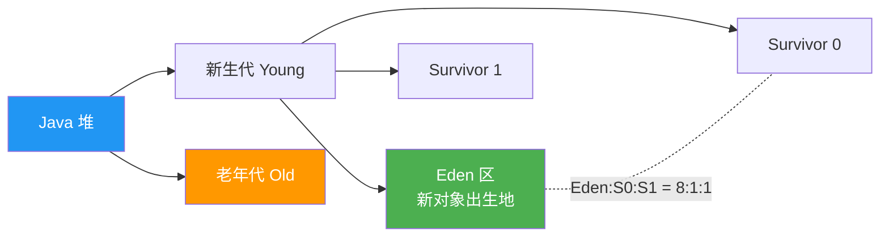
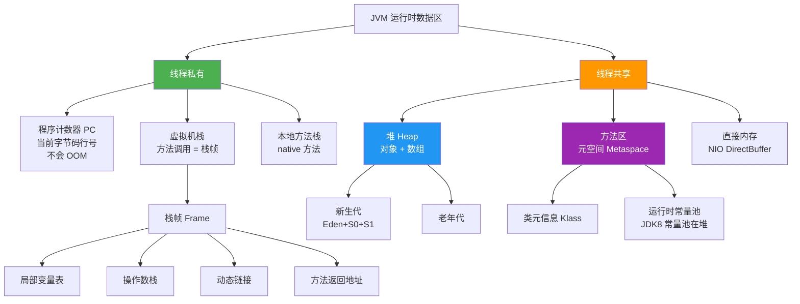
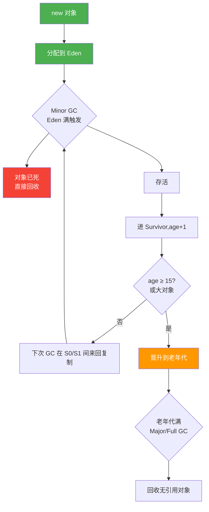

# JVM 内存结构

> **一句话**:JVM 把运行时内存分成几块区域,各司其职 —— 程序计数器记执行到哪,栈管方法调用,堆存对象,方法区存类信息。搞懂它才能定位 OOM 和 GC 问题。

## 核心概念

JVM 运行时数据区分为**线程私有**和**线程共享**两类:

### 线程私有(每个线程一份)

| 区域 | 作用 | 会 OOM 吗 |
|------|------|----------|
| **程序计数器(PC Register)** | 记录当前线程执行到的字节码行号 | 不会(唯一不会 OOM 的区域) |
| **虚拟机栈(VM Stack)** | 每个方法调用创建一个栈帧(局部变量表、操作数栈、动态链接、方法出口) | 会(StackOverflowError / OOM) |
| **本地方法栈(Native Method Stack)** | 为 native 方法服务,作用类似 VM 栈 | 会 |

### 线程共享(所有线程共用)

| 区域 | 作用 | 会 OOM 吗 |
|------|------|----------|
| **堆(Heap)** | 存**对象实例**和数组,GC 主战场,分新生代/老年代 | 会(最常见 OOM 来源) |
| **方法区(Method Area)** | 存**类信息、常量、静态变量、JIT 编译后的代码**。JDK 8+ 由**元空间(Metaspace)**实现,使用本地内存 | 会 |

> ⚠️ 注意区分两个容易混的概念:
> - **JDK 1.7 前**:方法区 = 永久代(PermGen),在堆里,JVM 内存。
> - **JDK 1.8+**:方法区 = 元空间(Metaspace),用**本地内存**,不再受堆大小限制。永久代被废弃,字符串常量池移到堆里。

### 堆的分代结构



- **新生代:老年代 = 1:2**(默认)
- **Eden : S0 : S1 = 8 : 1 : 1**(默认,空间分配担保)
- 对象先在 Eden 分配,Minor GC 后存活对象进 Survivor,经过多次(默认 15 次)GC 还活着 → 进老年代。

## 原理图解

### 完整的运行时数据区(JDK 1.8+)



### 对象在堆里的一生(分代晋升)



## 代码实例

### 实例 1:制造堆 OOM

```java
import java.util.ArrayList;
import java.util.List;

public class HeapOOMDemo {
    public static void main(String[] args) {
        List<byte[]> list = new ArrayList<>();
        int count = 0;
        try {
            while (true) {
                // 每次塞 1MB,故意撑爆堆
                list.add(new byte[1024 * 1024]);
                count++;
            }
        } catch (OutOfMemoryError e) {
            // 捕获的是 Error 不是 Exception
            System.out.println("堆 OOM!塞了 " + count + " MB");
            e.printStackTrace();
        }
    }
}
```

**运行命令**(限制堆 32MB 看效果):
```bash
java -Xms32m -Xmx32m HeapOOMDemo
```

**运行输出**:
```
堆 OOM!塞了 32 MB
java.lang.OutOfMemoryError: Java heap space
    at HeapOOMDemo.main(HeapOOMDemo.java:9)
```

### 实例 2:制造栈溢出(无限递归)

```java
public class StackOverflowDemo {
    static int depth = 0;
    public static void recurse() {
        depth++;
        recurse();  // 无限递归
    }
    public static void main(String[] args) {
        try {
            recurse();
        } catch (StackOverflowError e) {
            System.out.println("栈溢出!递归深度 = " + depth);
        }
    }
}
```

**运行输出**(深度取决于栈大小,默认约 1MB):
```
栈溢出!递归深度 = 10234
```

> **区分**:栈溢出是 `StackOverflowError`(栈帧太深),堆 OOM 是 `OutOfMemoryError: Java heap space`。还有 `OutOfMemoryError: Metaspace` 是元空间溢出(常因动态生成太多类,如 CGLIB 没限制)。

### 实例 3:查看 JVM 内存区域(诊断必备)

```bash
# 1. 查看堆内存概况(运行中的 Java 进程)
jmap -heap <pid>

# 2. 查看对象占用统计,找谁占了内存(线上排查 OOM 第一步)
jmap -histo:live <pid> | head -20

# 3. 导出堆 dump,用 MAT/jvisualvm 分析
jmap -dump:format=b,file=heap.hprof <pid>

# 4. JDK 自带的可视化工具
jvisualvm    # 或 jconsole
```

## 常见误区 / 面试点

- **误区:JDK 8 还在用永久代** → JDK 8 起方法区由**元空间**实现,用本地内存;永久代只存在于 JDK 7 及以前。
- **误区:对象一定在堆上分配** → 不绝对。JIT 的**逃逸分析**发现对象不逃逸出方法时,可能**在栈上分配**(标量替换),随方法结束自动回收,减轻 GC 压力。
- **面试追问:为什么 Survivor 要两个?** → 复制算法需要一块空区域作为 to 区。GC 时把 Eden 和 from-Survivor 的存活对象复制到 to-Survivor,然后清空 Eden 和 from。两个 Survivor 角色交替,保证总有一个是空的。
- **面试追问:对象何时进老年代?** → ① 年龄到阈值(默认 15,`-XX:MaxTenuringThreshold`);② 大对象(`-XX:PretenureSizeThreshold`,直接进老年代避免在新生代复制);③ 动态年龄判断(Survivor 中相同年龄对象大小总和 > Survivor 一半,该年龄以上都晋升)。
- **面试追问:JVM 参数怎么调堆?** → `-Xms` 初始堆、`-Xmx` 最大堆(建议两者相等避免动态扩容抖动)、`-Xmn` 新生代大小、`-XX:MetaspaceSize` 元空间初始。

## 参考来源

- JavaGuide: `docs/java/jvm/memory-area.md`(Java 内存区域详解)
- JavaGuide: `docs/java/jvm/jvm-garbage-collection.md`(垃圾回收)
- JavaGuide: `docs/java/jvm/jvm-parameters-intro.md`(JVM 参数)
- 官方文档: [Oracle JVM 内存管理](https://docs.oracle.com/javase/8/docs/technotes/guides/vm/gctuning/)
