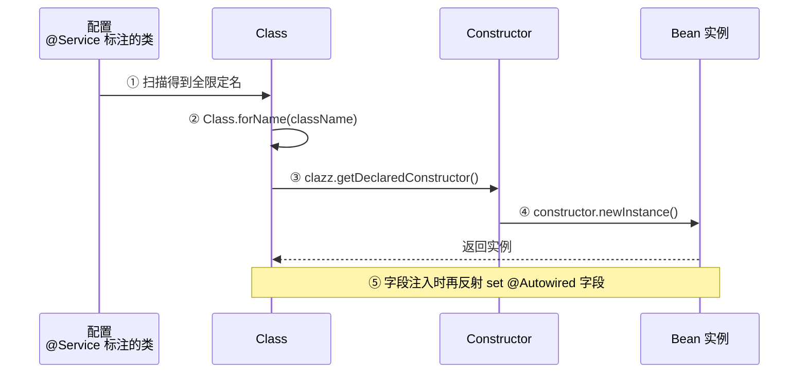

# 反射机制

> **一句话**:反射让程序在运行时"看穿"自己 —— 动态获取类信息、创建对象、调用方法、改字段值。框架(Spring、MyBatis)的核心魔法。

## 核心概念

### 什么是反射

普通方式:**编译时**就知道用什么类,`new Dog()` 写死。
反射方式:**运行时**才知道类名,动态加载、动态操作。

```java
// 普通
Dog d = new Dog();
d.bark();

// 反射:运行时通过类名字符串操作
Class<?> clazz = Class.forName("Dog");
Object d = clazz.getDeclaredConstructor().newInstance();
Method m = clazz.getMethod("bark");
m.invoke(d);
```

### 反射能做什么

| 功能 | API |
|------|-----|
| 获取类信息 | `Class` 对象:字段、方法、构造器、父类、接口、注解 |
| 创建实例 | `clazz.newInstance()`(弃用) / `constructor.newInstance()` |
| 调用方法 | `method.invoke(obj, args)` |
| 读写字段 | `field.set(obj, val)` / `field.get(obj)`,可突破 private |
| 操作数组 | `Array.newInstance`, `Array.get/set` |

### 获取 Class 的三种方式

```java
// 1. 类名.class(编译期已知,性能最好)
Class<Dog> c1 = Dog.class;

// 2. 对象.getClass()(运行时对象)
Dog d = new Dog();
Class<?> c2 = d.getClass();

// 3. Class.forName(全限定名字符串,最灵活)
Class<?> c3 = Class.forName("com.example.Dog");

System.out.println(c1 == c2 && c2 == c3);  // true 同一个 Class 对象
```

### 核心 API

| 类 | 主要方法 |
|----|---------|
| `Class` | `getField(s)`, `getDeclaredField(s)`, `getMethod(s)`, `getDeclaredMethod(s)`, `getConstructor(s)` |
| `Field` | `setAccessible(true)` 突破 private,`set/get` |
| `Method` | `setAccessible(true)`,`invoke(obj, args)` |
| `Constructor` | `newInstance(args)` 创建对象 |

> `getDeclaredXxx` 能拿到**声明**的所有成员(含 private,不含继承);`getXxx` 只能拿到 **public** 成员(含继承)。

## 原理图解

### Class 对象与实例的关系

```mermaid
graph TB
    LOAD[类加载] --> CLS["Class 对象<br/>(Dog 的元信息)<br/>每个类只有一个"]
    CLS --> F1[Field 表<br/>name/age]
    CLS --> M1[Method 表<br/>bark/eat]
    CLS --> C1[Constructor 表]
    CLS --> I1[实例 new Dog()<br/>实例1]
    CLS --> I2[实例 new Dog()<br/>实例2]

    REF[反射操作] --> CLS

    style CLS fill:#2196F3,color:#fff
    style REF fill:#FF9800,color:#fff
```

### Spring 怎么用反射实例化 Bean



## 代码实例

### 实例 1:反射读写 private 字段

```java
public class User {
    private String name = "张三";
    private void secret() { System.out.println("私有方法"); }
}

public class ReflectDemo {
    public static void main(String[] args) throws Exception {
        User user = new User();
        Class<?> clazz = user.getClass();

        // 读 private 字段
        Field name = clazz.getDeclaredField("name");
        name.setAccessible(true);              // 突破 private!
        System.out.println(name.get(user));    // 张三

        // 改 private 字段
        name.set(user, "李四");
        System.out.println(name.get(user));    // 李四

        // 调 private 方法
        Method m = clazz.getDeclaredMethod("secret");
        m.setAccessible(true);
        m.invoke(user);                        // 私有方法
    }
}
```

### 实例 2:简易版 Spring Bean 工厂

```java
@Retention(RetentionPolicy.RUNTIME)
@Target(ElementType.TYPE)
@interface MyComponent {}

@MyComponent
class UserService {
    public void save() { System.out.println("保存用户"); }
}

public class SimpleContainer {
    public static void main(String[] args) throws Exception {
        // 模拟 Spring 扫描包,这里直接给类名
        String className = "UserService";
        Class<?> clazz = Class.forName(className);

        // 检查是否有 @MyComponent 注解
        if (clazz.isAnnotationPresent(MyComponent.class)) {
            Object bean = clazz.getDeclaredConstructor().newInstance();
            Method save = clazz.getMethod("save");
            save.invoke(bean);   // 保存用户
        }
    }
}
```

## 常见误区 / 面试点

- **误区:反射破坏了封装,不能用** → 框架大量依赖反射(Spring、MyBatis、Jackson)。`setAccessible(true)` 在 JDK 9+ 受模块系统限制,但通过 `--add-opens` 可开放。它是双刃剑,不是禁用。
- **误区:反射很慢** → 比直接调用慢(10-30 倍),但现代 JVM 有缓存优化,普通业务场景可接受。频繁调用的热点代码建议缓存 `Method/Field` 对象。
- **面试追问:Class.forName 和 ClassLoader.loadClass 区别?** → `Class.forName` 会触发类的**初始化**(执行 static 块);`loadClass` 只加载不初始化(默认)。JDBC 驱动注册就用 forName 触发 static 块注册 Driver。
- **面试追问:反射能获取泛型类型吗?** → 直接拿不到(擦除),但通过 `Method.getGenericParameterType()` 拿 `ParameterizedType` 能解析方法签名上的泛型。Spring 的 `ResolvableType` 封装了这套机制。

## 参考来源

- JavaGuide: `docs/java/basis/reflection.md`
- 官方文档: [Java Reflection API](https://docs.oracle.com/javase/tutorial/reflect/)
