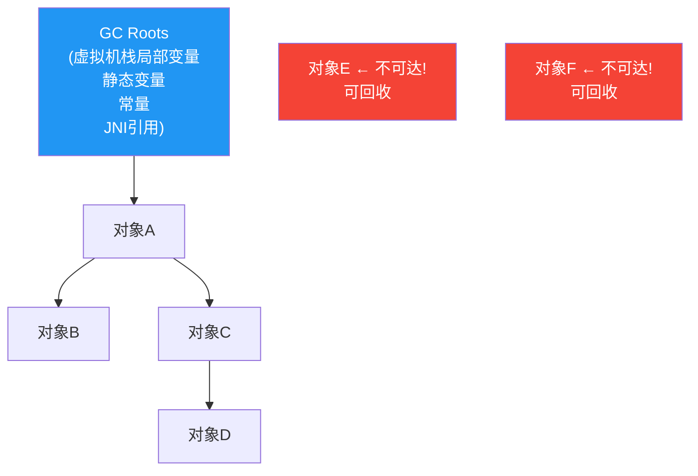
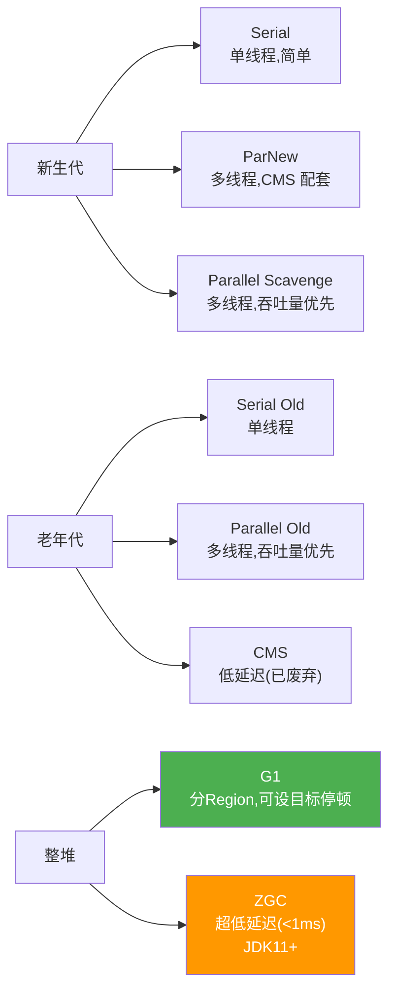
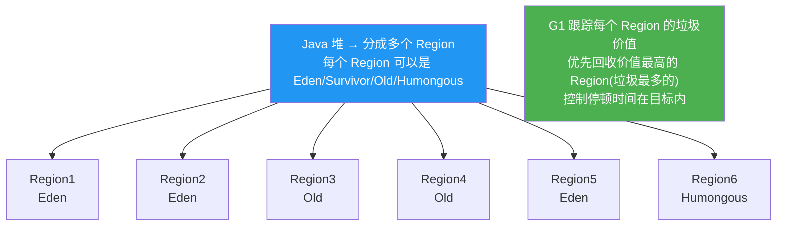
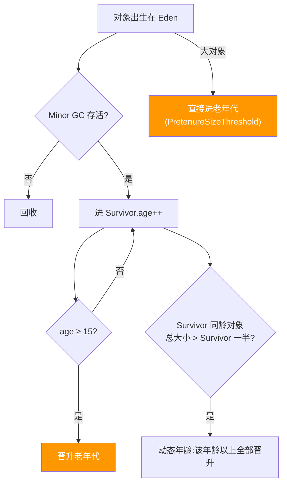

# JVM 垃圾回收 GC

> **一句话**:GC 自动回收堆里没用的对象,释放内存。核心问题是两个:**怎么判断对象该回收**(可达性分析)?**怎么回收**(算法)?**谁来做**(垃圾收集器)?

## 核心概念

### 如何判断对象可回收:可达性分析

从 **GC Roots**(根对象)出发,沿引用链向下搜索。如果一个对象到所有 GC Roots 都没有引用链,就不可达,可回收。



### 四种 GC 算法

| 算法 | 原理 | 优点 | 缺点 | 使用者 |
|------|------|------|------|--------|
| **标记-清除** | 标记所有可达对象,清除未标记的 | 简单 | 碎片化严重 | CMS(老年代) |
| **标记-复制** | 分两块,存活对象从 from 复制到 to,清空 from | 无碎片,分配快 | 浪费一半空间 | 新生代(Eden+S0/S1) |
| **标记-整理** | 标记存活,移到一端,清除边界以外 | 无碎片 | 移动对象有开销 | Serial Old,Parallel Old |
| **分代收集** | 新生代用复制,老年代用标记-清除/整理 | 兼顾效率和空间 | 复杂 | **现代 JVM 统一方案** |

### 新生代 vs 老年代的 GC

| | Minor GC | Major GC / Full GC |
|---|---|---|
| 范围 | 新生代(Eden+S0/S1) | 老年代(可能连带新生代) |
| 频率 | 非常频繁(Eden 满) | 低(老年代慢/满时) |
| 速度 | 快(复制算法,新生代小) | 慢(老年代大) |
| STW | 有(但停顿短) | 有(停顿长) |

> **STW(Stop-The-World)**:GC 时暂停所有用户线程。停顿时间 = 用户体验。

### 常见垃圾收集器



| 收集器 | 新生代 | 老年代 | 特点 | 适用 |
|--------|--------|--------|------|------|
| **Serial + Serial Old** | Serial(单线程) | Serial Old | 简单,STW 长 | 小型应用 |
| **ParNew + CMS** | ParNew(多线程) | CMS(并发标记清除) | 低停顿,但碎片化 | Java 8 常用(CMS 已废弃) |
| **Parallel Scavenge + Parallel Old** | PS(多线程) | PO(多线程) | **吞吐量优先** | 后台计算 |
| **G1**(JDK9 默认) | 分 Region | 分 Region | **可设目标停顿时间** | 大堆(>4GB) |
| **ZGC** | 整堆 | 整堆 | **超低延迟(<1ms STW)** | 超大堆、低延迟要求 |

## 原理图解

### G1 收集器的工作原理



G1 的优势:**不要求整个堆一起回收**。它根据用户设定的 `-XX:MaxGCPauseMillis`(目标停顿时间),选择"回收价值最高"的 Region 集合,控制每次 GC 的停顿。

### 对象何时进老年代(完整)



## 代码实例

### 实例 1:GC 日志分析

```bash
# 启用 GC 日志(JDK8)
java -XX:+PrintGCDetails -XX:+PrintGCDateStamps -Xloggc:gc.log MyApp

# JDK11+ 统一日志格式
java -Xlog:gc*:file=gc.log MyApp
```

日志关键信息:
```
[2026-07-02T10:30:15.123+0800] GC pause (G1 Evacuation Pause) (young)
  [Eden: 256M(256M)->0B(230M) Survivors: 0B->26M Heap: 256M(512M)->80M(512M)]
  [Times: user=0.08 sys=0.01, real=0.02 secs]
  [Eden: 256M->0B, Survivors: 0B->26M, Heap: 256M->80M]  停顿 20ms,可接受
```

### 实例 2:常见 JVM 参数

```bash
# 堆
-Xms4g -Xmx4g             # 初始和最大堆(建议相等)
-Xmn1g                     # 新生代大小
-XX:MetaspaceSize=256m     # 元空间

# GC 选择
-XX:+UseG1GC               # 用 G1(JDK9+ 默认)
-XX:MaxGCPauseMillis=200   # G1 目标停顿 200ms

# GC 日志(JDK11+)
-Xlog:gc*:file=gc.log:time,uptime,level,tags

# OOM 时自动导出堆 dump
-XX:+HeapDumpOnOutOfMemoryError
-XX:HeapDumpPath=/tmp/heap.hprof
```

### 实例 3:手动触发 GC(只用于测试)

```java
System.gc();  // 建议 Full GC(不保证立即执行)
// Runtime.getRuntime().gc(); 效果一样
// 生产环境严禁手动调!让 JVM 自己管
```

## 常见误区 / 面试点

- **误区:Minor GC 不会触发 Full GC** → 一般不会,但 Minor GC 前如果发现 Survivor 放不下所有存活对象,就需要老年代担保 → 可能触发 Full GC。
- **误区:System.gc() 立刻执行 Full GC** → 不一定。它只是"建议"JVM 执行,实际取决于 `-XX:+DisableExplicitGC`(默认 false)和 JVM 判断。
- **误区:G1 一定比 CMS 好** → 看场景。G1 适合大堆(>4GB)和可接受适度停顿的场景;小堆(几百 MB)CMS 或 Parallel 可能更好(ZGC 更适合超大堆+超低延迟)。
- **面试追问:G1 和 CMS 的区别?** → CMS 用标记-清除(有碎片),G1 用标记-复制+整理(无碎片)。CMS 一次性回收老年代,G1 分 Region 增量回收。G1 可设目标停顿时间,CMS 不行。CMS 已在 JDK 14 移除。
- **面试追问:如何排查线上 OOM?** → ① `-XX:+HeapDumpOnOutOfMemoryError` 自动导出 dump;② `jmap -dump:format=b,file=heap.hprof <pid>` 手动导出;③ 用 MAT/VisualVM 分析 dump,看谁占了最多内存;④ 排查是否内存泄漏(对象本该回收但被 GC Root 引用着)。

## 参考来源

- JavaGuide: `docs/java/jvm/jvm-garbage-collection.md`
- JavaGuide: `docs/java/jvm/jvm-parameters-intro.md`
- 相关: [JVM 内存结构](内存结构.md)(堆的分代结构)
