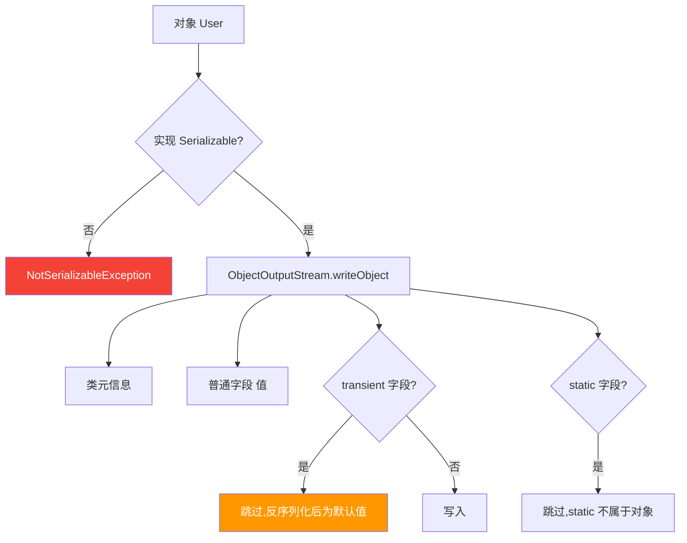
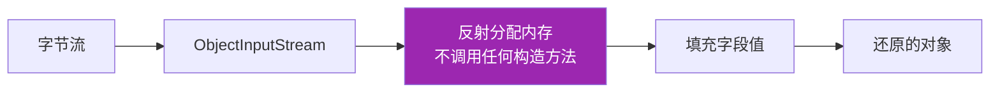

# 序列化与反序列化

> **一句话**:序列化把对象转成字节流(便于存储/网络传输),反序列化把字节流还原成对象。RPC、缓存、MQ 都依赖它。

## 核心概念

### 为什么要序列化

对象存在于内存,程序一关就没了。要持久化到磁盘、跨网络传输,必须转成字节流(或文本)。

```mermaid
flowchart LR
    A[内存中的对象<br/>User{id:1}] -->|序列化| B["字节流 / JSON / 二进制<br/>00010001..."]
    B -->|存储| DISK[磁盘文件]
    B -->|传输| NET[网络 → 另一台机器]
    B -->|缓存| REDIS[Redis]
    DISK -->|反序列化| C[还原成对象]
    NET --> C
    REDIS --> C
    style B fill:#FF9800,color:#fff
```

### Java 原生序列化 vs 主流框架

| 方案 | 格式 | 可读 | 性能 | 跨语言 | 典型场景 |
|------|------|------|------|--------|---------|
| **Java Serializable** | 二进制 | 否 | 差 | 仅 Java | JDK 原生,RMI |
| **JSON**(Jackson/Gson/Fastjson) | 文本 | 是 | 中 | 是 | REST API、前端交互 |
| **Hessian** | 二进制 | 否 | 好 | 是(cacique) | Dubbo 默认协议 |
| **Protobuf** | 二进制 | 否 | 极好 | 是 | gRPC、高性能场景 |
| **Kryo** | 二进制 | 否 | 极好 | 否 | Spark、Flink 内部 |

### Java 原生序列化的坑

```java
class User implements Serializable {   // 必须实现该接口
    private static final long serialVersionUID = 1L;  // 版本号
    private String name;
    private transient String password;  // transient 不参与序列化
}
```

**坑**:
1. **必须实现 Serializable**,否则 `NotSerializableException`。
2. **serialVersionUID 强烈建议显式声明**。不写的话编译器按类结构自动算,改一个字段(加注释、加方法)就变化,导致反序列化报 `InvalidClassException`。
3. **安全**:Java 反序列化有过著名的 RCE 漏洞(Apache Commons Collections),不要反序列化不可信数据。
4. **无法跨语言**:序列化的字节流只有 Java 能读。

## 原理图解

### Java 序列化的字段处理



### 反序列化创建对象(不走构造器!)



> **重要**:反序列化**不会调用构造方法**。这也是单例模式面临序列化破坏的原因 —— 需要实现 `readResolve()` 返回单例。

## 代码实例

### 实例 1:Java 原生序列化

```java
import java.io.*;

class User implements Serializable {
    private static final long serialVersionUID = 1L;
    private String name;
    private transient String pwd;  // 密码不序列化
    public User(String name, String pwd) { this.name = name; this.pwd = pwd; }
    public String toString() { return "User{name=" + name + ", pwd=" + pwd + "}"; }
}

public class SerializeDemo {
    public static void main(String[] args) throws Exception {
        User user = new User("张三", "123456");

        // 序列化到文件
        try (ObjectOutputStream oos = new ObjectOutputStream(
                new FileOutputStream("user.dat"))) {
            oos.writeObject(user);
        }

        // 反序列化
        try (ObjectInputStream ois = new ObjectInputStream(
                new FileInputStream("user.dat"))) {
            User u = (User) ois.readObject();
            System.out.println(u);  // User{name=张三, pwd=null}  ← pwd 丢了
        }
    }
}
```

### 实例 2:JSON 序列化(实战主流)

```java
import com.fasterxml.jackson.databind.ObjectMapper;

User user = new User("张三", "123456");

// 对象 → JSON
ObjectMapper mapper = new ObjectMapper();
String json = mapper.writeValueAsString(user);
// {"name":"张三","pwd":"123456"}

// JSON → 对象
User u = mapper.readValue(json, User.class);
```

## 常见误区 / 面定点

- **误区:transient 字段反序列化后一定是 null/0** → 正确(基本类型默认值,引用类型 null)。但若类实现了 `writeObject/readObject` 自定义序列化,可以手动处理 transient 字段。
- **误区:序列化会保存静态字段** → 不会。static 属于类不属于对象,序列化只管对象的状态。
- **面试追问:序列化破坏单例怎么办?** → 实现 `readResolve()` 方法,返回单例实例。反序列化时 JVM 会调用它替代新建对象。
- **面试追问:为什么 RPC(Dubbo)用 Hessian 不用 Java 序列化?** → Java 序列化①慢 ②大 ③不跨语言 ④不安全。Hessian/Protobuf 更紧凑、更快、跨语言。
- **面试追问:为什么不要反序列化不可信数据?** → 历史上多次反序列化 RCE 漏洞(ysoserial 工具链)。攻击者构造恶意字节流,反序列化时触发任意代码执行。生产用白名单(`ObjectInputFilter`,JDK 9+)。

## 参考来源

- JavaGuide: `docs/java/basis/serialization.md`
