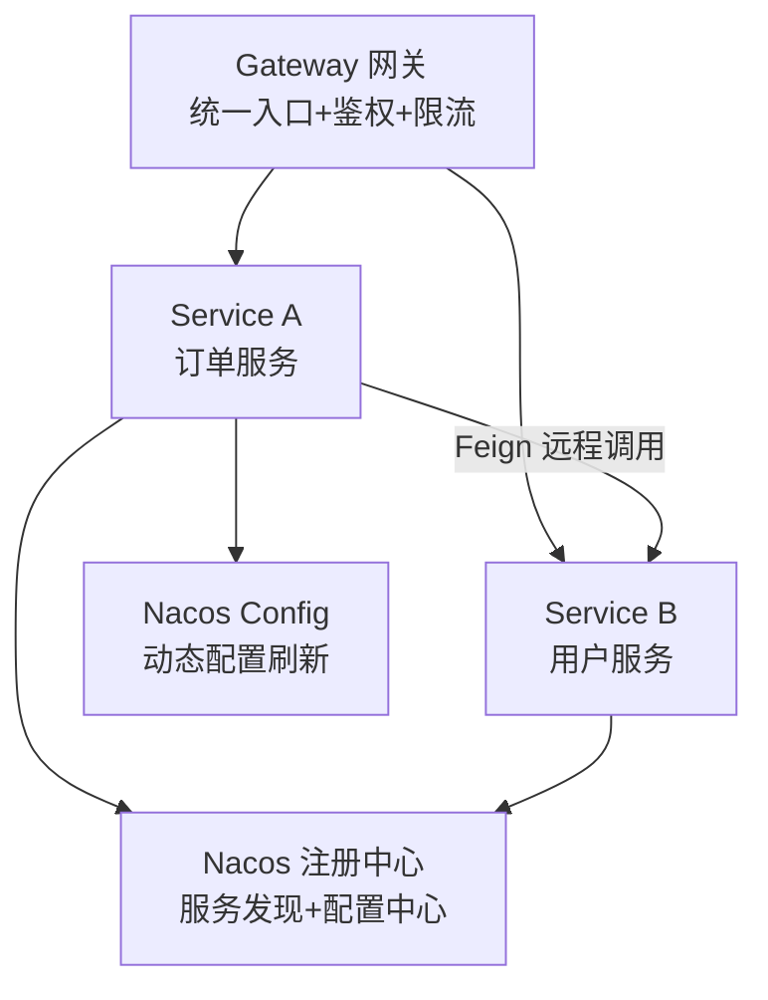

# 微服务与 Spring Cloud 基础

> **一句话**:微服务面试考点集中——服务发现、远程调用、网关、配置中心、熔断降级。Spring Cloud Alibaba 是国内主流。

## 微服务核心组件



## 五大组件速查

| 组件 | Spring Cloud 官方 | **Spring Cloud Alibaba（国内主流）** |
|------|------------------|----------------------------------|
| 注册中心 | Eureka（停更） | **Nacos**（AP/CP 可切换） |
| 配置中心 | Config + Bus | **Nacos Config**（动态刷新） |
| 远程调用 | Feign + LoadBalancer | **Feign + LoadBalancer** |
| 网关 | Gateway | Gateway |
| 熔断降级 | Resilience4j | **Sentinel**（可视化控制台） |

## Nacos — 服务发现 + 配置中心二合一

```yaml
# 服务注册
spring:
  cloud:
    nacos:
      discovery:
        server-addr: 127.0.0.1:8848
        namespace: prod  # 环境隔离

# 动态配置（改了立刻生效，不用重启）
spring:
  cloud:
    nacos:
      config:
        server-addr: 127.0.0.1:8848
        file-extension: yaml
        refresh-enabled: true  # @RefreshScope 自动刷新
```

```java
// @RefreshScope：配置变了自动刷新 Bean
@RestController
@RefreshScope
public class ConfigController {
    @Value("${app.timeout:3000}")
    private int timeout;  // Nacos 里改了，这里立刻生效
}
```

## Feign — 声明式远程调用

```java
// 定义接口 = 调用远程服务，像调本地方法一样
@FeignClient(name = "user-service", path = "/api/users")
public interface UserClient {
    @GetMapping("/{id}")
    UserDTO getUser(@PathVariable Long id);
}

// 使用
@RestController
public class OrderController {
    @Autowired
    private UserClient userClient;

    @GetMapping("/order/{id}")
    public OrderVO getOrder(@PathVariable Long id) {
        Order order = orderService.getById(id);
        UserDTO user = userClient.getUser(order.getUserId());  // 远程调！
        return OrderVO.of(order, user);
    }
}
```

## Sentinel — 流量控制 + 熔断降级

```java
// 流量控制：QPS 超过阈值就限流
// 熔断降级：慢调用比例/异常比例超过阈值就熔断

@RestController
public class OrderController {

    @GetMapping("/order/{id}")
    @SentinelResource(
        value = "getOrder",
        fallback = "getOrderFallback",       // 降级方法
        blockHandler = "getOrderBlockHandler" // 限流方法
    )
    public OrderVO getOrder(@PathVariable Long id) {
        return orderService.getById(id);
    }

    // 降级：服务熔断时返回兜底数据
    public OrderVO getOrderFallback(Long id, Throwable e) {
        return OrderVO.fallback("服务繁忙，请稍后再试");
    }

    // 限流：被限流时返回提示
    public OrderVO getOrderBlockHandler(Long id, BlockException e) {
        return OrderVO.fallback("请求太频繁，请稍后");
    }
}
```

## 分布式事务 — Seata AT 模式

```
Seata AT 模式（最常用，无侵入）：
  ① 业务 SQL 正常执行
  ② Seata 自动记录 undo log（回滚 SQL）
  ③ 全局事务提交 → 各分支异步提交 + 删除 undo log
  ④ 全局事务回滚 → 各分支执行 undo log 回滚

  优点：对业务代码零侵入，加 @GlobalTransactional 就行
  缺点：性能有损耗（额外的 undo log 写操作）
```

## 面试话术

「微服务我们用的 Spring Cloud Alibaba 全家桶——Nacos 做注册中心和配置中心，Feign 做远程调用，Sentinel 做熔断限流。Nacos 的好处是注册和配置不需要两套系统，运维成本低。Sentinel 比 Hystrix 强的是有可视化控制台，限流规则可以动态修改不用重启。」
