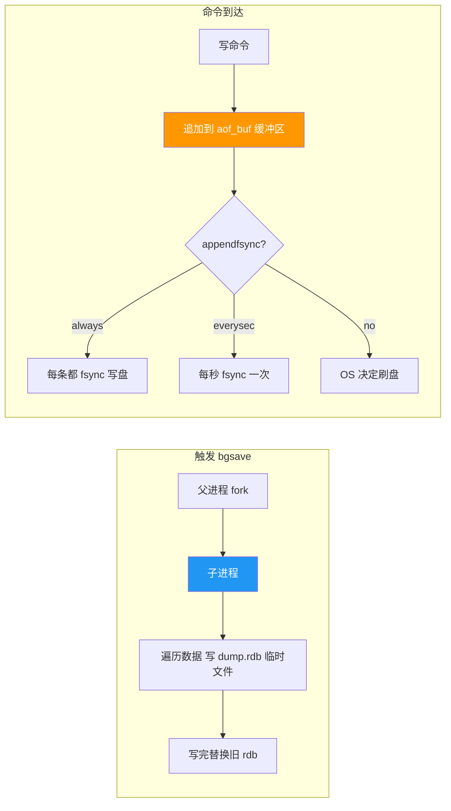
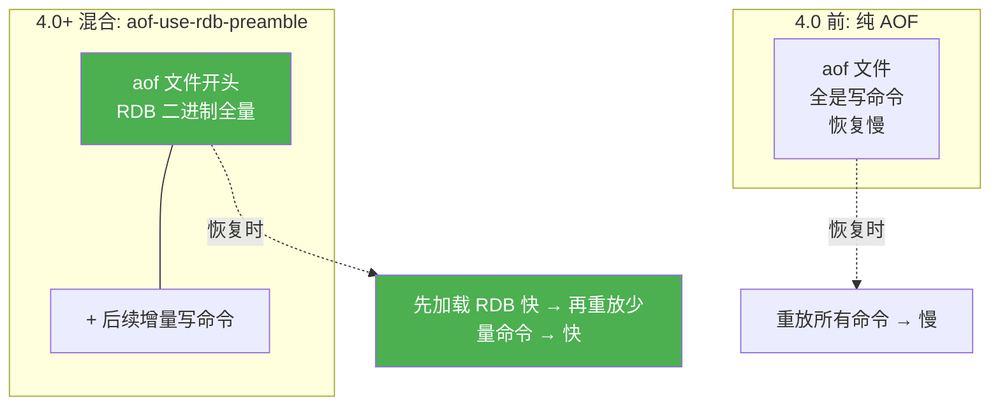
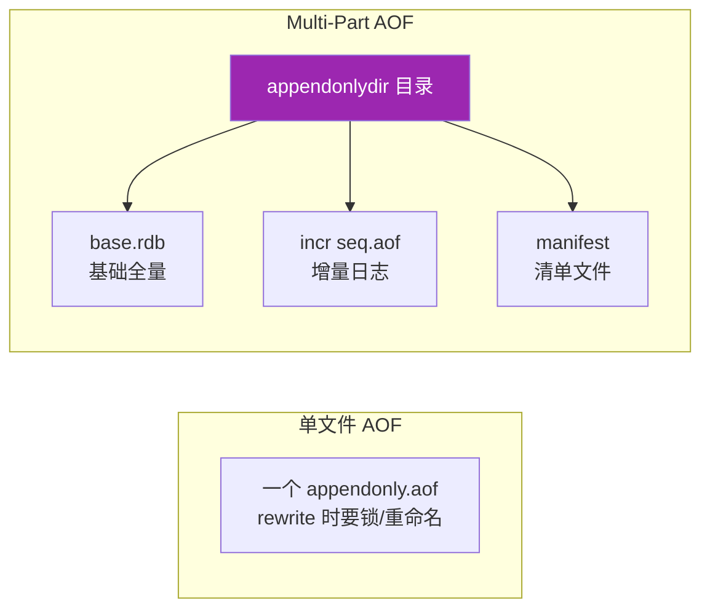

# Redis 持久化机制

> **一句话**:Redis 是内存数据库,断电就丢数据。持久化把内存数据写盘,重启后能恢复。有 RDB 快照、AOF 日志、混合持久化三种方式。

## 核心概念

### 三种持久化方式对比

| 维度 | RDB(快照) | AOF(日志) | 混合持久化(4.0+) |
|------|----------|----------|--------------------|
| 原理 | 某时刻全量数据快照 | 追加每条写命令 | AOF 文件 = RDB全量 + 增量命令 |
| 触发 | save/bgsave、配置自动触发 | 实时追加(可配刷盘策略) | AOF rewrite 时生成 |
| 文件 | `dump.rdb`(二进制,小) | `appendonly.aof`(文本,大) | aof(RDB 头 + 增量) |
| 恢复速度 | 快(直接加载二进制) | 慢(重放命令) | 较快 |
| 数据安全 | 可能丢最近几分钟 | 最多丢 1 秒(everysec) | 最多丢 1 秒 |
| 版本 | 默认开启 | 需手动开 | 7.0+ 默认开 |

### 关键机制

**RDB 的 bgsave(后台保存)**:
- Redis 通过 `fork()` 创建子进程,子进程利用操作系统的 **COW(Copy-On-Write)** 写时复制技术保存快照。
- fork 瞬间会阻塞,大内存实例 fork 慢(每 GB 约 10-20ms)。
- 期间父进程继续服务,修改的数据页会复制一份,不影响快照一致性。

**AOF 的三种刷盘策略**(`appendfsync`):
| 策略 | 含义 | 性能 | 安全 |
|------|------|------|------|
| `always` | 每条命令都刷盘 | 最差 | 不丢 |
| `everysec`(默认推荐) | 每秒刷一次 | 好 | 最多丢 1 秒 |
| `no` | 让 OS 决定 | 最好 | 可能丢较多 |

**AOF 重写(rewrite)**:AOF 文件越追加越大,重写把多条命令合并成最小等价命令(如对同一个 key 的多次 SET 合并成最后一次),缩减体积。也是 fork 子进程 + COW。

## 原理图解

### RDB 与 AOF 的工作流程



### 混合持久化(4.0+,7.0+ 默认)



### Redis 7.0 Multi-Part AOF



> 7.0 把单个 AOF 文件拆成目录,base 存全量、incr 存增量,rewrite 时不再需要临时文件重命名,内存占用更低。

## 代码实例

### redis.conf 关键配置

```ini
# ===== RDB 快照 =====
# 3600s 内至少 1 个 key 变化 → 触发 bgsave
save 3600 1
save 300 100
save 60 10000

# bgsave 出错时停止写入(保护数据一致)
stop-writes-on-bgsave-error yes
# 压缩 rdb 文件(CPU 换空间)
rdbcompression yes
# 文件名
dbfilename dump.rdb

# ===== AOF =====
# 开启 AOF(默认 no)
appendonly yes
appendfilename "appendonly.aof"
# 刷盘策略(推荐 everysec)
appendfsync everysec

# ===== 混合持久化 =====
# 4.0 引入,7.0+ 默认 yes
aof-use-rdb-preamble yes

# ===== AOF 重写触发 =====
# aof 文件比上次重写后大 100% 触发重写
auto-aof-rewrite-percentage 100
# 重写最小体积阈值
auto-aof-rewrite-min-size 64mb
```

### 命令行验证与手动操作

```bash
# 1. 查看当前持久化状态
redis-cli INFO persistence | grep -E "rdb|aof"
# 输出示例:
# rdb_last_bgsave_status:ok
# aof_enabled:1
# aof_rewrite_in_progress:0

# 2. 手动触发 RDB(后台,不阻塞)
redis-cli BGSAVE
# 手动触发 RDB(前台,会阻塞!生产慎用)
redis-cli SAVE

# 3. 手动触发 AOF 重写
redis-cli BGREWRITEAOF

# 4. 查看版本(确认是否支持混合持久化 / Multi-Part AOF)
redis-cli INFO server | grep redis_version
```

### 恢复流程演示

```bash
# 场景:Redis 重启,如何从持久化文件恢复?
# 1. RDB 恢复:启动时自动加载 dump.rdb
# 2. AOF 恢复:启动时自动加载 appendonly.aof
# 3. 优先级:AOF 开启时优先用 AOF(数据更全)

# 检查 aof 文件是否损坏(恢复失败时排查)
redis-check-aof --fix appendonly.aof
# 检查 rdb 文件
redis-check-rdb dump.rdb
```

> **生产建议**:开启 AOF(`appendonly yes`)+ 混合持久化(`aof-use-rdb-preamble yes`)+ `everysec` 刷盘,兼顾恢复速度和数据安全。纯缓存场景可只用 RDB 追求性能。

## 常见误区 / 面试点

- **误区:开了 AOF 就不需要 RDB** → 混合持久化下 AOF 文件开头就是 RDB,两者协同。RDB 还用于**主从复制**的全量同步、**备份归档**(定时把 rdb 拷贝到异地)。两者不冲突。
- **误区:`appendfsync always` 最安全就用它** → 每条命令都 fsync,磁盘 IO 压力极大,吞吐暴跌。生产几乎都用 `everysec`,1 秒的丢失窗口对多数业务可接受。
- **误区:bgsave 不阻塞主线程,所以没事** → fork 本身是阻塞的!大实例(几十 GB)fork 可能阻塞几百毫秒,期间整个 Redis 卡住。大实例应避免频繁 bgsave,或用支持 **THPI / fork 优化** 的新内核。
- **面试追问:RDB 的 fork + COW 怎么保证快照一致?** → fork 子进程时父子共享同一份物理内存(只读);父进程修改某页时,内核才复制那一页给父进程写,子进程看到的仍是旧数据。所以子进程写出的快照是 fork 那一刻的数据,一致。
- **面试追问:混合持久化怎么选?** → Redis 4.0+ 都建议开(`aof-use-rdb-preamble yes`),7.0+ 默认就是。兼顾 AOF 的数据完整性和 RDB 的恢复速度。
- **面试追问:AOF 重写期间有新命令进来怎么办?** → 重写期间,父进程的新写命令会同时写入 **AOF 重写缓冲区** 和 **旧 AOF 缓冲区**。子进程重写完后,父进程把缓冲区的增量追加到新 AOF,再原子替换。期间不丢数据。

## 参考来源

- JavaGuide: `docs/database/redis/redis-persistence.md`(Redis 持久化详解,主要借鉴)
- JavaGuide: `docs/database/redis/redis-questions-01.md`(Redis 常见问题)
- 官方文档: [Redis Persistence](https://redis.io/docs/latest/operate/oss_and_stack/management/persistence/)
- 相关笔记: `../../经验笔记/redis/`(若排查过持久化问题)
