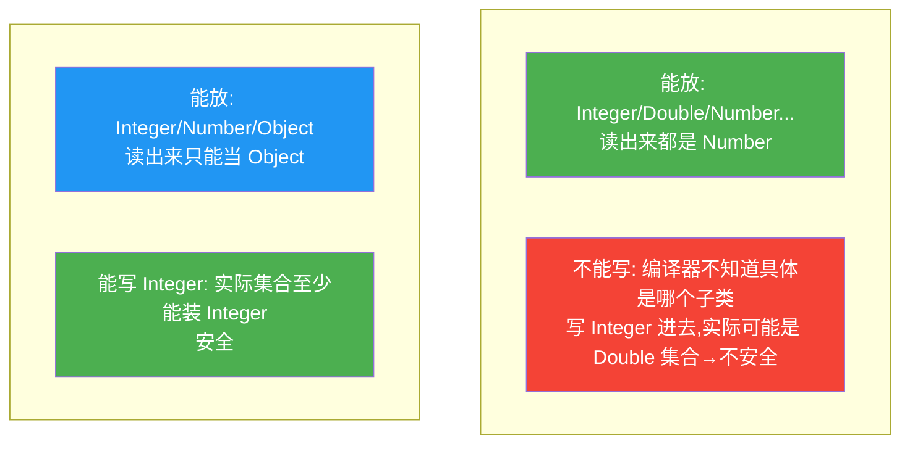
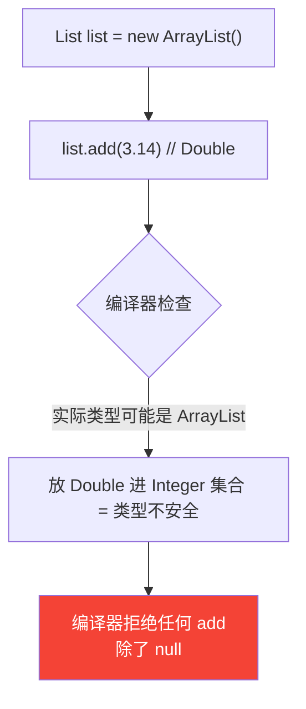

# 泛型与通配符

> **一句话**:泛型让集合/类在编译期就能约束元素类型,免去强转和运行时 ClassCastException;通配符 `?` + 上下界让泛型更灵活。

## 核心概念

### 为什么需要泛型

```java
// 没泛型(JDK 1.5 前):List 装的是 Object,什么都能塞,取出来要强转,容易 ClassCastException
List list = new ArrayList();
list.add("hello");
list.add(123);          // 编译通过,运行时埋雷
String s = (String) list.get(1);  // ClassCastException!

// 有泛型:编译期就限死类型,类型不匹配直接编译报错
List<String> list = new ArrayList<>();
list.add("hello");
list.add(123);          // 编译错误,提前暴露问题
String s = list.get(0); // 无需强转
```

泛型的好处:**类型安全(编译期检查)+ 消除强转 + 代码复用**。

### 类型擦除(重要)

Java 泛型是**伪泛型** —— 只在编译期检查类型,编译后泛型信息被**擦除**,运行时 `List<String>` 和 `List<Integer>` 都是同一个 `List` 类。

```java
List<String> a = new ArrayList<>();
List<Integer> b = new ArrayList<>();
System.out.println(a.getClass() == b.getClass());  // true!都是 ArrayList.class
```

擦除规则:
- 无界泛型 `<T>` 擦除为 `Object`
- 有上界 `<T extends Number>` 擦除为 `Number`
- 桥接方法保证多态正确

### 通配符 `?` 与上下界

这是泛型最绕的部分。先记核心:**泛型不协变**。

```java
// Object 是 String 的父类,但 List<Object> 不是 List<String> 的父类
List<Object> objs = new ArrayList<String>();  // 编译错误!
```

为解决"参数要能接收一族泛型",引入通配符:

| 写法 | 名称 | 含义 | 能读吗 | 能写吗 |
|------|------|------|--------|--------|
| `<?>` | 无界通配符 | 未知类型 | 只能读成 Object | 不能写(除 null) |
| `<? extends T>` | 上界 | T 或 T 的子类 | 能读成 T(生产者) | **不能写**(PECS 的 Producer) |
| `<? super T>` | 下界 | T 或 T 的父类 | 只能读成 Object | 能写 T(消费者) |

### PECS 原则(记忆口诀)

**P**roducer **E**xtends, **C**onsumer **S**uper:
- 要从集合**读**(生产数据)→ `<? extends T>`
- 要往集合**写**(消费数据)→ `<? super T>`
- 既读又写 → 不用通配符,用 `<T>`

## 原理图解

### 通配符的方向



### 为什么 `<? extends T>` 不能写



## 代码实例

### 实例 1:类型擦除的副作用

```java
public class ErasureDemo {
    // 编译报错!类型擦除后两个方法签名都是 method(List),重复
    // public void method(List<String> list) {}
    // public void method(List<Integer> list) {}

    // 运行时反射能绕过泛型检查
    public static void main(String[] args) throws Exception {
        List<String> list = new ArrayList<>();
        list.add("a");

        // 反射拿到原始 add(Object),绕过泛型
        Method add = List.class.getDeclaredMethod("add", Object.class);
        add.invoke(list, 123);  // 居然能加进去!

        System.out.println(list);  // [a, 123]  运行时确实混进去了
        // 但取出来强转会炸:
        for (String s : list) { }  // ClassCastException: Integer → String
    }
}
```

> **教训**:泛型只在编译期保护你。反射能绕过,所以别用反射去破坏泛型约束。

### 实例 2:PECS 实战 —— 复制集合

```java
public class Collections {
    // 把 src(生产者)的元素复制到 dest(消费者)
    public static <T> void copy(List<? super T> dest, List<? extends T> src) {
        for (T item : src) {    // 从 src 读,类型是 T
            dest.add(item);     // 往 dest 写 T,安全
        }
    }

    public static void main(String[] args) {
        List<Integer> src = Arrays.asList(1, 2, 3);
        List<Number> dest = new ArrayList<>();
        copy(dest, src);  // dest 写,Integer 是 Number 子类,OK
        System.out.println(dest);  // [1, 2, 3]
    }
}
```

这就是 JDK `java.util.Collections.copy` 的真实签名,PECS 的经典体现。

## 常见误区 / 面试点

- **误区:泛型能加速程序** → 不能。泛型是编译期机制,运行时擦除,既不增也不减性能(只是消除强转,少一点点装箱)。
- **误区:`List<?>` 和 `List<Object>` 等价** → 不同!`List<?>` 是"未知类型集合"不能 add;`List<Object>` 是"Object 集合"能 add 任何对象。
- **误区:不能创建泛型数组** → 正确,`new T[10]` 编译报错。因为数组协变 + 泛型不协变 + 擦除会导致类型安全漏洞。需要用 `(T[]) new Object[10]` 或 `ArrayList<T>` 替代。
- **面试追问:为什么 Java 用类型擦除而不是真泛型(像 C#)?** → 历史兼容性。Java 1.5 引入泛型时要保证和 1.4 的非泛型代码互操作,擦除是最低成本的迁移方案。代价是运行时拿不到泛型类型。
- **面试追问:怎么在运行时拿到泛型类型?** → 通过继承或匿名内部类保留泛型签名,再用 `ParameterizedType` 反射获取。Spring/Gson 的泛型解析就是这么做的。

## 参考来源

- JavaGuide: `docs/java/basis/generics-and-wildcards.md`
