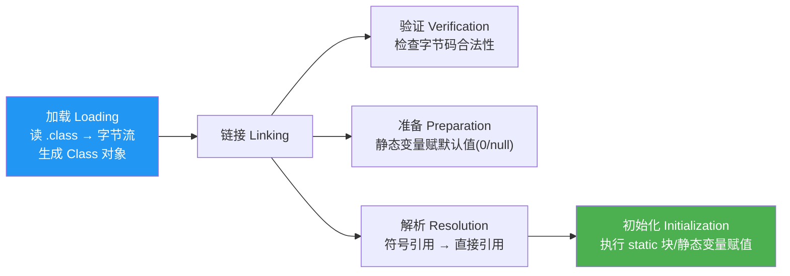
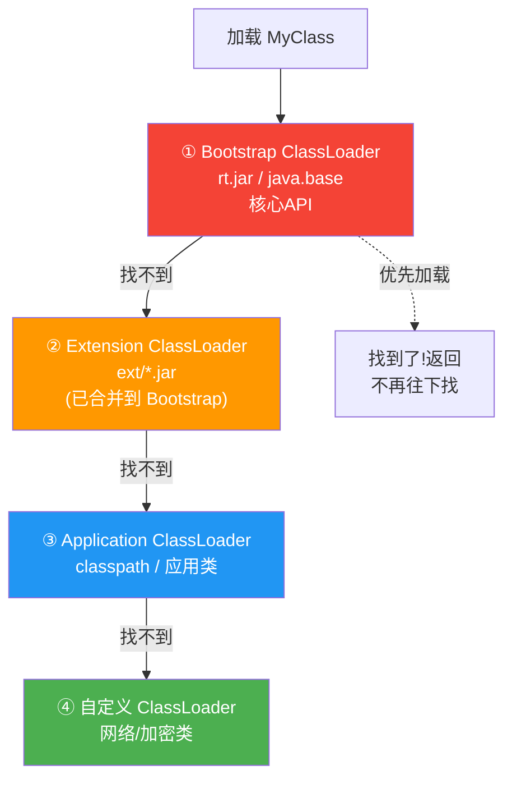
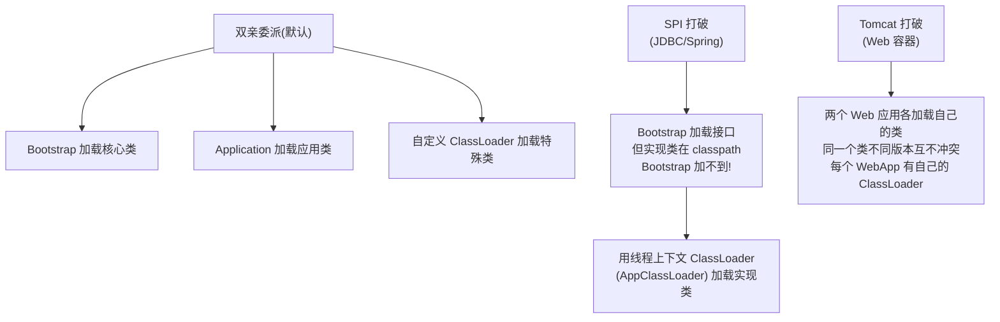
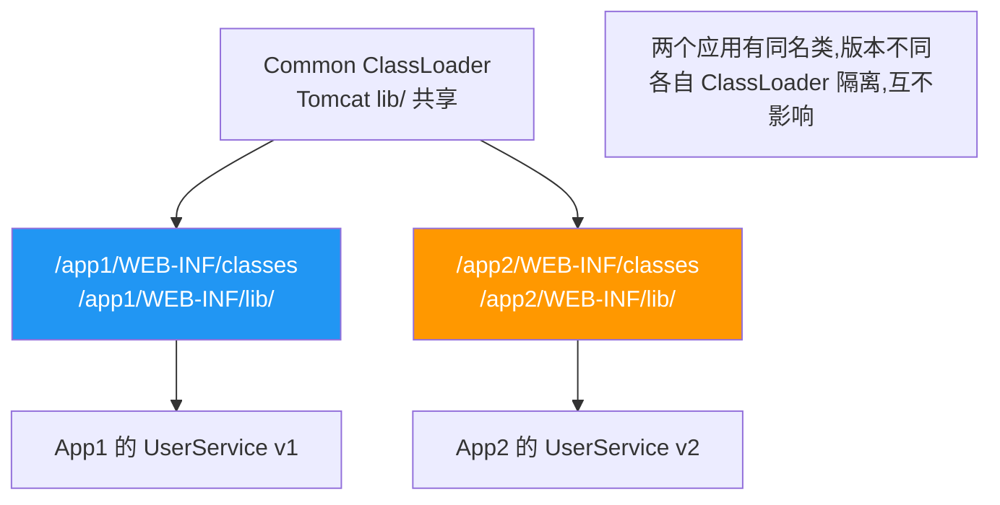

# JVM 类加载机制

> **一句话**:类加载是把 `.class` 字节码读进 JVM 并构建 `Class` 对象的过程。**双亲委派模型**让类加载有序,保证 `java.lang.Object` 唯一。

## 核心概念

### 类加载的时机

类并不都在启动时加载,而是**懒加载**(用到才加载)。触发加载的情况:

```java
new MyClass()         // 创建实例
MyClass.staticField  // 访问静态字段
MyClass.staticMethod // 调用静态方法
Class.forName("MyClass")  // 反射
子类初始化           // 父类先加载
Main class           // JVM 启动
```

### 类加载的三个阶段



> **准备 vs 初始化的区别**(经典面试题):
> `static int x = 10` → 准备阶段 x=0(默认值);初始化阶段 x=10(赋值语句)
> `static final int y = 10` → 准备阶段 y=10(编译期常量直接赋值)

### 双亲委派模型(Parent Delegation)



**核心规则**:收到加载请求时,先**委派给父加载器**。父加载器能加载就返回,不能才自己加载。保证了:
1. `java.lang.String` 永远由 Bootstrap 加载(不会被你自定义的 String 篡改 → **安全性**)
2. 同一个类不会被重复加载(父加载器加载过的,子不再加载 → **唯一性**)

### 三个内置类加载器

| 加载器 | 加载路径 | 说明 |
|--------|---------|------|
| **Bootstrap**(启动类) | `JAVA_HOME/lib` / `java.base` 模块 | C++ 实现,不在 Java API 中 |
| **Extension**(扩展类) | `JAVA_HOME/lib/ext`(JDK9+ 合并到 Bootstrap) | Java API |
| **Application**(应用类) | classpath / 用户类路径 | `ClassLoader.getSystemClassLoader()` |

> JDK 9+ 模块化后,Extension 合并到 Bootstrap,但双亲委派逻辑不变。

## 原理图解

### 打破双亲委派的场景



### Tomcat 的类加载体系



## 代码实例

### 实例 1:验证类加载器层次

```java
public class ClassLoaderDemo {
    public static void main(String[] args) {
        // String 是核心类,由 Bootstrap 加载
        ClassLoader cl = String.class.getClassLoader();
        System.out.println("String: " + cl);  // null(Bootstrap 用 C++ 实现,Java 里拿不到)

        // 我们的类,由 AppClassLoader 加载
        cl = ClassLoaderDemo.class.getClassLoader();
        System.out.println("自己的类: " + cl);  // sun.misc.Launcher$AppClassLoader

        // AppClassLoader 的父加载器
        System.out.println("父: " + cl.getParent());  // ExtClassLoader
        System.out.println("祖父: " + cl.getParent().getParent());  // null(Bootstrap)
    }
}
```

### 实例 2:自定义 ClassLoader(热部署基础)

```java
import java.io.*;

public class MyClassLoader extends ClassLoader {
    private String classDir;

    public MyClassLoader(String dir) { this.classDir = dir; }

    @Override
    protected Class<?> findClass(String name) throws ClassNotFoundException {
        String fileName = classDir + "/" + name.replace('.', '/') + ".class";
        try {
            byte[] bytes = Files.readAllBytes(Path.of(fileName));
            return defineClass(name, bytes, 0, bytes.length);  // 核心:把字节变 Class
        } catch (IOException e) {
            throw new ClassNotFoundException(name, e);
        }
    }

    public static void main(String[] args) throws Exception {
        // 自定义加载器从指定目录加载
        MyClassLoader loader = new MyClassLoader("./classes");
        Class<?> clazz = loader.loadClass("com.example.MyService");
        Object obj = clazz.getDeclaredConstructor().newInstance();
        System.out.println("加载类: " + clazz.getName());
        System.out.println("类加载器: " + clazz.getClassLoader());
    }
}
```

> **热部署原理**:每次请求到来时,用自定义 ClassLoader 重新加载类(丢弃旧的 Class 对象),就实现了不重启更新代码。

## 常见误区 / 面试点

- **误区:双亲委派是强制的** → 不是,可以被打破。SPI(JDBC)、Tomcat、OSGi、热部署等都打破了双亲委派。
- **误区:Bootstrap ClassLoader 是 Java 类** → 不是。它是 JVM 的一部分(C++ 实现),Java 层面拿到的引用是 null。
- **面试追问:为什么 Tomcat 要打破双亲委派?** → ① 隔离:不同 WebApp 可能用同一库的不同版本,必须各自加载互不干扰;② Tomcat 自己的类和 WebApp 的类也要隔离(避免 App 的类覆盖 Tomcat 的)。
- **面试追问:JDBC 怎么打破双亲委派?** → `java.sql.Driver` 接口在 `rt.jar`(Bootstrap 加载),但 MySQL 驱动实现在 classpath(AppClassLoader 加载)。Bootstrap 加不到实现类!解决方案:`DriverManager` 用**线程上下文 ClassLoader**(AppClassLoader)去加载驱动实现。这是 Java SPI 的经典 case。

## 参考来源

- JavaGuide: `docs/java/jvm/class-loading-process.md`
- JavaGuide: `docs/java/jvm/classloader.md`
- JavaGuide: `docs/java/jvm/class-file-structure.md`
- 相关: [SPI机制](SPI机制.md)(SPI 打破双亲委派的详细案例)
