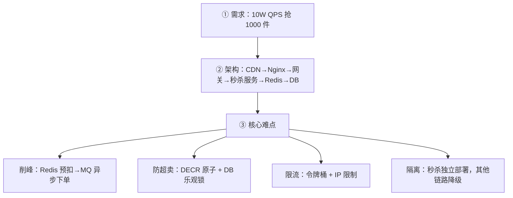

# 系统设计面试答题框架

> **一句话**:设计题考的是**结构化思考**——先聊需求、再画架构、逐层优化、讲清 trade-off。

## 万能五步法

```
① 需求澄清（3 分钟）
   QPS？读写比？数据量？延迟要求？

② 高层架构（5 分钟）
   画图：前端→CDN→网关→服务→DB/Redis
   从最简单方案开始，逐步演进

③ 核心难点逐个击破（10 分钟）
   识别 2-3 个关键问题，每个给出方案

④ 每个方案讲 trade-off（5 分钟）
   "我选 A 因为...不选 B 因为..."
   这比给出方案本身更体现深度

⑤ 总结（2 分钟）
   "后续可加：分库分表、异地多活、监控告警"
```

## 秒杀系统案例



## 必背 trade-off

| 选择 | 好处 | 代价 |
|------|------|------|
| Redis 缓存 | 快 | 一致性 |
| MQ 异步 | 削峰解耦 | 延迟+复杂 |
| 微服务 | 独立部署 | 网络+分布式事务 |
| 分库分表 | 扩展 | 跨库难 |
| 读写分离 | 读性能 | 主从延迟 |
