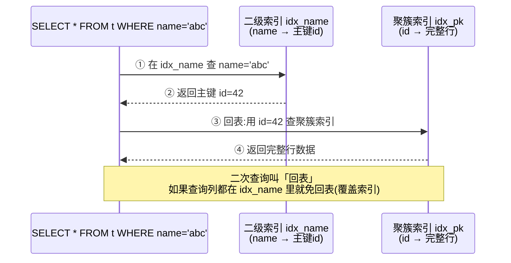

# MySQL 索引原理

> **一句话**:索引是 MySQL 给表加的"目录",用 B+ 树把查找从全表扫描 O(n) 降到 O(log n),但占额外空间且拖慢写入。

> 📌 本文涉及：[B+Tree 原理详解](B+Tree%20索引原理详解.md) · [MySQL 事务与锁](MySQL%20事务与锁.md) · [红黑树原理](红黑树原理详解.md)

## 核心概念

### 为什么是 B+ 树

MySQL(InnoDB)用 **B+ 树**存索引,而不是哈希、二叉树或 B 树:

| 数据结构     | 问题                                                               |
| -------- | ---------------------------------------------------------------- |
| 哈希表      | 只能等值查询,不支持范围查询(`>`, `between`)和排序                                |
| 二叉搜索树    | 退化成链表就是 O(n);树太高,磁盘 IO 多                                         |
| B 树      | 每个节点都存数据,非叶子节点存的 key 少,树更高                                       |
| **B+ 树** | 非叶子节点只存 key(扇出大,3-4 层就能存千万级数据);数据全在**叶子节点**且**叶子间双向链表**相连,范围查询极快 |

B+ 树的优势:**矮胖**(减少磁盘 IO)+ **叶子链表**(范围查询顺扫)。

### 索引类型

| 类型              | 说明                                                       |
| --------------- | -------------------------------------------------------- |
| **主键索引(聚簇索引)**  | 叶子节点存**完整行数据**。一张表只有一个。按主键查询直接拿到整行。                      |
| **二级索引(非聚簇索引)** | 叶子节点存的是**主键值**,不是行数据。查到主键后还要**回表**到聚簇索引取数据。              |
| **联合索引**        | 多列组合,遵循**最左前缀原则**。如 `(a,b,c)` 能匹配 a、a,b、a,b,c,但不能匹配 b,c。 |
| **覆盖索引**        | 查询的列全在索引里,不用回表。`EXPLAIN` 看到 `Extra: Using index` 就是。     |
| **唯一索引**        | 值必须唯一,允许 NULL。                                           |

### 最左前缀原则(联合索引核心) 

对联合索引 `(a, b, c)`:

```sql
-- ✅ 能用到索引
WHERE a = 1
WHERE a = 1 AND b = 2
WHERE a = 1 AND b = 2 AND c = 3
WHERE a = 1 AND b > 2        -- b 用到范围,c 失效

-- ❌ 用不到(缺了最左的 a)
WHERE b = 2
WHERE b = 2 AND c = 3
WHERE c = 3
```

## 原理图解

### B+ 树结构(InnoDB 聚簇索引)

```mermaid
graph TB
    R[根节点<br/>key: 10 | 20 | 30]
    R --> N1[非叶子<br/>≤10]
    R --> N2[非叶子<br/>10-20]
    R --> N3[非叶子<br/>≥30]

    N1 --> L1[叶子: 1,3,5,7,10<br/>存完整行数据]
    N2 --> L2[叶子: 12,15,18,20]
    N3 --> L3[叶子: 25,30,40,50]

    L1 <-.双向链表.-> L2
    L2 <-.双向链表.-> L3

    style R fill:#2196F3,color:#fff
    style N1 fill:#2196F3,color:#fff
    style N2 fill:#2196F3,color:#fff
    style N3 fill:#2196F3,color:#fff
    style L1 fill:#4CAF50,color:#fff
    style L2 fill:#4CAF50,color:#fff
    style L3 fill:#4CAF50,color:#fff
```

> 找 `key=18`:根节点 → 走 10-20 分支 → 叶子节点找到 18。**3 次磁盘 IO** 搞定千万级数据。

### 聚簇索引 vs 二级索引(回表过程)



### 索引失效的常见场景

```mermaid
flowchart TD
    Q[查询] --> CHECK{索引失效检查}
    CHECK --> C1[对索引列做运算/函数<br/>WHERE YEAR(create_time) = 2024<br/>WHERE id + 1 = 10]
    CHECK --> C2[隐式类型转换<br/>phone 是 varchar 但 WHERE phone = 13800]
    CHECK --> C3[最左前缀不满足<br/>联合索引缺左列]
    CHECK --> C4[LIKE 以 %开头<br/>WHERE name LIKE '%abc']
    CHECK --> C5[OR 连接非索引列]
    CHECK --> C6[NOT IN / != / IS NOT NULL<br/>部分场景优化器放弃索引]

    C1 --> FULL[全表扫描]
    C2 --> FULL
    C3 --> FULL
    C4 --> FULL
    C5 --> FULL
    C6 --> FULL

    style FULL fill:#F44336,color:#fff
```

## 代码实例

### 建表 + 加索引 + 看 EXPLAIN

```sql
-- 1. 建表
CREATE TABLE employee (
    id BIGINT PRIMARY KEY AUTO_INCREMENT,
    name VARCHAR(50) NOT NULL,
    age INT,
    phone VARCHAR(20),
    dept_id BIGINT,
    create_time DATETIME DEFAULT CURRENT_TIMESTAMP
);

-- 2. 插入测试数据
INSERT INTO employee (name, age, phone, dept_id) VALUES
('张三', 28, '13800000001', 1),
('李四', 35, '13800000002', 2),
('王五', 28, '13800000003', 1);

-- 3. 建联合索引
CREATE INDEX idx_name_age_dept ON employee(name, age, dept_id);
CREATE INDEX idx_phone ON employee(phone);

-- 4. 验证索引是否生效(关键技能:看 EXPLAIN)
EXPLAIN SELECT * FROM employee WHERE name = '张三';
-- type = ref,key = idx_name_age_dept ✓ 用到索引

EXPLAIN SELECT * FROM employee WHERE age = 28;
-- type = ALL,key = NULL ✗ 索引失效(违反最左前缀)

-- 5. 覆盖索引(只查索引包含的列)
EXPLAIN SELECT name, age, dept_id FROM employee WHERE name = '张三';
-- Extra: Using index ✓ 不回表
```

### EXPLAIN 关键列解读

```sql
EXPLAIN SELECT * FROM employee WHERE phone = 13800000001;
-- 故意:phone 是 varchar,但传了数字 → 隐式转换 → 索引失效
```

| 列       | 值                                                                                        | 含义                  |
| ------- | ---------------------------------------------------------------------------------------- | ------------------- |
| `type`  | `system > const > eq_ref > ref > range > index > ALL`                                    | **ALL = 全表扫描,必须优化** |
| `key`   | 实际用的索引名                                                                                  | NULL 表示没用索引         |
| `rows`  | 估算扫描行数                                                                                   | 越小越好                |
| `Extra` | `Using index` = 覆盖索引(好)<br/>`Using filesort` = 额外排序(注意)<br/>`Using temporary` = 用临时表(警惕) | 性能信号                |

> **实战口诀**:线上慢查询第一步就是 `EXPLAIN`,看 `type` 是不是 ALL、`Extra` 有没有 filesort/temporary。

## 常见误区 / 面试点

- **误区:索引建得越多越好** → 索引占空间,且每次 INSERT/UPDATE/DELETE 都要维护索引树。写多读少的表建一堆索引会拖慢写入。只为查询频繁的列建。
- **误区:`WHERE id + 1 = 10` 会用 id 索引** → 对索引列做运算会让索引失效。改成 `WHERE id = 9`。
- **误区:建了 `(a,b,c)` 联合索引,`WHERE b=1 AND c=2 AND a=3` 用不到** → 能用。MySQL 优化器会自动调整顺序匹配最左前缀,WHERE 子句顺序不影响。
- **面试追问:为什么 InnoDB 推荐用自增主键?** → ① 自增主键插入是顺序追加到 B+ 树叶子末尾,不触发页分裂;② 用 UUID 等随机主键,插入位置随机,频繁页分裂和页移动,写性能差且碎片多。③ 自增主键(BIGINT 8字节)比 UUID(16+字节)占用小,二级索引存主键值,主键越小二级索引越省空间。
- **面试追问:聚簇索引和非聚簇索引区别?** → 聚簇索引叶子节点存数据行(数据和索引一体),一张表只有一个;非聚簇索引叶子存主键值,要回表。InnoDB 主键是聚簇,MyISAM 的索引和数据分离,都是非聚簇。
- **面试追问:索引下推(ICP)是什么?** → MySQL 5.6+ 的优化。联合索引 `(a,b)`,查询 `WHERE a=? AND b LIKE '%xx'`,老版本要先按 a 取出所有主键回表再过滤 b;有了 ICP,在存储引擎层就用 b 过滤,减少回表次数。EXPLAIN 看到 `Extra: Using index condition` 就是。

## 参考来源

- JavaGuide: `docs/database/mysql/mysql-index.md`(MySQL 索引)
- JavaGuide: `docs/database/mysql/mysql-index-invalidation.md`(索引失效)
- JavaGuide: `docs/database/mysql/innodb-implementation-of-mvcc.md`(MVCC,事务相关)
- 官方文档: [MySQL Indexes](https://dev.mysql.com/doc/refman/8.0/en/mysql-indexes.html)
