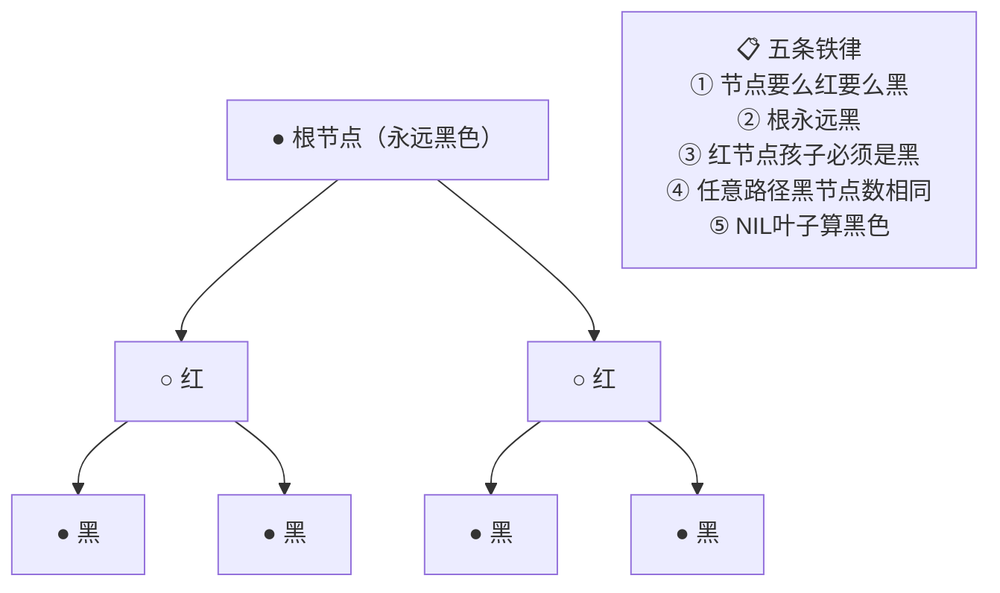

# 红黑树原理详解

> **一句话**:红黑树是「弱平衡」二叉搜索树——牺牲严格平衡换插入性能。HashMap 用它代替链表，TreeMap 用它实现有序。

> 📌 关联阅读：[HashMap](HashMap.md) · [ConcurrentHashMap](ConcurrentHashMap.md) · [索引(B+Tree)](索引.md)

---

## 五条铁律



## 为什么 HashMap 用它？

| 对比 | 链表 | 红黑树 | AVL |
|------|:--:|:--:|:--:|
| 查找 | O(n) | O(log n) | O(log n) 稍快 |
| 插入 | O(1) | O(log n)，**旋转 ≤3 次** | O(log n)，旋转可能多次 |
| 删除 | O(1) | O(log n)，旋转 ≤3 次 | O(log n)，旋转可能多次 |
| HashMap 的选择 | 短链表 | ✅ 链表≥8 时 | 维护成本高 |

**HashMap 增删频繁** → 红黑树插入/删除最多旋转 3 次，AVL 严格平衡需要更多旋转。

## 三种旋转

### 左旋

```
     X                    Y
    / \                  / \
   a   Y      →        X   c
      / \              / \
     b   c            a   b

以 X 为支点，把右子 Y 升上去，X 变成 Y 的左子
```

### 右旋

```
       X                  Y
      / \                / \
     Y   c      →       a   X
    / \                    / \
   a   b                  b   c

以 X 为支点，把左子 Y 升上去，X 变成 Y 的右子
```

### 变色

```
    ○ (红)      →     ● (黑)
    ● (黑)      →     ○ (红)

变色不改变树结构，只调整颜色来满足红黑树性质
```

## 插入修正：三种情况

插入新节点默认为**红色**，然后根据父节点颜色判断：

| 情况 | 父节点 | 叔节点 | 操作 |
|------|--------|--------|------|
| ① | 黑色 | - | ✅ 啥也不用做 |
| ② | 红色 | **红色** | 父和叔变黑，祖父变红，递归向上 |
| ③ | 红色 | **黑色** | 旋转+变色 |

```
情况②（父红叔红）：
      ●(祖父)              ○(祖父变红)
     /    \                /    \
   ○(父)  ○(叔)    →    ●(父)  ●(叔)
   /                    /
 ○(新)                ○(新)

  父和叔变黑，祖父变红 → 把红色「推上去」继续修正

情况③（父红叔黑，新节点是父的右子，父是祖父的左子）：
      ●(祖父)              ●(祖父)
     /    \                /    \
   ○(父)  ●(叔)   →     ○(新)  ●(叔)
     \                  /
     ○(新)            ○(父)

  先对父左旋 → 变成情况③的另一种 → 再对祖父右旋+变色
```

## 红黑树 vs B+Tree

| | 红黑树 | B+Tree |
|------|--------|--------|
| 存储 | **内存** | **磁盘** |
| 出度 | 2 | 几十~几百 |
| 高度 | 高（log₂10⁶≈20） | 矮（3-4 层存千万级） |
| 节点存数据 | 都存 | 只有叶子存 |
| 用途 | HashMap/TreeMap | MySQL 索引 |
| 为什么 | 二叉适合内存查找 | 矮胖减少磁盘 IO |

> 📌 B+Tree 详见：[索引](索引.md)

## 面试追问

**Q: 为什么不用跳表？**
A: 跳表实现更简单（不用旋转），ConcurrentHashMap 在 JDK 8 中依然保留了「链表过长可能转树」的设计但源码里有跳表的探讨。红黑树的优势是空间利用率更高——每个节点只需 1 个 bit 存颜色，跳表每个节点要维护多层指针。

**Q: 红黑树节点插入后最多几次旋转？**
A: 最多 **3 次**（情况③）。AVL 最坏可能 O(log n) 次。
