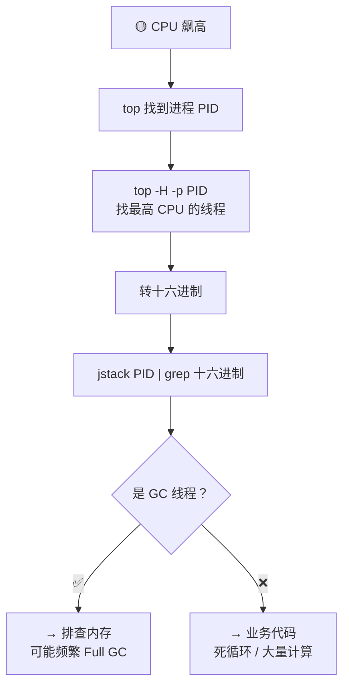
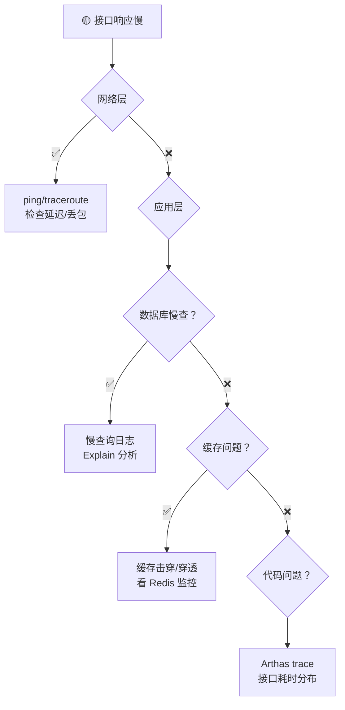

# 线上问题排查实战手册

> **一句话**:面试官问"遇到线上故障怎么排查"——不是问你背命令，是看你的**排查思路**：现象→定位→根因→修复→复盘。

---

## 一、CPU 飙高

### 排查步骤

```bash
# ① 找到 CPU 最高的 Java 进程
top -c                          # 记下 PID

# ② 找到该进程里 CPU 最高的线程
top -H -p <PID>                 # 记下线程 ID（十进制）
# 或：ps -mp <PID> -o THREAD,tid,time | sort -rn | head -10

# ③ 线程 ID 转十六进制
printf "%x\n" <TID>             # 得到十六进制 nid

# ④ 打印线程堆栈，搜这个线程在干嘛
jstack <PID> | grep -A 30 <十六进制nid>

# ⑤ 如果发现是 GC 线程 → 转去排查内存
#    如果发现是业务线程 → 看堆栈定位到哪行代码
```



### 常见根因

| 根因 | 特征 | 解决 |
|------|------|------|
| **死循环** | jstack 看到同一行代码反复出现 | 代码 review，加边界条件 |
| **频繁 Full GC** | GC 线程 CPU 高 + jstat 看到 FGC 涨 | 增大堆、排查大对象、调整 GC |
| **正则回溯** | 堆栈中有 Pattern.match | 正则加超时，改写为更高效的正则 |
| **流未关闭** | 线程数持续增长 | finally 关闭资源，try-with-resources |

---

## 二、内存溢出 / OOM

### 排查步骤

```bash
# ① 确认 OOM 类型
# 日志里搜：java.lang.OutOfMemoryError: Java heap space  → 堆溢出
#           java.lang.OutOfMemoryError: Metaspace          → 元空间溢出
#           java.lang.OutOfMemoryError: unable to create new native thread → 线程数太多

# ② 拿到堆 dump（启动时加参数）
# -XX:+HeapDumpOnOutOfMemoryError -XX:HeapDumpPath=/tmp/heap.hprof

# ③ jmap 查看对象分布
jmap -histo:live <PID> | head -30

# ④ 用 MAT/JProfiler 分析 dump 文件
# 重点看：Dominator Tree（谁占了最多内存）、Leak Suspects（泄漏嫌疑）
```

### 四种 OOM 对比

| OOM 类型 | 报错信息 | 常见原因 | 排查工具 |
|---------|---------|---------|---------|
| **堆溢出** | Java heap space | 内存泄漏 / 堆太小 | jmap -histo + MAT |
| **元空间溢出** | Metaspace | 动态生成类太多（CGLIB/Groovy） | jstat -gc |
| **GC Overhead** | GC overhead limit exceeded | GC 耗时 > 98% 但回收 < 2% | 增大堆，优化代码 |
| **线程溢出** | unable to create new native thread | 线程数超系统限制 | `ulimit -u` |

### jmap 怎么看 — 实战

```bash
# 看哪些对象占用最多内存
jmap -histo:live <PID> | head -20

# 输出示例：
#  num     #instances         #bytes  class name
#    1:       1856043       44545032  [C              ← char[] 占 44M！
#    2:       1854122       44498928  java.lang.String ← String 占 44M！
#    3:        123456       18907680  [B
#
# 如果发现你的业务类排名靠前 → 内存泄漏
# 如果都是 JDK 基础类 → 堆大小不够，调大 -Xmx
```

### 面试话术

「遇到 OOM，我第一步看日志确认类型。堆溢出最常见——用 jmap -histo 看对象分布，如果 HashMap 或自定义对象排前三，基本上就是内存泄漏。再配合 MAT 的 Dominator Tree 找到谁持有了这个大对象，定位到代码。」

---

## 三、接口响应慢

### 排查思路



### Arthas 三板斧

```bash
# ① 看接口各步骤耗时
trace com.xxx.controller.OrderController getOrder -n 5
# 输出：每一步方法调用耗时，精确到 ms

# ② 看方法入参和返回值
watch com.xxx.service.OrderService getOrder '{params, returnObj}' -x 3

# ③ 热修复（临时兜底）
redefine /tmp/HotFix.class   # 修改 class 后热替换，不用重启！

# ④ 看线程池状态
thread -b                     # 找死锁
thread --state BLOCKED        # 找阻塞线程
dashboard                     # 实时看线程+内存+GC
```

### 常见慢接口根因

| 根因 | 特征 | 解决 |
|------|------|------|
| **慢 SQL** | DB 连接池满了 | 加索引、优化 SQL、读写分离 |
| **缓存失效** | Redis 负载突然升高 | 热点 key 不过期 + 异步更新 |
| **下游超时** | 调用外部服务耗时长 | 调大超时、加熔断降级 |
| **锁竞争** | 线程大量 BLOCKED | 缩小锁范围、用 ConcurrentHashMap |
| **大循环** | n+1 查询 | 批量查询、用 JOIN |

---

## 四、死锁排查

```bash
# jstack 直接找到死锁
jstack <PID> | grep -A 10 "deadlock"
# 或：
jstack <PID> > stack.txt && grep "Found one Java-level deadlock" stack.txt
```

```java
// 死锁四要素：
// ① 互斥：锁不能共享
// ② 持有并等待：线程A 持有锁1 等锁2
// ③ 不可剥夺：不能抢别人的锁
// ④ 循环等待：A→等B→等C→等A

// 破局：破坏任一条件即可
// 最常用：破坏循环等待 → 所有线程按同一顺序获取锁！

// ❌ 死锁代码
synchronized(lockA) {{
    synchronized(lockB) {{ ... }}
}}
synchronized(lockB) {{
    synchronized(lockA) {{ ... }}  // ← 和上面顺序相反，死锁！
}}

// ✅ 统一获取顺序
synchronized(lockA) {{
    synchronized(lockB) {{ ... }}
}}
synchronized(lockA) {{  // ← 先拿 lockA 再拿 lockB
    synchronized(lockB) {{ ... }}
}}
```

---

## 五、MySQL 慢查询

### 排查步骤

```sql
-- ① 开启慢查询日志
SET GLOBAL slow_query_log = ON;
SET GLOBAL long_query_time = 0.5;  -- 超过 0.5 秒就记录

-- ② 找到最慢的 SQL
-- 或用工具：pt-query-digest / 阿里 Druid 监控
SELECT * FROM mysql.slow_log ORDER BY query_time DESC LIMIT 10;

-- ③ Explain 分析
EXPLAIN SELECT * FROM t_order WHERE user_id = 123 AND status = 1;
-- 看 type=ALL/rows=10万 → 没走索引！

-- ④ 看行锁等待
SHOW ENGINE INNODB STATUS;
-- 搜 "LATEST DETECTED DEADLOCK" 找死锁
-- 搜 "---TRANSACTION" 找长事务

-- ⑤ 杀长事务
SELECT * FROM information_schema.innodb_trx WHERE TIME_TO_SEC(TIMEDIFF(NOW(), trx_started)) > 60;
KILL <trx_mysql_thread_id>;
```

### 常见的索引失效

```sql
-- 索引 idx_user_status(user_id, status)

-- ✅ 走索引
SELECT * FROM t_order WHERE user_id = 123 AND status = 1;
-- ✅ 走索引（最左前缀）
SELECT * FROM t_order WHERE user_id = 123;
-- ❌ 不走！缺最左列
SELECT * FROM t_order WHERE status = 1;
-- ❌ 不走！对索引列用函数
SELECT * FROM t_order WHERE YEAR(create_time) = 2026;
-- ✅ 改成范围
SELECT * FROM t_order WHERE create_time BETWEEN '2026-01-01' AND '2026-12-31';
-- ❌ 不走！前置百分号
SELECT * FROM t_order WHERE user_name LIKE '%张三';
```

---

## 六、Redis 故障

| 故障 | 现象 | 排查 | 解决 |
|------|------|------|------|
| **缓存穿透** | DB 被打爆 | `COMMANDSTAT` 看命中率 | 布隆过滤器 + 缓存空值 |
| **缓存击穿** | 热点 key 过期瞬间 DB 撑不住 | 看监控的 key 过期曲线 | 互斥锁 + 永不过期 |
| **缓存雪崩** | 大量 key 同时过期 | 看过期时间分布 | TTL 加随机值 |
| **Big Key** | Redis 响应抖动 | `redis-cli --bigkeys` | 拆分成多个小 key |
| **热 Key** | 单分片 QPS 高 | `redis-cli --hotkeys` | 本地缓存 + 多副本 |
| **内存满了** | 写入失败 | `INFO memory` | 加内存 / 设淘汰策略 |

```bash
# 查大 key
redis-cli --bigkeys

# 查慢命令
redis-cli slowlog get 10

# 看内存
redis-cli INFO memory | grep used_memory_human

# 看连接数
redis-cli INFO clients | grep connected_clients
```

---

## 七、消息积压

```bash
# Kafka 看积压
kafka-consumer-groups --bootstrap-server localhost:9092 \
  --group order-group --describe

# 输出：
# TOPIC    PARTITION  CURRENT-OFFSET  LOG-END-OFFSET  LAG
# order    0          1000            5000             4000   ← 积压 4000 条！
```

| 原因 | 怎么解决 |
|------|---------|
| 消费速度跟不上生产 | ① 加 Consumer 实例（Partition 数要 ≥ Consumer 数）② 消费逻辑优化（批量处理、异步） |
| 消费逻辑报错 | ① 死信队列 + 重试 ② 跳过单条，记录日志 |
| 突发流量 | ① 临时扩容 Consumer ② 限流生产端 |

---

## 八、排查工具速查

| 工具 | 用途 | 关键命令 |
|------|------|---------|
| **top** | 系统负载 | `top -c` 看进程 CPU/内存 |
| **jstack** | 线程堆栈 | `jstack <PID>` 看线程在哪卡住 |
| **jmap** | 内存快照 | `jmap -histo <PID>` 看对象分布 |
| **jstat** | GC 统计 | `jstat -gc <PID> 1000` 实时看 GC |
| **Arthas** | 在线诊断 | `trace/watch/dashboard/thread -b` |
| **MAT** | dump 分析 | Dominator Tree + Leak Suspects |
| **Explain** | SQL 分析 | `EXPLAIN SELECT ...` 看索引 |
| **Grafana** | 监控大盘 | QPS/RT/错误率/JVM/DB |
| **ELK** | 日志搜索 | 关键词搜 error + traceId 串联 |

---

## 九、面试话术

### 问：线上接口突然变慢，你怎么办？

> 「我按四层排查：先看网络层（ping 看延迟）→ 再看应用层（Arthas trace 看哪步慢）→ 再看缓存层（Redis 监控看是否击穿）→ 最后看数据库层（慢查询日志 + Explain）。大部分时候是慢 SQL 或缓存失效，一层层收敛就找到了。」

### 问：OOM 怎么排查？

> 「先看日志确认类型，堆空间溢出最常见。用 jmap -histo 看对象分布，如果某个业务类实例数异常高，再用 MAT 的 Dominator Tree 找到持有者。如果只是堆太小，调大 -Xmx。排查过程中保证有一台机器留着 dump 文件不动，不要急着重启。」

### 问：你最自豪的一次排查经历？

> 「有一次凌晨 2 点 CPU 报警，上去 jstack 发现几十个线程都在做正则匹配——一个用户上传了超长文本触发了正则回溯。临时方案是加正则超时，根治方案是换成更高效的正则 + 限制输入长度。从那之后所有正则我都加超时。」
