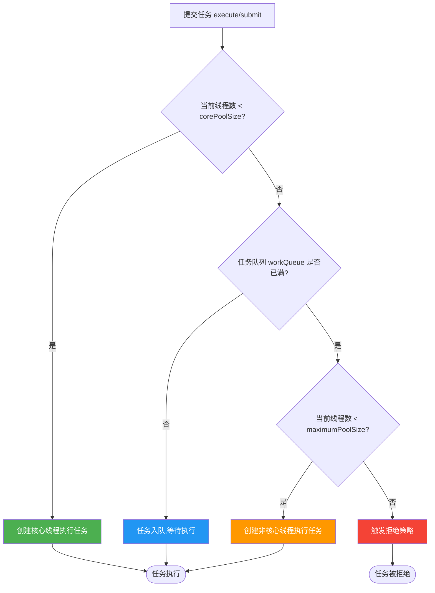
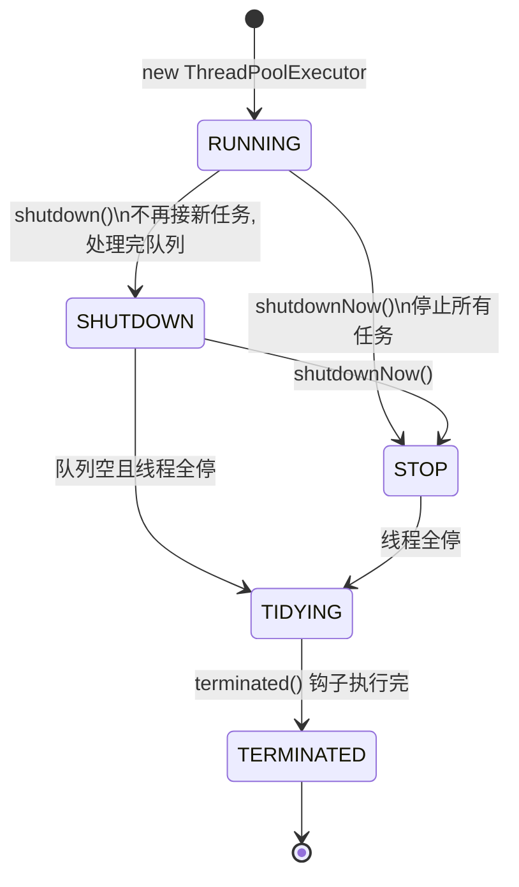

# Java 线程池详解

> **一句话**:线程池复用已创建的线程,免去频繁创建/销毁的开销,同时限制并发数防止系统被压垮。

## 核心概念

### 为什么要用线程池

每次 `new Thread()` 都要经历"创建线程 → 用户态切内核态 → 销毁线程"的过程,开销大且不可控。线程池把线程**池化**:用过的线程不销毁,放回池里等下一个任务复用。

好处有三:
1. **降低资源消耗**:复用线程,减少创建/销毁开销。
2. **提高响应速度**:任务到达时,线程已就绪,直接执行。
3. **便于管理**:统一调优、监控、限流。

### 核心类:ThreadPoolExecutor

Java 线程池的真正实现是 `ThreadPoolExecutor`,而 `Executors` 工具类只是它的便捷封装。**《阿里巴巴 Java 开发手册》强制要求用 `ThreadPoolExecutor` 显式构造,禁止用 `Executors`** —— 因为 `Executors` 的几个方法用了无界队列或无界线程数,容易 OOM。

### 7 个核心参数

```java
public ThreadPoolExecutor(
    int corePoolSize,              // 1. 核心线程数:常驻不回收的线程
    int maximumPoolSize,           // 2. 最大线程数:核心+非核心的上限
    long keepAliveTime,            // 3. 非核心线程的空闲存活时间
    TimeUnit unit,                 // 4. keepAliveTime 的单位
    BlockingQueue<Runnable> workQueue,         // 5. 任务队列
    ThreadFactory threadFactory,               // 6. 线程工厂:给线程起名等
    RejectedExecutionHandler handler           // 7. 拒绝策略
)
```

## 原理图解

### 任务提交后的执行流程(最核心)

这是面试和实战都必须记牢的逻辑:



**关键记忆点**:先核心、再队列、最后非核心,满了才拒绝。**不是**先创建到 maximum 再入队 —— 顺序反了。

### 线程池状态流转



### 4 种内置拒绝策略

| 策略 | 行为 | 适用场景 |
|------|------|----------|
| `AbortPolicy`(默认) | 抛 `RejectedExecutionException` | 关键任务,必须知道被拒绝 |
| `CallerRunsPolicy` | 让提交任务的线程自己跑 | 不丢任务,反压(让上游慢下来) |
| `DiscardPolicy` | 静默丢弃新任务 | 可容忍丢任务 |
| `DiscardOldestPolicy` | 丢弃队列最老的任务,再提交新的 | 只关心最新任务 |

## 代码实例

### 实例 1:标准创建 + 观察执行流程

```java
import java.util.concurrent.*;

public class ThreadPoolDemo {
    public static void main(String[] args) {
        // 核心2,最大4,队列容量2 → 最多能缓冲 4+2=6 个任务
        ThreadPoolExecutor pool = new ThreadPoolExecutor(
                2, 4, 30, TimeUnit.SECONDS,
                new ArrayBlockingQueue<>(2),
                Executors.defaultThreadFactory(),
                new ThreadPoolExecutor.AbortPolicy());

        // 提交 6 个任务(恰好不触发拒绝)
        for (int i = 1; i <= 6; i++) {
            final int taskId = i;
            pool.execute(() -> {
                System.out.println("任务" + taskId + " 由 " +
                        Thread.currentThread().getName() + " 执行");
                try { Thread.sleep(1000); } catch (InterruptedException e) {}
            });
        }

        // 提交第 7 个 → 触发 AbortPolicy 拒绝
        try {
            pool.execute(() -> System.out.println("任务7"));
        } catch (RejectedExecutionException e) {
            System.out.println("任务7 被拒绝: " + e.getClass().getSimpleName());
        }

        pool.shutdown();
    }
}
```

**运行输出(任务1-4 由 4 个线程立即执行,任务5-6 在队列等待,任务7 被拒绝)**:

```
任务1 由 pool-1-thread-1 执行
任务2 由 pool-1-thread-2 执行
任务3 由 pool-1-thread-3 执行
任务4 由 pool-1-thread-4 执行
任务7 被拒绝: RejectedExecutionException
任务5 由 pool-1-thread-1 执行    ← 1秒后有线程空闲,从队列取
任务6 由 pool-1-thread-2 执行
```

> 💡 为什么任务3、4 会创建非核心线程?因为提交任务3时,核心2个都忙,队列(容量2)还没满,任务3入队;提交任务4时,核心忙+队列已有3,队列满了 → 才创建非核心线程。仔细数:核心2(任务1,2)+ 队列2(任务3,4入队时队列满后才扩容)……实际行为取决于提交速度,自己跑一遍体会更深。

### 实例 2:用 CallerRunsPolicy 实现反压

```java
ThreadPoolExecutor pool = new ThreadPoolExecutor(
        2, 2, 0, TimeUnit.SECONDS,
        new ArrayBlockingQueue<>(2),
        new ThreadPoolExecutor.CallerRunsPolicy());  // ← 关键

// 提交 10 个任务
for (int i = 1; i <= 10; i++) {
    final int id = i;
    pool.execute(() -> {
        System.out.println("任务" + id + " 在 " + Thread.currentThread().getName());
        try { Thread.sleep(500); } catch (InterruptedException e) {}
    });
}
```

**效果**:当池满时,提交任务的线程(main 线程)会自己去执行任务,从而**自动减速**,不会丢任务也不会 OOM。这是生产环境最常用的策略之一。

### 实例 3:给线程起有意义的名字(生产必备)

```java
ThreadFactory namedFactory = r -> {
    Thread t = new Thread(r);
    t.setName("order-process-" + t.getId());  // 业务前缀,排查问题神器
    t.setDaemon(false);
    return t;
};

ThreadPoolExecutor pool = new ThreadPoolExecutor(
        4, 8, 60, TimeUnit.SECONDS,
        new LinkedBlockingQueue<>(100),
        namedFactory,  // ← 自定义工厂
        new ThreadPoolExecutor.CallerRunsPolicy());
```

> 生产环境线上排查问题时,`jstack` 看到一堆 `pool-1-thread-x` 完全分不清是哪个业务的。给线程起业务前缀名,能省大量排查时间。

## 常见误区 / 面试点

- **误区:用 `Executors.newFixedThreadPool` 很方便** → 它内部用无界 `LinkedBlockingQueue`(长度 `Integer.MAX_VALUE`),任务堆积直接 OOM。生产必须显式构造。
- **误区:核心线程数越大越好** → CPU 密集型任务线程数 ≈ CPU 核数;IO 密集型可设为 `CPU核数 × (1 + 等待时间/计算时间)`。盲目调大反而频繁上下文切换,更慢。
- **面试追问:任务执行顺序为什么是"核心→队列→非核心"?** → 这是 JDK 的设计:先入队能让已有的核心线程尽快复用(它们会主动从队列拉任务),避免过早创建新线程。
- **面试追问:`submit()` 和 `execute()` 区别?** → `execute()` 无返回值、异常直接抛;`submit()` 返回 `Future`,异常被封装在 Future 里,要 `future.get()` 才能拿到。
- **面试追问:如何合理设置线程数?** → 见上方"误区"第2条,记住 CPU 密集 vs IO 密集的公式。

## 参考来源

- JavaGuide: `docs/java/concurrent/java-thread-pool-summary.md`(线程池总结,只读借鉴)
- JavaGuide: `docs/java/concurrent/java-thread-pool-best-practices.md`(最佳实践)
- 官方 Javadoc: `java.util.concurrent.ThreadPoolExecutor`
- 相关笔记: `../../经验笔记`(若排查过线程池相关问题)
