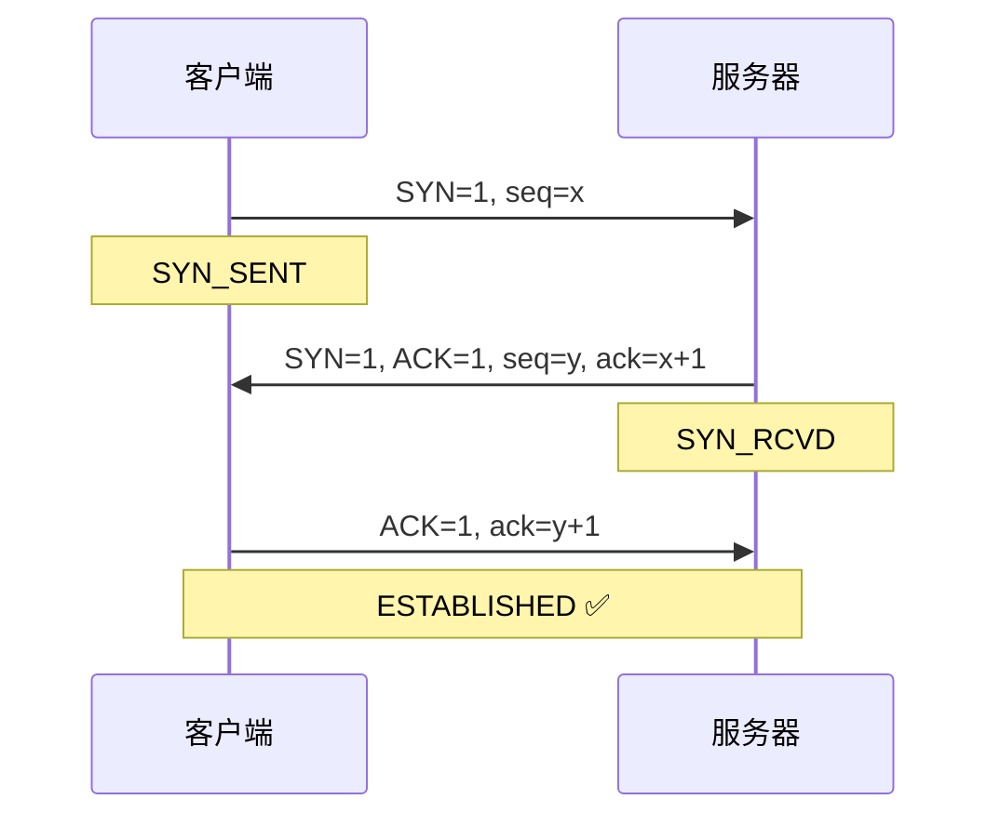

# 计算机网络基础

> **一句话**:TCP 三次握手建立连接、四次挥手断开。HTTP 是应用层协议，HTTPS 加 TLS 加密。

## TCP 三次握手



**为什么三次不是两次**：防止已失效的连接请求到达服务器。旧 SYN 包如果只有两次握手会建立无用连接。

## TCP 四次挥手

```
客户端                          服务器
  │── FIN=1 ────────────────→│  FIN_WAIT_1
  │←── ACK=1 ────────────────│  CLOSE_WAIT
  │←── FIN=1 ────────────────│  LAST_ACK
  │── ACK=1 ────────────────→│
  │  TIME_WAIT(2MSL)→CLOSED  │  CLOSED
```

**为什么四次**：TCP 全双工，双方都要 FIN + ACK。

## HTTP 状态码

| 状态码 | 含义 |
|:--:|------|
| 200 | OK |
| 301/302 | 永久/临时重定向 |
| 400 | 客户端请求错误 |
| 401 | 未认证 |
| 403 | 没权限 |
| 404 | 未找到 |
| 500 | 服务器错误 |
| 502 | 网关错误 |
| 503 | 服务不可用 |

## HTTP vs HTTPS

| | HTTP | HTTPS |
|------|------|-------|
| 加密 | 明文 ❌ | TLS 加密 ✅ |
| 端口 | 80 | 443 |
| 证书 | 无 | CA 证书 |
