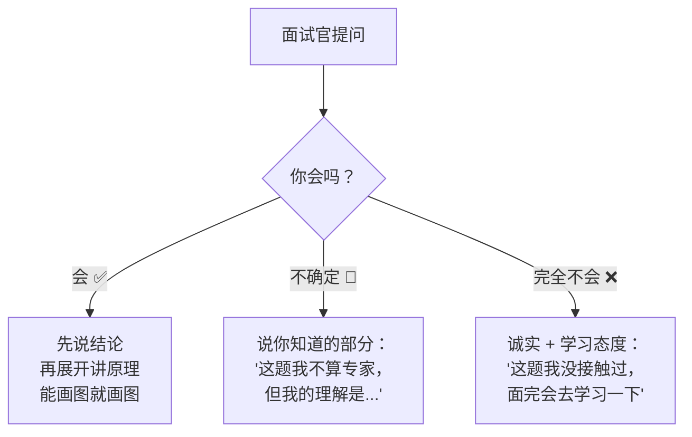

# 面试当天准备清单

> **一句话**:技术准备再好，面试当天的细节掉链子也白搭。

---

## 面试前 24 小时

| 时间 | 做什么 | 重要度 |
|------|--------|:--:|
| 前一天 | 过一遍面试导航索引，挑薄弱点回看对应笔记 | ⭐⭐⭐ |
| 前一天 | 对着镜子练一遍自我介绍（60 秒必须准确） | ⭐⭐⭐⭐⭐ |
| 前一天 | 准备好 3 个反问问题 | ⭐⭐⭐⭐ |
| 前一天 | 查公司官网 + 产品 + 技术博客，了解业务 | ⭐⭐⭐⭐ |
| 前一天 | 看岗位 JD，把每一条要求和自己的经验对上 | ⭐⭐⭐⭐ |
| 前一晚 | 把身份证、简历 2 份、充电宝装进包里 | ⭐⭐ |
| 前一晚 | **早睡**！别熬夜突击（状态 > 知识） | ⭐⭐⭐⭐⭐ |

---

## 面试前 1 小时

- 再看一遍自我介绍
- 翻一下自己最熟悉的 3 个项目（当场问项目不会慌）
- 喝口水，去趟洗手间
- 不要再看新知识了（来不及理解，反而扰乱心态）

---

## 面试中 — 不会的问题怎么破



**关键原则**：
1. 不会就说不会，硬编会被追问到死 → 印象更差
2. 说「我了解一点，但不深入」然后转到你熟悉的相邻知识点
3. 每个回答控制在 1-2 分钟（太长面试官会走神）

---

## 技术问题回答结构（万能公式）

```
① 一句话总结：用 10 秒说清楚是什么
② 原理/画图：用 30 秒讲怎么工作
③ 代码/实践：用 30 秒证明你用过
④ trade-off：用 20 秒说"为什么选这个不选那个"

例：
问：HashMap 为什么线程不安全？
① 「两个原因：数据覆盖和扩容时的并发问题。」
② 「put 的时候，两个线程同时拿到同个链表，一个线程的赋值可能被覆盖。」
③ 「我们线上踩过坑，压测的时候 HashMap.size 比实际插入少，换成 ConcurrentHashMap 解决。」
④ 「ConcurrentHashMap 用 CAS+synchronized 锁单桶，比 HashTable 全表锁快，但比 HashMap 多了一点内存开销。」
```

---

## 常见陷阱

| 陷阱 | 怎么办 |
|------|--------|
| 面试官连问三个你不会的 | **别慌**！可能是故意的压力测试。深呼吸，诚实回答，展示学习态度。 |
| 你会的面试官不问了 | 在回答里主动抛出——"这个场景我们还考虑了 YYY 方案，虽然最后没选..." |
| 算法题卡住了 | 先说思路——即使没写完代码，思路对也能拿一半分 |
| 面试官打断你 | 可能时间紧，快速跳到结论 |

---

## 面试后

- 当天晚上发感谢消息（3 句话：兴趣+亮点+期待）
- 把被问住的问题记下来，补到知识库里
- 不管结果如何，复盘一次：哪些答得好、哪些没答好

---

> 💪 面试不是考试，是和面试官的**技术交流**。你有真实的项目、有系统化的知识库、有三条路线的准备——自信聊就行。
