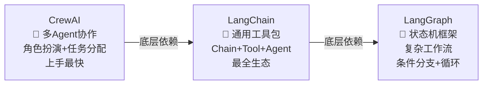

# Python Agent 开发实战 — 框架对比与选型

> **一句话**:Python 是 AI Agent 开发的主力语言。面试官会问「你用过哪些框架？选哪个为什么？」——不是考你会不会用，是考你**理解框架的设计差异**。

## 三大框架定位



## 框架深度对比

| 维度 | LangChain | LangGraph | CrewAI | AutoGen |
|------|-----------|-----------|--------|---------|
| 定位 | 工具包 | 工作流引擎 | 多 Agent 协作 | 对话式多 Agent |
| 上手难度 | 中（概念多） | 高（状态机思维） | **低（5 分钟出 Demo）** | 中 |
| 适合场景 | 简单 Agent + RAG | 复杂多步推理 | 角色分工协作 | 多轮对话协作 |
| Agent 模式 | ReAct | 自定义状态图 | 角色+任务 | 对话驱动 |
| 回调/流式 | ✅ | ✅ | ✅ | ✅ |
| 中文生态 | ⭐⭐⭐⭐⭐ | ⭐⭐⭐ | ⭐⭐ | ⭐ |
| 公司 | LangChain Inc | LangChain Inc | CrewAI Inc | Microsoft |

## 选型决策树

```
问：任务需要多步条件判断+循环？
  是 → LangGraph（状态机式工作流）
  否 → 继续

问：需要多个 Agent 分工协作？
  是 → CrewAI（角色扮演，上手快）
  否 → 继续

问：只是简单 RAG + 工具调用？
  是 → LangChain（最全生态，最稳）
```

## 代码对比 — 同一任务三种写法

### 任务：「搜索最新 AI 新闻，翻译成中文，总结要点」

**LangChain 写法**：

```python
from langchain.agents import create_openai_functions_agent, AgentExecutor
from langchain.tools import Tool
from langchain_openai import ChatOpenAI

# 定义工具
tools = [
    Tool(name="search", func=lambda q: search_news(q), description="搜索新闻"),
    Tool(name="translate", func=lambda t: translate_to_cn(t), description="翻译成中文"),
]

# 创建 Agent
llm = ChatOpenAI(model="deepseek-v4-pro")
agent = create_openai_functions_agent(llm, tools, prompt)
executor = AgentExecutor(agent=agent, tools=tools)
result = executor.invoke({"input": "搜索最新的 AI 新闻，翻译成中文并总结"})
```

**LangGraph 写法**：

```python
from langgraph.graph import StateGraph, END
from typing import TypedDict

class AgentState(TypedDict):
    query: str
    news: str
    translated: str
    summary: str

workflow = StateGraph(AgentState)

def search_node(state):
    state["news"] = search_news(state["query"])
    return state

def translate_node(state):
    state["translated"] = translate_to_cn(state["news"])
    return state

def summarize_node(state):
    state["summary"] = llm.invoke(f"总结：{state['translated']}")
    return state

workflow.add_node("search", search_node)
workflow.add_node("translate", translate_node)
workflow.add_node("summarize", summarize_node)
workflow.set_entry_point("search")
workflow.add_edge("search", "translate")
workflow.add_edge("translate", "summarize")
workflow.add_edge("summarize", END)

app = workflow.compile()
result = app.invoke({"query": "最新 AI 新闻"})
```

**CrewAI 写法**：

```python
from crewai import Agent, Task, Crew

researcher = Agent(
    role="研究员",
    goal="搜索最新的 AI 新闻",
    backstory="你是资深 AI 研究员",
    tools=[search_tool],
)

translator = Agent(
    role="翻译员",
    goal="将新闻翻译成中文",
    backstory="你是专业中英翻译",
    tools=[translate_tool],
)

summarizer = Agent(
    role="编辑",
    goal="总结新闻要点",
    backstory="你是资深科技编辑",
)

task1 = Task(description="搜索最新的 AI 新闻", agent=researcher)
task2 = Task(description="翻译成中文", agent=translator)
task3 = Task(description="总结成 200 字要点", agent=summarizer)

crew = Crew(agents=[researcher, translator, summarizer],
            tasks=[task1, task2, task3])
result = crew.kickoff()
```

## Function Calling 统一适配层（实战经验）

```python
"""统一 OpenAI 和 Anthropic 的 function calling 格式"""
import json
from typing import Any

def normalize_tool_call(response: dict) -> dict:
    """把不同模型的 tool call 格式统一"""
    # OpenAI 格式
    if "tool_calls" in response:
        tc = response["tool_calls"][0]
        return {
            "name": tc["function"]["name"],
            "arguments": json.loads(tc["function"]["arguments"])
        }
    # Anthropic 格式
    elif "content" in response:
        for block in response["content"]:
            if block["type"] == "tool_use":
                return {
                    "name": block["name"],
                    "arguments": block["input"]
                }
    raise ValueError(f"Unknown tool call format: {response}")

def execute_tool(name: str, args: dict) -> str:
    """安全执行工具调用"""
    tool = TOOL_REGISTRY.get(name)
    if not tool:
        return json.dumps({"error": f"Unknown tool: {name}"})

    # 参数校验
    schema = tool["parameters"]
    for param, info in schema.items():
        if info.get("required") and param not in args:
            return json.dumps({"error": f"Missing required param: {param}"})

    # 执行 + 异常兜底
    try:
        result = tool["handler"](**args)
        return json.dumps({"success": True, "data": result})
    except Exception as e:
        return json.dumps({"success": False, "error": str(e)})
```

## 面试话术

「Python Agent 开发我用了三个框架应对不同场景。简单的 RAG + 搜索用 LangChain，上手快生态全。复杂工作流用 LangGraph——它把 Agent 的执行建模成状态图，比 LangChain 的线性 Chain 灵活很多。多个 Agent 分工的场景用 CrewAI，角色扮演的方式直观、5 分钟就能出原型。选框架不是看谁新谁热，是看任务复杂度和技术团队的熟悉度。」
