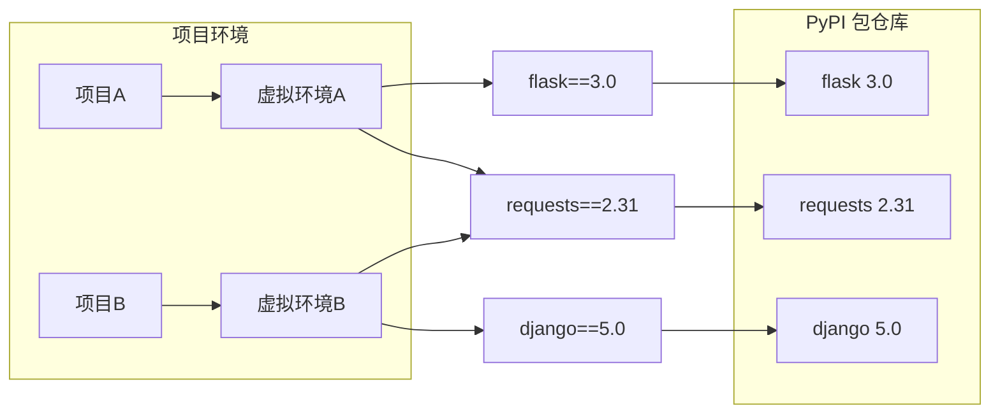

# Python 包管理与环境

> **一句话**:Python 的包管理是"乱世"，但用对工具并不复杂。记住：**uv 是现代首选，pip + venv 是兜底方案**。

## 核心概念

### Java Maven vs Python 包管理

| Java (Maven) | Python | 说明 |
|-------------|--------|------|
| `pom.xml` | `requirements.txt` / `pyproject.toml` | 依赖声明文件 |
| `mvn clean install` | `pip install` / `uv pip install` | 安装依赖 |
| `~/.m2/repository` | /venv/lib/python3.x/site-packages | 包存储位置 |
| Maven Central | PyPI (https://pypi.org) | 包仓库 |
| `mvn compile` | 无需编译（解释型语言） | |

### 核心概念



| 概念 | 解释 | 类比 |
|------|------|------|
| **PyPI** | Python 的官方包仓库（类似 Maven Central） | Maven 仓库 |
| **虚拟环境** | 隔离的项目依赖环境，每个项目有自己的包 | 每个项目一个 Maven `pom.xml` |
| **pip** | 官方包管理工具（类似 Maven 但功能弱很多） | Maven（但更基础） |
| **uv** | 新一代包管理，比 pip 快 10-100 倍 | Maven（但更快） |
| **poetry** | 更现代的项目管理，同时管依赖和打包 | Gradle |

## 代码实例

### 方案 A：pip + venv（最基础，够用）

```bash
# ===== 1. 创建虚拟环境 =====
# Windows:
python -m venv myenv
myenv\Scripts\activate       # 激活虚拟环境

# Mac/Linux:
# python3 -m venv myenv
# source myenv/bin/activate

# 激活后终端前面会出现 (myenv) 标记
(myenv) C:\Users\...$

# ===== 2. 安装依赖 =====
pip install requests          # 安装最新版
pip install requests==2.31.0  # 安装指定版本
pip install requests>=2.30    # 安装不低于某个版本

# ===== 3. 生成依赖清单 =====
pip freeze > requirements.txt  # 导出所有依赖

# 生成的 requirements.txt 内容:
# requests==2.31.0
# flask==3.0.0
# ...

# ===== 4. 在别的机器上安装 =====
pip install -r requirements.txt  # 一次性安装所有依赖

# ===== 5. 常用命令 =====
pip list                    # 查看已安装的包
pip show requests           # 查看某个包的详细信息
pip uninstall requests      # 卸载包
pip install -U requests     # 升级包
```

### 方案 B：uv（强烈推荐！现代首选）

```bash
# ===== 安装 uv（一个命令） =====
# Windows (PowerShell):
# powershell -c "irm https://astral.sh/uv/install.ps1 | iex"

# Mac/Linux:
# curl -LsSf https://astral.sh/uv/install.sh | sh

# 或者用 pip
pip install uv

# ===== 为什么 uv 更快？ =====
# uv 是用 Rust 写的，比 pip（Python 写的）快 10-100 倍
# pip install: 下载+安装 100 个包 ≈ 30-60 秒
# uv pip install: 同样的操作 ≈ 2-5 秒

# ===== uv 的使用（和 pip 几乎一样） =====

# 1. 创建虚拟环境
uv venv
# Windows 激活:
.venv\Scripts\activate

# 2. 安装依赖（比 pip 快 10 倍）
uv pip install requests openai chromadb langchain

# 3. 导出依赖
uv pip freeze > requirements.txt

# 4. 从 requirements.txt 安装
uv pip install -r requirements.txt

# 5. uv 的一键项目初始化（未来趋势）
# uv init        # 创建 pyproject.toml
# uv add requests # 添加依赖 + 直接安装
# uv sync        # 同步依赖
```

### 方案 C：Poetry（专业项目级）

```bash
# ===== 安装 =====
pip install poetry

# ===== 创建新项目 =====
poetry new my-agent-project
cd my-agent-project

# ===== 添加依赖 =====
poetry add openai          # 安装并自动写入 pyproject.toml
poetry add langchain --dev # 开发依赖

# ===== 安装所有依赖 =====
poetry install

# ===== 运行脚本 =====
poetry run python main.py  # 在虚拟环境中运行

# ===== 生成的 pyproject.toml =====
# [tool.poetry.dependencies]
# python = "^3.11"
# openai = "^1.0"
# langchain = "^0.2"
```

### Agent 项目推荐配置

```toml
# pyproject.toml - Agent 项目的标准配置
[project]
name = "my-agent"
version = "0.1.0"
requires-python = ">=3.11"

dependencies = [
    "openai>=1.0",           # LLM API 调用
    "chromadb>=0.5",         # 向量数据库
    "langchain>=0.2",        # Agent 框架（可选）
    "fastapi>=0.110",        # API 部署
    "uvicorn>=0.29",         # ASGI 服务器
    "aiohttp>=3.9",          # 异步 HTTP
    "python-dotenv>=1.0",    # 环境变量
]

[project.optional-dependencies]
dev = [
    "pytest>=8.0",           # 测试
    "mypy>=1.0",             # 类型检查
    "ruff>=0.3",             # 代码格式化（替代 flake8+black）
]

# Agent 项目依赖速查表
# pip install:
#   openai           # OpenAI/DeepSeek 通用 SDK
#   chromadb         # 向量数据库
#   langchain        # Agent 框架
#   fastapi          # API 服务
#   uvicorn          # 服务器
#   aiohttp          # 异步 HTTP
#   httpx            # HTTP 客户端（推荐，支持同步/异步）
#   sentence-transformers  # 本地 Embedding
#   python-dotenv    # 环境变量管理
#   pydantic         # 数据校验（LangChain 依赖）
```

### 环境变量管理

```python
# ===== .env 文件管理敏感信息 =====
# 项目根目录创建 .env 文件:
# OPENAI_API_KEY=sk-xxx
# DEEPSEEK_API_KEY=sk-yyy
# CHROMA_PERSIST_DIR=./data/chroma

# .env 文件加入 .gitignore，不上传到 GitHub！

# 在代码中读取:
from dotenv import load_dotenv
import os

load_dotenv()  # 加载 .env 文件

api_key = os.getenv("DEEPSEEK_API_KEY")
if not api_key:
    raise ValueError("请设置 DEEPSEEK_API_KEY 环境变量")

# 或者直接设置环境变量（Windows PowerShell）:
# $env:DEEPSEEK_API_KEY="sk-xxx"
# python main.py

# Windows CMD:
# set DEEPSEEK_API_KEY=sk-xxx
# python main.py
```

### pip 换源（国内用户必看）

```bash
# 国内 pip 下载慢，换成国内镜像源

# 阿里云（推荐，速度快稳定）
pip config set global.index-url https://mirrors.aliyun.com/pypi/simple/

# 清华大学
# pip config set global.index-url https://pypi.tuna.tsinghua.edu.cn/simple/

# 临时使用（一次性的）
# pip install -i https://mirrors.aliyun.com/pypi/simple/ openai

# uv 使用国内源
# uv pip install --index-url https://mirrors.aliyun.com/pypi/simple/ openai
```

## 常见误区

- **误区1**: "pip install 装的包全局可用" —— 错！pip 默认装到当前 Python 环境的 site-packages。如果没激活虚拟环境，可能装到系统 Python 里，导致不同项目混乱。
- **误区2**: "requirements.txt 要手动写" —— 不需要。用 `pip freeze > requirements.txt` 或 `uv pip freeze > requirements.txt` 自动生成。也可以直接指定最顶层的依赖（`pip freeze` 会列出所有子依赖）。
- **误区3**: "把 .env 文件传到 GitHub" —— 绝对不要！加 `echo ".env" >> .gitignore`。可以用 `.env.example` 作为模板。
- **误区4**: "每次都 pip install 很慢" —— 用 uv 替代 pip，快 10 倍。或者加国内镜像源。

## 参考来源

- uv 官方文档: https://docs.astral.sh/uv/
- pip 官方文档: https://pip.pypa.io/en/stable/
- Poetry 文档: https://python-poetry.org/docs/
- Python 虚拟环境指南: https://docs.python.org/3/tutorial/venv.html
- 相关笔记: `Python异步编程.md`
