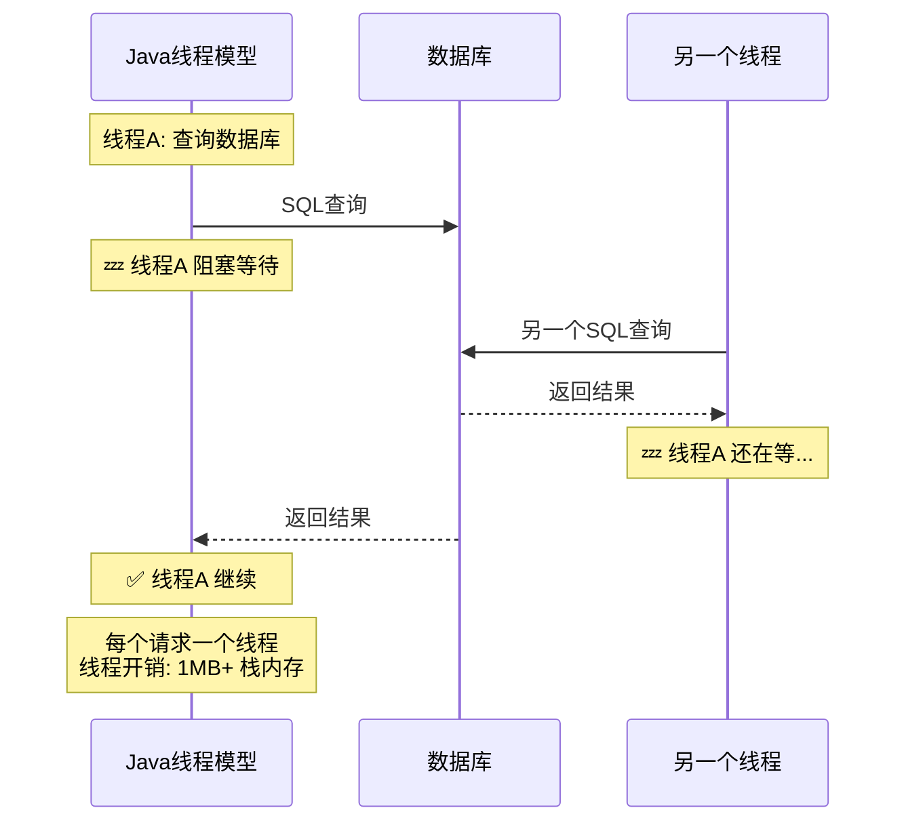

# Python 异步编程

> **一句话**:Agent 开发的绝大部分时间都在等——等 LLM API 返回、等数据库查询、等搜索接口——而异步编程让你在等的这段空闲里干别的事。**不会 async = Agent 性能差 10 倍**。

## 核心概念

### Java 线程 vs Python 异步



```mermaid
sequenceDiagram
    participant Loop as Python事件循环
    participant API1 as LLM API 1
    participant API2 as LLM API 2

    Note over Loop: 协程A: 调用LLM
    Loop->>API1: 发送请求
    Note over Loop: 协程A await → 挂起
    Loop->>API2: 协程B 发送请求（同时！）
    Note over Loop: 两个请求都在等...
    API1-->>Loop: 协程A 收到响应
    Loop-->>Loop: 继续执行协程A
    API2-->>Loop: 协程B 收到响应
    Loop-->>Loop: 继续执行协程B

    Note over Loop: 单线程 + 事件循环<br/>协程开销: ~几KB
```

| 维度 | Java 多线程 | Python 异步 |
|------|------------|------------|
| 并发模型 | 线程/线程池 | 协程/事件循环 |
| 资源开销 | 1MB+/线程 | 几KB/协程 |
| 适用场景 | CPU 密集 | **I/O 密集（Agent 场景！）** |
| 切换机制 | 操作系统抢占式 | 程序主动 `await` |
| 性能 | 线程多时上下文切换开销大 | 大量并发时仍高效 |

**Agent 开发为什么必须用异步**：
```
一个典型的 Agent 流程:
1. 用户提问
2. 调用 LLM API（等 2-5 秒） ← 纯等待
3. 解析返回结果（瞬间）
4. 调用搜索工具（等 0.5-1 秒） ← 纯等待
5. 再调用 LLM API（等 2-5 秒） ← 纯等待
6. 输出回答

同步: 一个一个等，耗时 = 所有步骤之和
异步: 多个等待可以重叠，耗时 ≈ 最慢的那个
```

### 核心概念速查

| 概念 | 解释 | Java 类比 |
|------|------|-----------|
| `async def` | 定义一个协程（可暂停的函数） | `CompletableFuture.supplyAsync()` |
| `await` | 暂停当前协程，等结果 | `.get()` 但**不阻塞线程** |
| `asyncio.run()` | 启动事件循环 | `ExecutorService.submit()` |
| `asyncio.gather()` | 并发执行多个协程 | `CompletableFuture.allOf()` |
| `asyncio.sleep()` | 非阻塞等待 | `Thread.sleep()` 但**不阻塞** |

## 代码实例

### 基础语法

```python
import asyncio
import time

# ===== 1. 定义协程 =====
async def say_hello():
    print("Hello")
    await asyncio.sleep(1)    # 暂停1秒，但不阻塞其他协程
    print("World")

# 运行协程
asyncio.run(say_hello())     # 输出 Hello → (1秒后) → World

# ===== 2. 并发执行（最重要！） =====
async def fetch_data(name: str, delay: int) -> str:
    print(f"开始获取 {name}...")
    await asyncio.sleep(delay)               # 模拟 I/O 等待
    print(f"完成获取 {name}")
    return f"{name} 的数据"

async def main():
    # 同步执行: 总耗时 = delay1 + delay2 + delay3
    # r1 = await fetch_data("A", 2)   # 等2秒
    # r2 = await fetch_data("B", 3)   # 再等3秒
    # r3 = await fetch_data("C", 1)   # 再等1秒
    # 总耗时: 6秒

    # 并发执行: 总耗时 = 最慢的那个
    results = await asyncio.gather(
        fetch_data("A", 2),    # 同时开始
        fetch_data("B", 3),    # 同时开始
        fetch_data("C", 1),    # 同时开始
    )
    print(results)  # ['A 的数据', 'B 的数据', 'C 的数据']
    # 总耗时: 3秒（最慢的 B 花 3 秒）

asyncio.run(main())
```

### Agent 开发实战：异步 LLM 调用

```python
"""
实际 Agent 开发中的异步用法
"""

import asyncio
from openai import AsyncOpenAI

async_client = AsyncOpenAI(
    api_key="your-key",
    base_url="https://api.deepseek.com"
)

# ===== 1. 基础：异步调用 LLM =====
async def async_llm(prompt: str) -> str:
    """异步调用 LLM（不阻塞事件循环）"""
    response = await async_client.chat.completions.create(
        model="deepseek-chat",
        messages=[{"role": "user", "content": prompt}],
        temperature=0
    )
    return response.choices[0].message.content

# ===== 2. 批量并发：同时处理多个请求 =====
async def batch_process(queries: list[str]) -> list[str]:
    """批量处理多个问题，耗时 ≈ 最慢的那个"""
    tasks = [async_llm(q) for q in queries]
    return await asyncio.gather(*tasks)

# 使用:
# 同步版: 处理 10 个问题，每个 3 秒 → 总耗时 30 秒
# 异步版: 处理 10 个问题，每个 3 秒 → 总耗时 3-5 秒

# ===== 3. 流式输出 =====
async def stream_llm(prompt: str):
    """流式输出 LLM 回复"""
    stream = await async_client.chat.completions.create(
        model="deepseek-chat",
        messages=[{"role": "user", "content": prompt}],
        stream=True   # 启用流式
    )

    async for chunk in stream:     # 异步迭代
        if chunk.choices[0].delta.content:
            yield chunk.choices[0].delta.content  # 逐个 token 生成

# FastAPI 中配合 SSE 使用
# @app.post("/chat")
# async def chat_endpoint(prompt: str):
#     return StreamingResponse(stream_llm(prompt))

# ===== 4. 带超时的 Agent 调用 =====
async def agent_with_timeout(prompt: str, timeout: int = 30):
    """给 Agent 调用加超时"""
    try:
        result = await asyncio.wait_for(
            async_llm(prompt),
            timeout=timeout        # 30秒超时
        )
        return result
    except asyncio.TimeoutError:
        return "Agent 响应超时"

# ===== 5. 限速（Rate Limiting）=====
import asyncio

class RateLimiter:
    """控制 API 调用的并发数"""
    def __init__(self, max_concurrent: int = 5):
        self.semaphore = asyncio.Semaphore(max_concurrent)

    async def call_with_limit(self, prompt: str) -> str:
        async with self.semaphore:    # 控制同时只能有 5 个请求
            return await async_llm(prompt)

# ===== 6. 真实的 Agent 循环（异步版）=====
class AsyncAgent:
    def __init__(self):
        self.client = async_client

    async def run(self, question: str) -> str:
        """异步 Agent 主循环"""
        messages = [{"role": "user", "content": question}]

        for step in range(5):
            response = await self.client.chat.completions.create(
                model="deepseek-chat",
                messages=messages,
                tools=self.tools
            )

            msg = response.choices[0].message
            messages.append(msg)

            if not msg.tool_calls:
                return msg.content

            # 并行执行多个工具调用
            tool_tasks = []
            for tc in msg.tool_calls:
                tool_tasks.append(self.execute_tool(tc))

            # 并发执行所有工具
            results = await asyncio.gather(*tool_tasks)

            for tc, result in zip(msg.tool_calls, results):
                messages.append({
                    "role": "tool",
                    "tool_call_id": tc.id,
                    "content": result
                })

        return "达到最大步数"

    async def execute_tool(self, tool_call) -> str:
        """异步执行单个工具"""
        # 模拟工具调用
        await asyncio.sleep(0.5)  # 工具执行耗时
        return f"工具 {tool_call.function.name} 执行结果"

# ===== 运行异步 Agent =====
async def main():
    agent = AsyncAgent()
    result = await agent.run("帮我查一下北京和上海的天气")
    print(f"最终结果: {result}")

# 在 Python 脚本中运行
if __name__ == "__main__":
    asyncio.run(main())
```

### 同步和异步的混用问题（新手必踩的坑）

```python
# ❌ 错误：在异步函数中调用同步阻塞函数
import requests

async def bad_agent():
    # requests.get() 是同步的，会阻塞整个事件循环！
    response = requests.get("https://api.example.com")
    return response.text

# ✅ 正确：用 aiohttp 替代 requests
import aiohttp

async def good_agent():
    async with aiohttp.ClientSession() as session:
        async with session.get("https://api.example.com") as response:
            return await response.text()

# ✅ 或者：用 asyncio.to_thread 把同步代码放到线程池
def sync_llm_call(prompt: str) -> str:
    """同步的 LLM 调用"""
    import openai
    client = openai.OpenAI(api_key="your-key")
    return client.chat.completions.create(...)

async def async_wrapper(prompt: str) -> str:
    """用线程池包装同步调用"""
    return await asyncio.to_thread(sync_llm_call, prompt)

# ✅ 常用异步 HTTP 客户端
# pip install aiohttp
# pip install httpx    # 支持同步/异步切换，更推荐
```

### Agent 开发中的异步模式总结

| 场景 | 推荐方式 | 说明 |
|------|---------|------|
| 单次 LLM 调用 | `await client.chat.create()` | 最简单的异步调用 |
| 批量多路调用 | `await asyncio.gather(*tasks)` | 并发 N 个请求，耗时=最慢的 |
| 流式输出 | `async for chunk in stream` | 实时展示 LLM 回答 |
| 带超时 | `await asyncio.wait_for(coro, timeout)` | 防止卡死 |
| 限速 | `asyncio.Semaphore(n)` | 控制并发数 |
| 睡眠 | `await asyncio.sleep(n)` | 非阻塞等待 |
| 同步转异步 | `await asyncio.to_thread(func)` | 兼容旧代码 |

## 常见误区

- **误区1**: "异步 = 并行" —— 错。Python 异步是并发（concurrent）但不是并行（parallel）。单线程中通过切换执行。但 Agent 开发是 I/O 密集（等 API），不是 CPU 密集，所以并发就够了。
- **误区2**: "一用 async 就自动快了" —— 错。如果代码里没有 `await` 的 I/O 操作，用 async 反而更慢（有额外开销）。
- **误区3**: "在 Jupyter/REPL 里不能跑 async" —— 可以，用 `await` 直接调用（Jupyter 有内置事件循环）。但脚本里必须用 `asyncio.run()`。
- **误区4**: "异步函数里不能用同步库" —— 可以用，但同步库会阻塞事件循环。推荐用 `asyncio.to_thread` 包装。

## 参考来源

- Python asyncio 官方文档: https://docs.python.org/3/library/asyncio.html
- Real Python 异步教程: https://realpython.com/python-async-features/
- 相关笔记: `Python包管理与环境.md`
