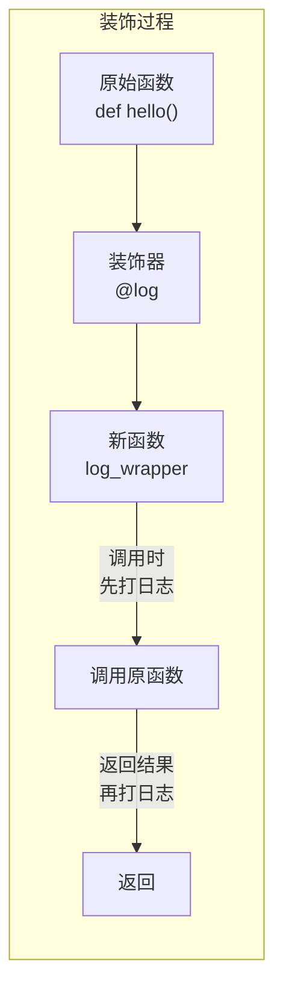

# Python 高级特性

> **一句话**:这 4 个高级特性是 Python 区别于 Java 最核心的地方——装饰器（注解+AOP 的简化版）、生成器（懒加载）、上下文管理器（try-finally 的优雅版）、类型注解（可选的静态检查）。

## 核心概念

### 1. 装饰器 Decorator — Java 注解 + AOP 的合体

装饰器是 Python 最核心也最优雅的设计之一。理解它 = 理解 Java 注解 + AOP + 函数式编程。

**本质**：装饰器就是"一个接收函数作为参数、返回新函数的函数"。



**为什么 Agent 开发必须掌握装饰器**：

| 场景 | 用装饰器 | 不用装饰器 |
|------|---------|-----------|
| 工具调用日志 | 一行 `@log_tool_call` | 每个工具函数都要写日志代码 |
| LLM 调用重试 | 一行 `@retry(max=3)` | 每个 API 调用都包 try-catch |
| 缓存 | 一行 `@lru_cache` | 自己手写缓存逻辑 |
| 限流 | 一行 `@rate_limit(10)` | 每个工具函数加计数 |

```python
# ===== 装饰器基础 =====
# 装饰器 = 接收函数 → 返回新函数

# 最简单的装饰器
def log(func):
    def wrapper(*args, **kwargs):
        print(f"调用: {func.__name__}({args}, {kwargs})")
        result = func(*args, **kwargs)
        print(f"返回: {result}")
        return result
    return wrapper

# 使用装饰器（等价于: say_hello = log(say_hello)）
@log
def say_hello(name: str) -> str:
    return f"Hello, {name}"

say_hello("Alice")
# 输出:
# 调用: say_hello(('Alice',), {})
# 返回: Hello, Alice

# ===== Java 工程师理解 =====
# @log  = Java 的 @Log 注解
# def log(func) ...  = AOP 的 @Around 切面
# wrapper 函数       = MethodInterceptor

# ===== Agent 开发中的实用装饰器 =====

# 1. 工具调用日志
def log_tool_call(func):
    def wrapper(*args, **kwargs):
        print(f"🔧 [工具] {func.__name__}")
        start = time.time()
        result = func(*args, **kwargs)
        elapsed = time.time() - start
        print(f"✅ [完成] {elapsed:.2f}s")
        return result
    return wrapper

@log_tool_call
def search_web(query: str) -> str:
    # 实际搜索逻辑
    return f"搜索结果: {query}"

# 2. 重试装饰器（Agent 开发必备）
import time
from functools import wraps

def retry(max_attempts: int = 3, delay: int = 1):
    """函数调用失败时自动重试"""
    def decorator(func):
        @wraps(func)  # 保持原函数的元信息
        def wrapper(*args, **kwargs):
            for attempt in range(max_attempts):
                try:
                    return func(*args, **kwargs)
                except Exception as e:
                    if attempt == max_attempts - 1:
                        raise  # 最后一次失败，向上抛
                    print(f"重试 {attempt+1}/{max_attempts}: {e}")
                    time.sleep(delay)
            return None
        return wrapper
    return decorator

@retry(max_attempts=3, delay=2)
def call_llm_api(prompt: str) -> str:
    # API 调用可能超时
    return "response"

# 3. 缓存装饰器（减少重复 API 调用）
from functools import lru_cache

@lru_cache(maxsize=128)
def get_embedding(text: str) -> list:
    """相同的文本不会重复调用 Embedding API"""
    return [0.1, 0.2, 0.3]  # 实际会调 API
```

### 2. 生成器 Generator — 懒加载的序列

**本质**：生成器是"按需生产"的迭代器，不像列表那样一次性生成所有元素。

```python
# ===== 普通列表 vs 生成器 =====

# 列表：一次性生成所有数据，占用内存
squares_list = [x*x for x in range(1000000)]  # 立即创建 100 万个元素
print(sys.getsizeof(squares_list))  # ~8MB

# 生成器：按需生成，几乎不占内存
squares_gen = (x*x for x in range(1000000))  # 生成器表达式，用 () 不是 []
print(sys.getsizeof(squares_gen))  # ~200 字节！

# 使用 yield 创建生成器
def fibonacci(n):
    """生成前 n 个斐波那契数"""
    a, b = 0, 1
    for _ in range(n):
        yield a           # yield = return + 暂停
        a, b = b, a + b   # 下次从这继续

for num in fibonacci(10):
    print(num)  # 0, 1, 1, 2, 3, 5, 8, 13, 21, 34

# ===== 为什么 Agent 开发需要生成器？ =====

# 1. 流式输出 LLM 结果（最常用）
def stream_llm_response(prompt: str):
    """模拟 LLM 流式输出"""
    for token in ["你好", "，", "今天", "天气", "真", "好"]:
        yield token       # 生成一个 token
        time.sleep(0.1)   # 模拟延迟

for token in stream_llm_response("你好"):
    print(token, end="", flush=True)  # 流式渲染

# 2. 处理大量文档（RAG 场景）
def load_documents_in_chunks(filepath: str, chunk_size: int = 1000):
    """按需读取文档块，不把所有内容加载到内存"""
    with open(filepath, 'r', encoding='utf-8') as f:
        chunk = []
        for line in f:
            chunk.append(line)
            if len(chunk) >= chunk_size:
                yield ''.join(chunk)
                chunk = []
        if chunk:
            yield ''.join(chunk)

# 3. Agent 步骤生成
def agent_steps(goal: str, max_steps: int = 10):
    """逐步生成 Agent 的执行步骤"""
    for step in range(max_steps):
        thought = f"第{step+1}步: 分析当前状态..."
        yield {"step": step, "thought": thought}
        action = f"执行: search('{goal}')"
        yield {"step": step, "action": action}
        if step > 3:
            yield {"step": step, "answer": "信息足够，可以回答"}
            return
```

### 3. 上下文管理器 Context Manager — try-finally 的优雅版

**本质**：`with` 语句自动管理资源的获取和释放。

```python
# ===== Java 的 try-with-resources vs Python 的 with =====
# Java: try (InputStream is = new FileInputStream("file.txt")) { ... }
# Python:
with open("file.txt", "r") as f:
    content = f.read()
# 自动关闭文件，不用 finally

# ===== Agent 开发中的上下文管理器 =====

# 1. 计时
import time

class Timer:
    def __enter__(self):
        self.start = time.time()
        return self

    def __exit__(self, exc_type, exc_val, exc_tb):
        self.elapsed = time.time() - self.start
        print(f"⏱ 耗时: {self.elapsed:.2f}s")

with Timer() as t:
    # 模拟 LLM 调用
    time.sleep(1)
print(f"代理用时: {t.elapsed:.2f}s")

# 2. API 调用跟踪
class TrackAPICall:
    def __init__(self, tool_name: str):
        self.tool_name = tool_name

    def __enter__(self):
        print(f"📞 开始调用: {self.tool_name}")
        self.start = time.time()
        return self

    def __exit__(self, exc_type, exc_val, exc_tb):
        cost = time.time() - self.start
        if exc_type:
            print(f"❌ 失败: {self.tool_name} ({exc_val})")
        else:
            print(f"✅ 完成: {self.tool_name} ({cost:.2f}s)")
        return False  # 不吞异常

# 使用
with TrackAPICall("deepseek-chat"):
    response = client.chat.completions.create(...)

# 3. @contextmanager 装饰器（简化写法）
from contextlib import contextmanager

@contextmanager
def session_scope():
    """数据库会话管理器"""
    session = create_session()
    try:
        yield session
    except Exception:
        session.rollback()
        raise
    finally:
        session.close()

with session_scope() as session:
    session.query(...)
```

### 4. 类型注解 Type Hints — 可选的静态类型

**本质**：Python 3.5+ 支持类型注解，不强制但推荐。配合 mypy 能做静态类型检查。

```python
# ===== 基础类型注解 =====
name: str = "张三"
age: int = 25
price: float = 99.9
is_active: bool = True

# ===== 容器类型 =====
from typing import List, Dict, Tuple, Set, Optional, Union

# 列表
names: List[str] = ["张三", "李四", "王五"]
matrix: List[List[int]] = [[1, 2], [3, 4]]

# 字典
user: Dict[str, object] = {"name": "张三", "age": 25}

# 元组
coords: Tuple[float, float] = (116.4, 39.9)

# 可选值（= Java Optional）
def find_user(user_id: int) -> Optional[str]:
    if user_id == 1:
        return "张三"
    return None  # 可能返回 None

# 联合类型（= 一个类型或另一个类型）
def parse_value(val: Union[str, int]) -> str:
    if isinstance(val, int):
        return str(val)
    return val

# Python 3.10+ 可以用更简洁的语法
# def parse_value(val: str | int) -> str:  # 不用 Union

# ===== 函数注解 =====
def process_data(
    data: List[str],
    max_length: int = 100,
    filter_func: callable = None
) -> Dict[str, int]:
    """类型注解会自动成为文档"""
    result: Dict[str, int] = {}
    for item in data:
        if filter_func and filter_func(item):
            continue
        result[item] = len(item)
    return result

# ===== Agent 开发中的类型注解 =====

# 定义清晰的 Agent 接口
class AgentTool(BaseModel):
    name: str
    description: str
    parameters: Dict[str, object]

class AgentMessage(BaseModel):
    role: str  # system / user / assistant / tool
    content: str
    tool_calls: Optional[List[Dict]] = None
    tool_call_id: Optional[str] = None

class AgentState(TypedDict):
    """Agent 的状态类型"""
    messages: List[AgentMessage]
    current_step: int
    max_steps: int
    tools: List[AgentTool]

# ===== 检查类型 =====
# mypy your_file.py
# 会检查类型注解是否正确，和 Java 编译器一样
```

## 常见误区 / 面试点

- **误区1**: "装饰器很难理解" —— 其实就三句话：它接收一个函数、返回一个新函数、`@` 只是语法糖。
- **误区2**: "类型注解会让 Python 变慢" —— 不会。类型注解运行时被忽略，只在静态检查工具（mypy）中生效。
- **误区3**: "生成器和列表随便用" —— 数据量大时生成器省内存，但生成器不能随机访问（不能 `gen[0]`），需要权衡。

## 参考来源

- Python 官方文档 - 装饰器: https://docs.python.org/3/glossary.html#term-decorator
- Python 官方文档 - 类型注解: https://docs.python.org/3/library/typing.html
- 相关笔记: `Java手册/00-Python基础/03-Python异步编程.md`
