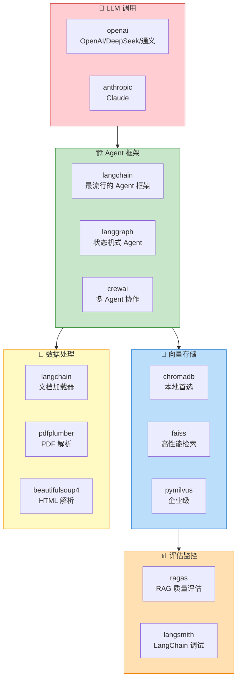

# AI 开发 Python 库速查

> **一句话**：Agent 开发中 80% 的代码都在和这些库打交道。不是罗列所有库，而是告诉你**每个库解决什么问题、什么时候用、怎么快速上手**。

## 全景地图



---

## 一、LLM 调用

### openai — 万能 LLM 客户端

不只是 OpenAI，**DeepSeek、通义千问、智谱、Ollama 等大部分模型都兼容 OpenAI API 格式**。

```python
# 安装
# pip install openai

from openai import OpenAI

# DeepSeek（推荐，便宜好用）
client = OpenAI(
    api_key="your-deepseek-key",
    base_url="https://api.deepseek.com"
)

# 通义千问
# client = OpenAI(
#     api_key="your-qwen-key",
#     base_url="https://dashscope.aliyuncs.com/compatible-mode/v1"
# )

# Ollama 本地模型
# client = OpenAI(
#     api_key="ollama",
#     base_url="http://localhost:11434/v1"
# )

# 最简调用
response = client.chat.completions.create(
    model="deepseek-chat",
    messages=[{"role": "user", "content": "你好"}]
)
print(response.choices[0].message.content)

# Function Calling（Agent 核心能力）
response = client.chat.completions.create(
    model="deepseek-chat",
    messages=[{"role": "user", "content": "北京天气？"}],
    tools=[{
        "type": "function",
        "function": {
            "name": "get_weather",
            "description": "获取城市天气",
            "parameters": {
                "type": "object",
                "properties": {
                    "city": {"type": "string"}
                },
                "required": ["city"]
            }
        }
    }]
)
```

| 模型 | base_url | 推荐场景 |
|------|----------|---------|
| DeepSeek V3 | `https://api.deepseek.com` | 性价比最高，日常 Agent 首选 |
| 通义千问 | `https://dashscope.aliyuncs.com/compatible-mode/v1` | 国内合规要求 |
| Ollama | `http://localhost:11434/v1` | 离线/隐私需求 |
| OpenAI | `https://api.openai.com/v1` | 最强推理（贵） |

---

## 二、Agent 框架

### langchain — 最完整的 Agent 工具箱

```python
# pip install langchain langchain-openai

from langchain_openai import ChatOpenAI
from langchain.agents import create_tool_calling_agent, AgentExecutor
from langchain.tools import tool
from langchain_core.prompts import ChatPromptTemplate

# 定义工具
@tool
def search(query: str) -> str:
    """搜索互联网信息"""
    return f"搜索结果: {query} 相关..."

@tool
def calculator(expression: str) -> str:
    """计算数学表达式"""
    return str(eval(expression))

# 创建 Agent
llm = ChatOpenAI(
    model="deepseek-chat",
    api_key="your-key",
    base_url="https://api.deepseek.com"
)

prompt = ChatPromptTemplate.from_messages([
    ("system", "你是有用的助手"),
    ("human", "{input}"),
    ("placeholder", "{agent_scratchpad}"),
])

agent = create_tool_calling_agent(llm, [search, calculator], prompt)
executor = AgentExecutor(agent=agent, tools=[search, calculator])

result = executor.invoke({"input": "搜索 LangChain 最新版本，然后算 123 * 456"})
```

**什么时候用 LangChain**：
- 需要快速搭建 Agent 原型
- 需要丰富的工具链（文档加载、向量存储、Prompt 模板）
- 团队中有不熟悉底层原理的成员

**什么时候不用**：
- 追求极致性能和可控性 → 直接调 API
- 项目非常简单 → LangChain 太重

### langgraph — 状态机式 Agent

```python
# pip install langgraph

from langgraph.graph import StateGraph, END
from typing import TypedDict, Annotated
import operator

class AgentState(TypedDict):
    messages: Annotated[list, operator.add]
    next_action: str

def router(state: AgentState) -> str:
    """决定下一步"""
    last_msg = state["messages"][-1]
    if "搜索" in last_msg:
        return "search"
    return "respond"

graph = StateGraph(AgentState)
graph.add_node("router", router)
graph.add_node("search", search_node)
graph.add_node("respond", respond_node)

graph.set_entry_point("router")
graph.add_conditional_edges("router", lambda s: s["next_action"])
graph.add_edge("search", "respond")
graph.add_edge("respond", END)

app = graph.compile()
```

**什么时候用 LangGraph**：
- 需要复杂的流程控制（循环、条件分支、并行）
- Agent 的执行流程不是线性的
- 需要可视化 Agent 执行过程

### crewai — 多 Agent 协作

```python
# pip install crewai

from crewai import Agent, Task, Crew

researcher = Agent(
    role="研究员",
    goal="搜集最新信息",
    backstory="你是一个资深研究员",
    llm="deepseek-chat"
)

writer = Agent(
    role="写手",
    goal="撰写高质量报告",
    backstory="你是一个专业写手",
    llm="deepseek-chat"
)

task1 = Task(description="搜索 AI Agent 最新进展", agent=researcher)
task2 = Task(description="基于研究结果撰写报告", agent=writer)

crew = Crew(agents=[researcher, writer], tasks=[task1, task2])
result = crew.kickoff()
```

**详见同目录 `10-Multi-Agent多智能体.md`**

---

## 三、向量存储

### chromadb — 本地开发首选

```python
# pip install chromadb

import chromadb
from chromadb.utils import embedding_functions

client = chromadb.PersistentClient(path="./my_db")
ef = embedding_functions.SentenceTransformerEmbeddingFunction(
    model_name="all-MiniLM-L6-v2"
)

collection = client.get_or_create_collection(
    name="docs", embedding_function=ef
)

# 添加文档
collection.add(
    documents=["HashMap 是数组+链表+红黑树"],
    ids=["doc_1"]
)

# 语义搜索
results = collection.query(
    query_texts=["HashMap 底层结构"],
    n_results=3
)
```

**什么时候用**：开发/测试阶段、< 10 万文档、不需要分布式。

### faiss — 高性能检索

```python
# pip install faiss-cpu  (GPU 版本: faiss-gpu)

import faiss
import numpy as np

# 创建索引
dimension = 768  # embedding 维度
index = faiss.IndexFlatL2(dimension)

# 添加向量
vectors = np.random.random((1000, dimension)).astype('float32')
index.add(vectors)

# 搜索
query = np.random.random((1, dimension)).astype('float32')
distances, indices = index.search(query, k=5)
```

**什么时候用**：大量文档（> 10 万）、需要极致检索速度。注意：FAISS 只是检索库，不负责存储，需要自己管理文本映射。

### Milvus — 企业级

```python
# pip install pymilvus

from pymilvus import MilvusClient

client = MilvusClient("./milvus_demo.db")

# 创建集合
client.create_collection(
    collection_name="docs",
    dimension=768
)

# 插入
client.insert(collection_name="docs", data=[{
    "id": 1, "vector": embedding, "text": "文档内容"
}])

# 搜索
results = client.search(
    collection_name="docs",
    data=[query_vector],
    limit=5
)
```

**什么时候用**：生产环境、需要分布式部署、需要混合检索（向量 + 标量过滤）。

---

## 四、数据处理

| 库 | 用途 | 快速代码 |
|----|------|---------|
| **pdfplumber** | PDF 文本/表格提取 | `pdfplumber.open("a.pdf").pages[0].extract_text()` |
| **beautifulsoup4** | HTML 解析 | `BeautifulSoup(html, "lxml").get_text()` |
| **python-docx** | Word 文档读写 | `Document("a.docx").paragraphs` |
| **unstructured** | 万能文档解析 | `partition(filename="a.pdf")` |
| **tiktoken** | Token 计数 | `tiktoken.get_encoding("cl100k").encode(text)` |

---

## 五、Embedding 模型速查

| 模型 | 维度 | 大小 | 中文 | 用途 |
|------|------|------|------|------|
| `all-MiniLM-L6-v2` | 384 | 80MB | ❌ | 英文轻量，开发调试首选 |
| `BAAI/bge-large-zh-v1.5` | 1024 | 1.3GB | ✅ | 中文最佳 |
| `BAAI/bge-m3` | 1024 | 2.2GB | ✅ | 多语言，2024 SOTA |
| `m3e-base` | 768 | 430MB | ✅ | 中文轻量，够用 |
| `text-embedding-3-small` | 512 | 云 | ✅ | OpenAI，付费 |

---

## 六、评估监控

### ragas — RAG 质量评估

```python
# pip install ragas

from ragas import evaluate
from ragas.metrics import faithfulness, answer_relevancy

results = evaluate(
    dataset=test_dataset,
    metrics=[faithfulness, answer_relevancy]
)
print(results)
```

---

## 快速启动模板

新建 Agent 项目时的最小依赖：

```bash
# requirements.txt — Agent 项目最小依赖
openai>=1.0           # LLM 调用（兼容 DeepSeek/通义/Ollama）
chromadb>=0.4         # 向量数据库（本地）
langchain>=0.3        # Agent 框架（需要时）
sentence-transformers>=2.0  # 本地 Embedding
python-dotenv>=1.0    # 环境变量管理
tiktoken>=0.5         # Token 计数
```

```bash
pip install -r requirements.txt
```

## 参考来源

- 同目录各专题文章
- OpenAI Python SDK: https://github.com/openai/openai-python
- LangChain 文档: https://python.langchain.com/docs
- Chroma 文档: https://docs.trychroma.com
