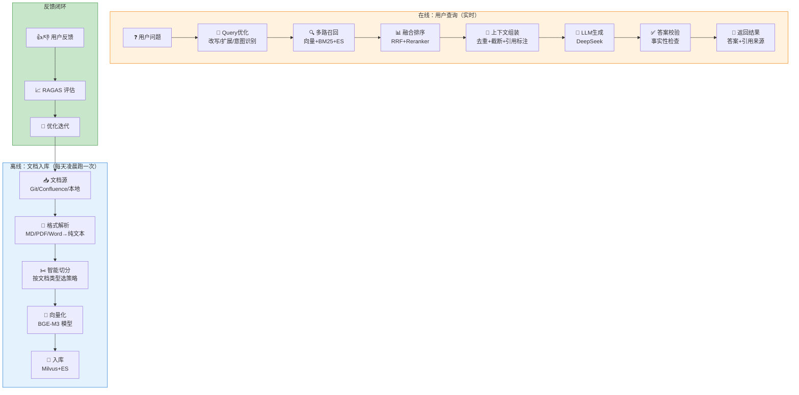

# RAG 企业级落地方案

> **一句话**：真实的企业 RAG 系统不是调个 API 就上线——文档处理、检索优化、效果评估、成本控制、持续迭代，每一步都有坑。本文给你一个可复制、可运行的完整方案。

## 场景设定

以一个典型场景为例：**公司内部技术文档问答系统**。

- 文档量：~50,000 篇（技术文档、API 文档、设计文档、周报）
- 格式：Markdown + PDF + Confluence 页面 + Word
- 用户：200+ 研发人员
- 要求：3 秒内回答、引用来源、支持中英文混合检索

## 系统全景



## 模块一：文档处理流水线

### 1.1 多格式解析

```python
"""
文档解析器路由 —— 根据文件扩展名自动选择解析器
"""

import os
from pathlib import Path


class DocumentRouter:
    """根据文件类型路由到对应的解析器"""

    ROUTES = {
        ".md": "MarkdownParser",
        ".pdf": "PDFParser",
        ".docx": "DocxParser",
        ".txt": "TextParser",
        ".html": "HTMLParser",
    }

    def __init__(self):
        self.parsers = {}  # 懒加载

    def parse(self, file_path: str) -> dict:
        ext = Path(file_path).suffix.lower()
        parser_name = self.ROUTES.get(ext)
        if not parser_name:
            raise ValueError(f"不支持的文件格式: {ext}")

        parser = self._get_parser(parser_name)
        return parser.parse(file_path)

    def _get_parser(self, name: str):
        if name not in self.parsers:
            # 实际项目中这里用工厂模式 + 注册
            ...
        return self.parsers[name]
```

### 1.2 切分策略矩阵

不同类型文档用不同策略，**没有万能切分器**：

| 文档类型 | 推荐策略 | Chunk Size | Overlap | 原因 |
|---------|---------|------------|---------|------|
| Markdown 技术文档 | 按标题层级 | 按 H2/H3 自然切 | 0 | 标题=天然语义边界 |
| API 文档 | 按函数/方法 | 按函数边界 | 0 | 函数=最小完整语义单元 |
| PDF 论文 | 递归切分 | 800-1000 字符 | 200 | 无结构，需要重叠保留上下文 |
| 周报/会议纪要 | 固定长度 | 500 字符 | 100 | 内容松散，不需要精确语义 |
| Confluence 页面 | 按页面 + 段落 | 按段落 | 0 | 页面本身是逻辑单元 |

```python
"""
切分策略选择器
"""

from enum import Enum

class ChunkStrategy(Enum):
    MARKDOWN_HEADER = "markdown_header"    # 按标题
    CODE_FUNCTION = "code_function"        # 按函数
    RECURSIVE = "recursive"                # 递归切分
    FIXED_SIZE = "fixed_size"              # 固定长度
    PAGE_PARAGRAPH = "page_paragraph"      # 按页面段落

# 策略 -> 参数的映射
STRATEGY_CONFIG = {
    ChunkStrategy.MARKDOWN_HEADER: {"chunk_size": 0, "separators": ["\n## ", "\n### "]},
    ChunkStrategy.CODE_FUNCTION:   {"chunk_size": 0, "separators": ["\ndef ", "\nclass "]},
    ChunkStrategy.RECURSIVE:       {"chunk_size": 800, "overlap": 200},
    ChunkStrategy.FIXED_SIZE:      {"chunk_size": 500, "overlap": 100},
}

def get_strategy(doc_type: str) -> ChunkStrategy:
    mapping = {
        "markdown": ChunkStrategy.MARKDOWN_HEADER,
        "api_doc":  ChunkStrategy.CODE_FUNCTION,
        "pdf":      ChunkStrategy.RECURSIVE,
        "weekly":   ChunkStrategy.FIXED_SIZE,
        "confluence": ChunkStrategy.PAGE_PARAGRAPH,
    }
    return mapping.get(doc_type, ChunkStrategy.RECURSIVE)
```

### 1.3 元数据 —— 被严重低估的一环

文档入库时提取元数据，后续检索可以**按元数据过滤**，大幅提升精度：

```yaml
# 每条 Chunk 应该带的元数据
metadata:
  source_file: "HashMap源码分析.md"     # 源文件
  doc_type: "技术文档"                   # 文档类型
  team: "基础架构组"                     # 所属团队
  created_at: "2024-03-15"             # 创建时间
  updated_at: "2025-12-01"             # 最后更新
  version: "v2.3"                      # 版本号
  title_hierarchy: ["Java集合","Map","HashMap"]  # 标题层级
  language: "zh"                       # 语言
  status: "published"                  # 状态：published/draft/archived
```

**实际效果**：用户搜"基础架构组的 HashMap 文档" → 先按 `team=基础架构组` 过滤 → 再语义检索 → 精准度 ↑ 300%。

## 模块二：检索优化

### 2.1 意图识别分流

不是所有问题都适合用同一检索方式。先识别意图，再走不同检索路径：

```python
"""
意图识别 → 分流检索
"""

from enum import Enum

class QueryIntent(Enum):
    FACTUAL = "factual"          # 事实查询："HashMap默认容量是多少？"
    COMPARISON = "comparison"    # 对比查询："HashMap vs ConcurrentHashMap"
    HOW_TO = "how_to"           # 操作指南："怎么配置Redis集群？"
    TROUBLESHOOT = "troubleshoot" # 排错："NullPointerException 怎么解决？"
    OVERVIEW = "overview"       # 概览："介绍一下微服务架构"

INTENT_RETRIEVAL_MAP = {
    QueryIntent.FACTUAL:       ["vector", "bm25"],       # 精准匹配
    QueryIntent.COMPARISON:    ["vector", "bm25", "es"], # 多关键词
    QueryIntent.HOW_TO:        ["vector", "es"],         # 步骤类内容
    QueryIntent.TROUBLESHOOT:  ["bm25", "es"],           # 错误信息关键词
    QueryIntent.OVERVIEW:      ["vector"],               # 语义理解为主
}

def classify_intent(question: str) -> QueryIntent:
    """用 LLM 识别用户意图，成本极低（一次 cheap model 调用）"""
    prompt = f"""分析以下问题的意图类型：
问题：{question}

意图类型（5选1）：
- factual: 询问具体事实/数值
- comparison: 对比两个或多个事物
- how_to: 询问操作步骤/方法
- troubleshoot: 报告错误/异常
- overview: 要求概述/介绍

只输出英文类型名："""
    # 实际用便宜模型（如 deepseek-chat）做分类
    ...
```

### 2.2 多路召回 + 融合

```python
"""
多路召回 + RRF 融合 —— 单次查询的完整检索流程
"""

def multi_route_retrieval(question: str, intent: QueryIntent, top_k: int = 5):
    """根据意图选择检索路径，多路召回并融合"""
    
    routes = INTENT_RETRIEVAL_MAP.get(intent, ["vector", "bm25"])
    
    all_results = []
    
    for route in routes:
        if route == "vector":
            results = vector_store.search(question, k=top_k * 3)
            all_results.append([(r, "vector") for r in results])
        elif route == "bm25":
            results = bm25_index.search(question, k=top_k * 3)
            all_results.append([(r, "bm25") for r in results])
        elif route == "es":
            results = es_client.search(question, k=top_k * 3)
            all_results.append([(r, "es") for r in results])
    
    # RRF 融合
    fused = reciprocal_rank_fusion(all_results, k=60)
    
    # Cross-Encoder 重排序（只对 Top-20 做）
    top20 = fused[:20]
    reranked = cross_encoder.rerank(question, top20, top_k)
    
    return reranked
```

## 模块三：效果评估与监控

### 3.1 RAGAS 评估体系

没有评估就没有优化。企业 RAG 至少监控这四个指标：

```python
"""
RAGAS 评估 —— 每周自动跑一次，生成评估报告
"""

from ragas import evaluate
from ragas.metrics import (
    faithfulness,
    answer_relevancy,
    context_precision,
    context_recall,
)

# 准备测试集（至少 100 条标注过的 Q&A）
test_dataset = load_test_dataset("rag_eval_set.json")

# 跑评估
result = evaluate(
    dataset=test_dataset,
    metrics=[
        faithfulness,      # 答案是否有事实依据
        answer_relevancy,  # 答案是否切题
        context_precision, # 检索到的内容有多少是相关的
        context_recall,    # 相关的内容有多少被检索到了
    ]
)

# 输出报告
print(f"Faithfulness:       {result['faithfulness']:.2%}")       # 目标 > 85%
print(f"Answer Relevancy:   {result['answer_relevancy']:.2%}")   # 目标 > 85%
print(f"Context Precision:  {result['context_precision']:.2%}")  # 目标 > 70%
print(f"Context Recall:     {result['context_recall']:.2%}")     # 目标 > 70%
```

### 3.2 监控 Dashboard（需要关注的指标）

| 指标类型 | 具体指标 | 告警阈值 | 说明 |
|---------|---------|---------|------|
| **质量** | Faithfulness | < 80% | 幻觉率上升，检查 Prompt 和检索质量 |
| **质量** | 用户 👎 率 | > 15% | 用户不满增多 |
| **性能** | P99 延迟 | > 5s | 检索或 LLM 慢了 |
| **性能** | 缓存命中率 | < 30% | 缓存策略需优化 |
| **成本** | 日均 API 费用 | > $50 | LLM 调用太多 |
| **数据** | 文档新鲜度 | > 7 天未更新 | 有文档过期了 |

## 模块四：成本优化

### 4.1 分层缓存策略

```
请求进来
  ├── L1: 精确缓存 (内存, <1ms)
  │     问题哈希完全相同 → 直接返回
  │     命中率: ~15%
  │
  ├── L2: 语义缓存 (向量库, ~50ms)
  │     相似度 > 0.95 → 返回相似问题的答案
  │     命中率: ~25%
  │
  └── L3: 正常 RAG (完整流程, ~2s)
         缓存未命中 → 完整检索+生成
         命中率: ~60%
```

**成本计算**：
- 无缓存：1000 次查询 × $0.01 = **$10/天**
- 有缓存（40% 命中率）：600 次 × $0.01 = **$6/天，节省 40%**

### 4.2 模型分层

```
简单意图分类 → deepseek-chat ($0.14/M tokens)
复杂推理     → deepseek-reasoner ($0.55/M tokens)
Embedding    → BGE-M3 (本地免费)
Reranker     → bge-reranker-v2-m3 (本地免费)
```

**经验**：能用本地模型就用本地模型，只在必须走 LLM 的环节才调 API。

## 落地路线图

| 阶段 | 时间 | 目标 | 关键动作 |
|------|------|------|---------|
| **Phase 1: MVP** | 第 1-2 周 | 跑通基础 RAG | 单向量库 + 基础切分 + LLM |
| **Phase 2: 优化** | 第 3-4 周 | 检索质量 > 80% | 混合检索 + 重排序 + Query 优化 |
| **Phase 3: 生产** | 第 5-6 周 | 上线试运行 | 缓存 + 监控 + 反馈闭环 |
| **Phase 4: 规模** | 第 7-8 周 | 全量上线 | 多路召回 + 意图分流 + 评估体系 |

**核心原则**：每个 Phase 都是可独立验证的。不要把所有优化一次性做完，先上线、再迭代。

## 常见陷阱

- **坑1**：一上来就用 Milvus 集群 → MVP 阶段用 Chroma 就行，10000 篇文档以内完全够用。
- **坑2**：不评估就优化 → 先建 baseline（Faithfulness 多少？），优化后对比，否则不知道改没改好。
- **坑3**：PDF 解析随便选个库 → `PyPDF2` 对中文不好，用 `pdfplumber` 或 `PaddleOCR`。
- **坑4**：忽视文档更新 → 文档改了但向量库没更新，用户搜到旧内容。**必须有定期全量/增量重建机制**。

## 参考来源

- 同目录 `RAG检索增强生成.md` — RAG 原理与技术细节
- 同目录 `RAG系统架构设计.md` — 架构选型与设计决策
- RAGAS: https://docs.ragas.io/
- BGE-M3 Embedding: https://huggingface.co/BAAI/bge-m3
- Chroma: https://docs.trychroma.com/
- Milvus: https://milvus.io/docs/
