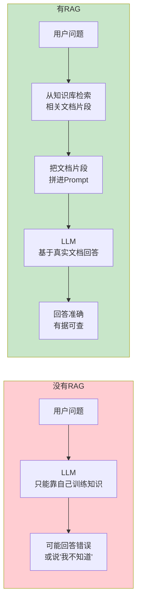
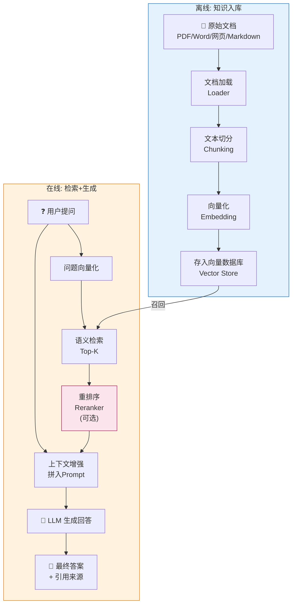
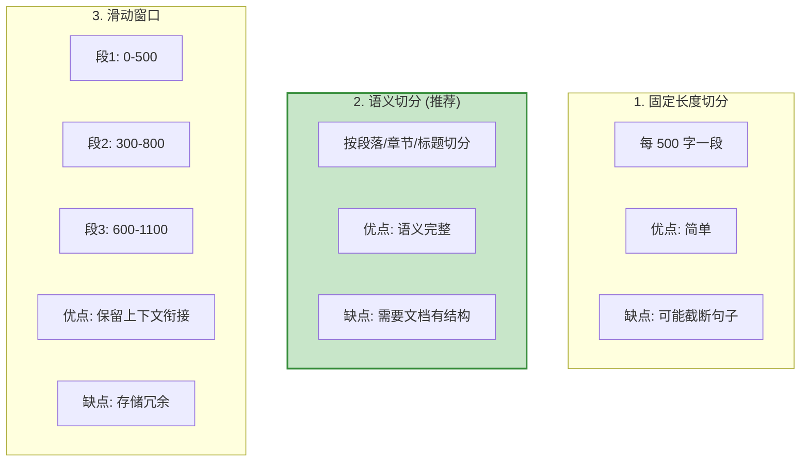

# RAG 检索增强生成

> **一句话**:RAG 让 Agent 拥有自己的知识库——把你的文档存进去，Agent 回答时先检索相关文档再生成答案，从此不再"一本正经地胡说八道"。

## 核心概念

LLM 有两个致命缺陷：
1. **知识有截止日期**（GPT-4 训练数据到 2024 年，不知道之后的事）
2. **不知道你的私有数据**（你的公司内部文档、产品手册、代码库）

RAG 解决这两个问题：**不靠 LLM 自己的记忆，而是每次回答前先从你的知识库中搜索相关内容，拼进 Prompt 里**。



**RAG vs 微调（Fine-tuning）**——企业最常问的问题：

| 维度 | RAG | 微调 |
|------|-----|------|
| 更新知识 | **秒级**，重新导入文档即可 | **天级**，需要重新训练 |
| 数据安全 | 文档不出你的服务器 | 需要发送数据给训练方 |
| 幻觉问题 | **低**，有文档依据 | 中等，模型仍可能编造 |
| 适用场景 | 知识问答、文档助手 | 改变输出风格/格式/专业术语 |
| 成本 | 低（只需向量数据库） | 高（训练计算资源） |
| 推荐度 | **90%的企业场景首选 RAG** | 只在 RAG 不够时补充 |

## 原理图解

### RAG 完整流水线



### 文档切分策略（关键细节）



| 切分策略 | Chunk 大小 | Overlap | 适用场景 |
|----------|-----------|---------|---------|
| 固定长度 | 500-1000 字符 | 50-100 | 文档无结构时 |
| 按段落 | 不固定 | 0 | 结构化文档（Markdown） |
| 递归切分 | 先按大标题→小标题→段落 | 每级 100-200 | **最常用** |
| 滑动窗口 | 500 | 200 | 需要上下文衔接时 |

## 代码实例

### 从零实现 RAG（不依赖框架）

```python
"""
最小 RAG 实现 - 理解原理
安装: pip install chromadb sentence-transformers openai
"""

import chromadb
from chromadb.utils import embedding_functions
from openai import OpenAI

# ========== 配置 ==========
client_llm = OpenAI(
    api_key="your-deepseek-api-key",
    base_url="https://api.deepseek.com"
)

# ========== 第1步: 准备知识文档 ==========
documents = [
    "HashMap是Java中最常用的Map实现。底层结构在JDK8中是数组+链表+红黑树。默认初始容量16，负载因子0.75。当链表长度超过8且数组长度超过64时，链表转为红黑树。put操作的时间复杂度平均O(1)，最坏O(log n)。",
    "ConcurrentHashMap是线程安全的HashMap。JDK7使用Segment分段锁，默认16个Segment。JDK8改为CAS+synchronized，锁粒度从Segment级别降到桶级别。Node数组+链表+红黑树。sizeCtl控制初始化和扩容。",
    "ArrayList是动态数组实现，默认初始容量10。扩容时新容量为旧容量的1.5倍(oldCapacity + oldCapacity >> 1)。add(E)均摊O(1)，add(index,E)最坏O(n)。不是线程安全的，需要外部同步。",
    "LinkedList是双向链表实现。每个节点包含prev和next指针。get(int)需要从头或尾遍历O(n)。add(E)和remove(E)在已知节点位置时O(1)。实现了Deque接口，可以作为队列或栈使用。",
    "Spring Boot自动装配的核心是@SpringBootApplication注解中的@EnableAutoConfiguration。它通过@Import导入AutoConfigurationImportSelector，该类读取META-INF/spring/org.springframework.boot.autoconfigure.AutoConfiguration.imports文件中的自动配置类全限定名，根据条件注解(@ConditionalOnClass等)决定是否加载。",
    "Spring IoC容器本质是一个大的Bean工厂。BeanDefinitionRegistry存储Bean定义，DefaultSingletonBeanRegistry存储单例Bean。BeanFactory是基础接口，ApplicationContext是高级接口(继承BeanFactory+消息+事件等)。",
]

# ========== 第2步: 文档切分 ==========
def split_text(text: str, chunk_size: int = 200, overlap: int = 50) -> list:
    """简单滑动窗口切分"""
    chunks = []
    start = 0
    while start < len(text):
        end = start + chunk_size
        chunks.append(text[start:end])
        start += chunk_size - overlap  # 滑动
    return chunks

all_chunks = []
for i, doc in enumerate(documents):
    chunks = split_text(doc)
    for j, chunk in enumerate(chunks):
        all_chunks.append({
            "text": chunk,
            "id": f"doc{i}_chunk{j}",
            "metadata": {"source_doc": i}
        })
print(f"切分后共 {len(all_chunks)} 个文本块")

# ========== 第3步: 向量化并存入数据库 ==========
chroma_client = chromadb.PersistentClient(path="./rag_demo_db")
ef = embedding_functions.SentenceTransformerEmbeddingFunction(
    model_name="all-MiniLM-L6-v2"
)
collection = chroma_client.get_or_create_collection(
    name="java_knowledge", embedding_function=ef
)

collection.add(
    documents=[c["text"] for c in all_chunks],
    ids=[c["id"] for c in all_chunks],
    metadatas=[c["metadata"] for c in all_chunks]
)
print(f"已存入向量数据库: {collection.count()} 条")

# ========== 第4步: 检索 + 生成 ==========
def rag_query(question: str, top_k: int = 3) -> str:
    """RAG 查询: 检索 → 拼Prompt → LLM生成"""

    # 4a. 语义检索
    results = collection.query(query_texts=[question], n_results=top_k)

    # 4b. 拼装 Prompt
    context_parts = []
    for i, doc in enumerate(results["documents"][0]):
        context_parts.append(f"[文档{i+1}] {doc}")
    context = "\n".join(context_parts)

    prompt = f"""根据以下参考资料回答问题。如果资料中没有相关信息，请明确说明。

参考资料:
{context}

问题: {question}

请基于参考资料回答，并在答案末尾标注引用了哪个文档。"""

    # 4c. LLM 生成
    response = client_llm.chat.completions.create(
        model="deepseek-chat",
        messages=[{"role": "user", "content": prompt}],
        temperature=0
    )

    return response.choices[0].message.content

# ========== 测试 ==========
if __name__ == "__main__":
    questions = [
        "HashMap的扩容机制是怎样的？",
        "ConcurrentHashMap在JDK8中做了什么改进？",
        "Spring Boot的自动装配原理是什么？",
    ]

    for q in questions:
        print(f"\n{'='*60}")
        print(f"问: {q}")
        print(f"{'='*60}")
        answer = rag_query(q)
        print(f"答: {answer}")
```

## 常见误区 / 面试点

- **误区1**: "RAG 就是向量搜索" —— 不完全是。向量搜索只是检索环节的一种方式。完整的 RAG 还包括文档处理、切分策略、重排序、答案生成等环节。
- **误区2**: "检索的文档越多越好" —— 错。塞太多文档会：① 超出上下文窗口 ② LLM 注意力分散反而降低质量。**Top-3 到 Top-5** 是经验甜点。
- **误区3**: "chunk 越大越好" —— 错。chunk 太大 → 检索不精准（一大段里只有一句有用）；chunk 太小 → 缺少上下文。**500-1000 token 是常用范围**。
- **面试追问方向**:
  - "如何评估 RAG 效果？" → 准确率、召回率、答案相关性（RAGAS 框架）
  - "检索不精准怎么办？" → ① 重排序（Reranker）② 混合检索（BM25 + 向量）③ 调整 chunk 大小
  - "RAG 和 Agent 的关系？" → RAG 是 Agent 记忆层的一种实现方式，Agent 可能用 RAG 检索知识，也可能用其他方式

## 项目代码参考

本文的 RAG 实现在 Python Agent 项目中：

| 代码文件 | 对应函数/类 | 演示的概念 |
|---------|------------|-----------|
| `agent-project-py/src/agent_rag.py` | `MiniRAG` | 完整 RAG 系统（文档→向量→检索→生成） |
| `agent-project-py/src/agent_rag.py` | `MiniRAG.query()` | 语义检索 + LLM 生成 |

> 📍 完整映射见 `20-知识与代码双向映射.md`

## 参考来源

- LangChain RAG 文档: https://python.langchain.com/docs/tutorials/rag/
- RAGAS 评估框架: https://docs.ragas.io
- LlamaIndex RAG 教程: https://docs.llamaindex.ai
- 相关笔记: `Java手册/06-AI与Agent/03-记忆系统.md`
