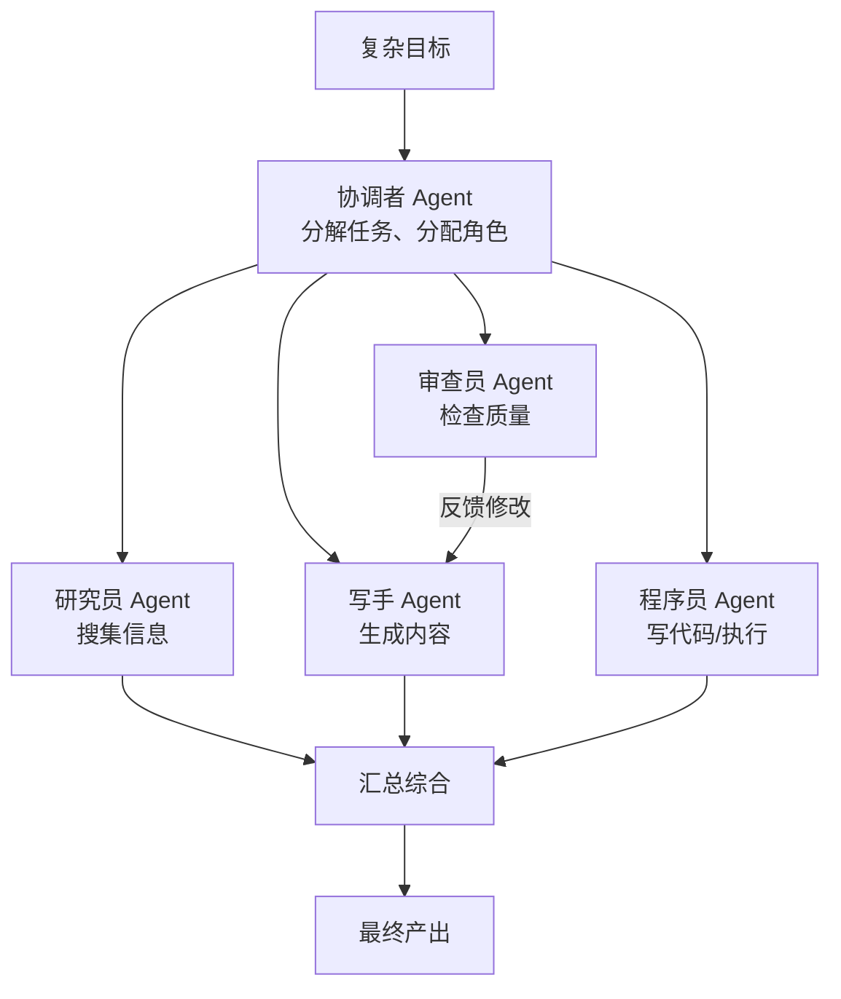
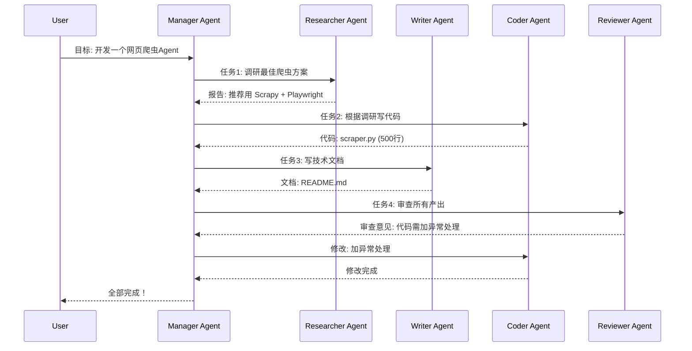
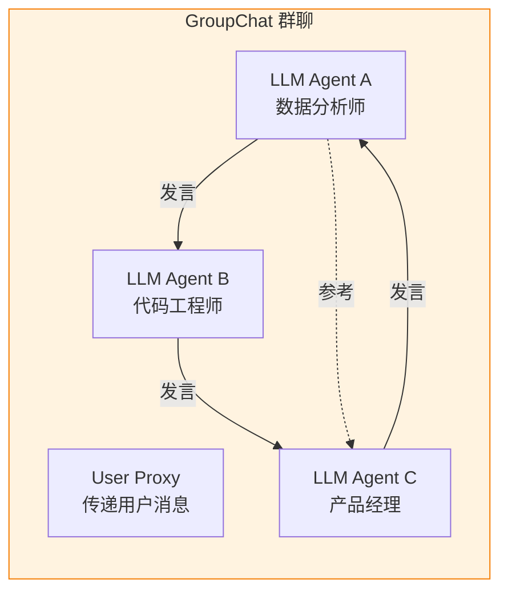

# Multi-Agent 多智能体协作

> **一句话**:当单个 Agent 搞不定时，让多个 Agent 组成"团队"——每个 Agent 扮演不同角色，像真正的团队一样讨论、分工、协作完成任务。

## 核心概念

单个 Agent 的能力有上限（上下文窗口、单次推理质量）。多 Agent 通过协作突破这个上限：



### 多 Agent 协作的四种模式

| 模式 | 结构 | 特点 | 代表框架 |
|------|------|------|---------|
| **顺序管道** | A→B→C | 简单，线性传递 | LangChain Chain |
| **层级管理** | 经理→员工 | 有管理者协调分配 | CrewAI(hierarchical) |
| **平等讨论** | A↔B↔C | 无中心，互相讨论 | AutoGen(groupchat) |
| **市场拍卖** | 投标→竞争 | 任务公开招标，Agent竞争接单 | AutoGen(magentic-one) |

## 原理图解

### CrewAI 角色协作架构



### AutoGen 群聊模式



## 代码实例

### AutoGen 多Agent讨论示例

```python
"""
AutoGen 多Agent 群聊示例
安装: pip install autogen-agentchat
"""

from autogen_agentchat.agents import AssistantAgent
from autogen_agentchat.conditions import MaxMessageTermination
from autogen_agentchat.teams import RoundRobinGroupChat
from autogen_ext.models.openai import OpenAIChatCompletionClient

# ========== 创建模型客户端 ==========
model_client = OpenAIChatCompletionClient(
    model="deepseek-chat",
    api_key="your-key",
    base_url="https://api.deepseek.com/v1",
)

# ========== 创建Agent角色 ==========

analyst = AssistantAgent(
    name="数据分析师",
    system_message="""你是一位资深数据分析师。
    你擅长从数据中提取洞察，关注数字、趋势和证据。
    讨论中你需要提供数据支撑观点。""",
    model_client=model_client,
)

engineer = AssistantAgent(
    name="技术架构师",
    system_message="""你是一位技术架构师，有15年经验。
    你擅长系统设计、技术选型和架构评审。
    讨论中你需要评估技术可行性。""",
    model_client=model_client,
)

pm = AssistantAgent(
    name="产品经理",
    system_message="""你是一位产品经理。
    你关注用户体验、市场需求和产品策略。
    讨论中你需要从用户角度提出需求和优先级。""",
    model_client=model_client,
)

# ========== 组建团队 ==========
team = RoundRobinGroupChat(
    agents=[analyst, engineer, pm],
    max_turns=6,  # 最多6轮发言（防止无限循环）
)

# ========== 运行讨论 ==========
topic = "我们要开发一个AI驱动的代码审查工具，请讨论技术方案和产品策略。"

result = await team.run(topic)

# 输出讨论过程（每位Agent依次发言，互相回应）
for message in result.messages:
    print(f"[{message.source}]: {message.content}\n")
```

## 常见误区 / 面试点

- **误区1**: "Agent 越多越好" —— 错。每多一个 Agent 就多一次 LLM 调用（= 成本和延迟）。2-4 个 Agent 是甜点，超过 5 个通常得不偿失。
- **误区2**: "多 Agent 一定比单 Agent 强" —— 不一定。简单任务单 Agent 更快更便宜。多 Agent 适合**需要多种专业视角**的复杂任务（如: 研究+写作+审查）。
- **面试追问方向**:
  - "多 Agent 通信用什么模式？" → 共享状态（LangGraph）、消息传递（AutoGen）、函数调用（CrewAI）
  - "如何防止 Agent 陷入死循环？" → 最大轮次限制、超时、终止条件、人类审批节点

## 参考来源

- AutoGen 文档: https://microsoft.github.io/autogen/
- CrewAI 文档: https://docs.crewai.com
- Magentic-One 论文: https://arxiv.org/abs/2410.03314
- 相关笔记: `Java手册/06-AI与Agent/07-框架对比与选型.md`

## 2026 年关键更新：MCP 与 A2A 协议

> 详见经验笔记：[Agent框架选型-2026](../../经验笔记/AI-Agent/项目实战/Agent框架选型-2026.md)

### 两大核心协议

| 协议 | 发起方 | 连接对象 | 定位 |
|------|--------|---------|------|
| **MCP** | Anthropic | Agent ↔ 工具/数据 | AI 的"USB-C 接口" |
| **A2A** | Google | Agent ↔ Agent | "智能体间的对讲机" |

**MCP + A2A 互补而非竞争**：MCP 给 Agent 工具，A2A 给 Agent 彼此。生产级系统通常两者并用。

### 什么时候不需要多 Agent？

| 场景 | 推荐 |
|------|------|
| 串行流水线（构思→大纲→写作） | **单体 Agent** — 不需要并行协作 |
| 不需要外部工具调用 | **单体 Agent** — MCP 是多余的 |
| 上下文能全塞进窗口（<1M tokens） | **单体 Agent** — 不需要 RAG |
| 单个开发者维护 | **单体 Agent** — 多 Agent 增加运维成本 |

**原则**：先有一个能用的单体 Agent，再考虑拆分成多 Agent。不要为了用框架而用框架。
