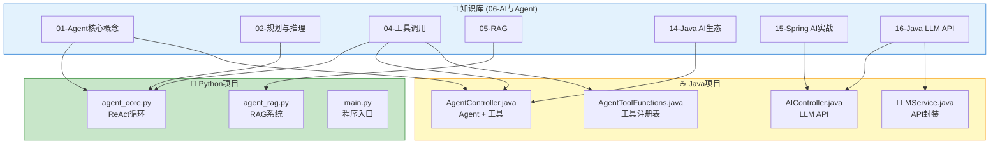

# 知识↔代码双向映射索引

> **一句话**:学知识时知道去哪看代码，看代码时知道对应什么知识——这个映射表就是桥梁。

## 总览

## 知识篇目 → 对应代码文件

| 篇目 | 概念 | Python 代码位置 | Java 代码位置 |
|------|------|----------------|--------------|
| `01-Agent核心概念.md` | Agent 定义、四层架构、最小Agent | `agent-project-py/src/agent_core.py` | `agent-project-java/src/.../controller/AgentController.java` |
| `02-规划与推理.md` | ReAct 循环、Thought→Action→Observation | `agent-project-py/src/agent_core.py` (run_agent 函数) | `agent-project-java/src/.../controller/AgentController.java` (runAgent 方法) |
| `03-记忆系统.md` | 向量数据库、长期记忆 | `agent-project-py/src/agent_rag.py` (MiniRAG 类) | — |
| `04-工具调用.md` | Function Calling、工具注册 | `agent-project-py/src/agent_core.py` (TOOLS 列表) | `agent-project-java/src/.../service/AgentToolFunctions.java` (TOOL_DEFINITIONS) |
| `05-RAG检索增强生成.md` | 文档→向量→检索→生成 | `agent-project-py/src/agent_rag.py` (MiniRAG.query) | — |
| `14-Java AI开发生态概览.md` | Java AI 框架路线 | — | `agent-project-java/pom.xml` (依赖配置) |
| `15-Spring AI实战.md` | Spring Boot + AI | — | `agent-project-java/.../controller/AIController.java` |
| `16-Java LLM API调用.md` | 原生 HTTP 调 API | — | `agent-project-java/.../service/LLMService.java` |
| `17-Java向量数据库与RAG.md` | Java 向量数据库方案 | — | `agent-project-java/pom.xml` (pgvector/Chroma 配置) |
| `18-Java AI项目实战模式.md` | SSE/重试/缓存/异步 | — | `agent-project-java/.../controller/AIController.java` |
| `19-Agent开发环境搭建指南.md` | 环境安装配置 | `agent-project-py/src/main.py` | `agent-project-java/.../AgentDemoApplication.java` |

## 代码文件 → 对应知识篇目

### 🐍 Python 项目 (`E:\AI\utils\agent-project-py\`)

| 文件 | 函数/类 | 功能 | 对应知识篇目 |
|------|---------|------|-------------|
| `src/main.py` | `main()` | 项目入口、交互菜单 | `19-Agent开发环境搭建指南.md` |
| `src/agent_core.py` | `run_agent()` | ReAct 循环：Thought→Action→Observation | `01-Agent核心概念.md`、`02-规划与推理.md` |
| `src/agent_core.py` | `TOOLS` | 工具定义（JSON Schema） | `04-工具调用.md` |
| `src/agent_core.py` | `TOOL_MAP` | 工具路由表（函数名→实际函数） | `04-工具调用.md` |
| `src/agent_rag.py` | `MiniRAG` | RAG 系统：文档导入→向量化→检索→回答 | `05-RAG检索增强生成.md`、`03-记忆系统.md` |
| `src/agent_rag.py` | `MiniRAG.query()` | 语义检索 + LLM 生成 | `05-RAG检索增强生成.md` |
| `requirements.txt` | — | 依赖清单 | `04-Python包管理与环境.md` |

### ☕ Java 项目 (`E:\AI\utils\agent-project-java\`)

| 文件 | 函数/类 | 功能 | 对应知识篇目 |
|------|---------|------|-------------|
| `AgentDemoApplication.java` | `main()` | Spring Boot 启动类 | `19-Agent开发环境搭建指南.md` |
| `controller/AIController.java` | `chat()` | LLM 基础聊天 API | `15-Spring AI实战.md`、`16-Java LLM API调用.md` |
| `controller/AIController.java` | `chatWithSystem()` | 带 System Prompt 的聊天 | `06-Prompt工程.md` |
| `controller/AgentController.java` | `runAgent()` | ReAct Agent + Function Calling | `14-Java AI开发生态概览.md`、`04-工具调用.md` |
| `service/LLMService.java` | `chatWithSystem()` | DeepSeek API 封装（RestTemplate） | `16-Java LLM API调用.md` |
| `service/LLMService.java` | `extractJson()` | 结构化输出（JSON 解析） | `06-Prompt工程.md` |
| `service/AgentToolFunctions.java` | `TOOL_DEFINITIONS` | 工具 JSON Schema 定义 | `04-工具调用.md` |
| `service/AgentToolFunctions.java` | `TOOLS` | 工具函数注册表 | `04-工具调用.md` |
| `pom.xml` | — | Maven 依赖配置 | `14-Java AI开发生态概览.md` |

## 如何使用这个映射

### 场景1：学知识时
> 你在读 `04-工具调用.md` 中关于 Function Calling 的概念
> → 看映射表：Python 侧有 `agent_core.py` 的 `TOOLS` 和 `TOOL_MAP`
> → 打开对应文件，看**真实的工具定义 JSON 长什么样**
> → 读懂了理论，又看到了实操代码

### 场景2：看代码时
> 你在改 `AgentController.java` 里的 `runAgent()` 方法
> → 看映射表：对应 `04-工具调用.md` 和 `14-Java AI开发生态概览.md`
> → 打开知识库，看**为什么 Agent 要这样设计**
> → 改完代码，又加深了原理理解

### 场景3：出了问题
> 代码报错或结果不对
> → 看映射表找到对应的知识篇目
> → 去 `13-实战场景与解决方案.md` 查症状
> → 或者去 `经验笔记\AI-Agent\常见问题记录.md` 看有没有类似踩坑

## 参考来源

- Python 项目: `E:\AI\utils\agent-project-py\`
- Java 项目: `E:\AI\utils\agent-project-java\`
- 知识库: `E:\知识库\Java手册\06-AI与Agent\`
- 经验笔记: `E:\知识库\经验笔记\AI-Agent\`
