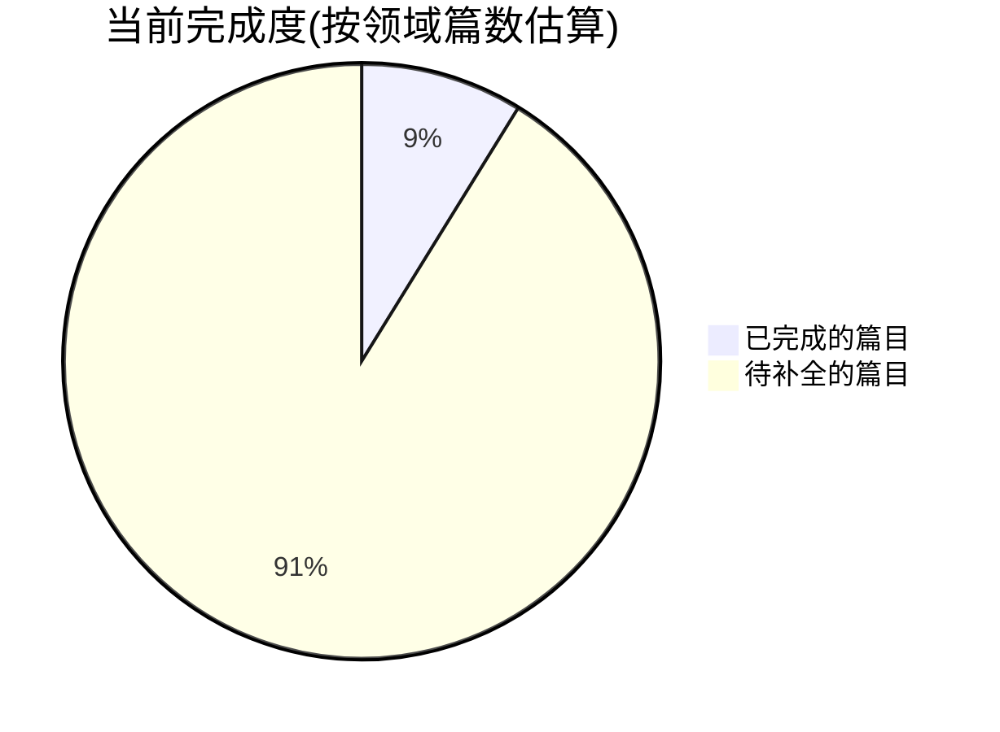

# Java 学习手册

> 系统化的 Java 后端知识库:每个知识点都包含 **原理讲解 + Mermaid 图解 + 可运行实例 + 面试点**。
>
> 内容借鉴 [`E:\知识库\JavaGuide`](../JavaGuide)(只读引用,不改动原库),并在此基础上补充图解和实例。

## 知识地图

```mermaid
graph LR
	START([学习路径]) --> P[00 Python 基础 🐍]
	    START --> A[01 Java 核心]
	    START --> B[02 数据库]
	    START --> C[03 框架]
	    START --> D[04 分布式与高可用]
	    START --> E[05 计算机基础]
	    START --> F[06 AI 与 Agent]

	    P --> P1[Python速成]
	    P --> P2[高级特性]
	    P --> P3[异步编程]
	    P --> P4[包管理]
	    P --> P5[数据处理]

	    A --> A1[基础语法]
	    A --> A2[集合框架]
	    A --> A3[并发编程]
	    A --> A4[JVM]
	    A --> A5[IO]
	    A --> A6[新特性]

	    F --> F1[Agent核心概念]
	    F --> F2[规划与推理]
	    F --> F3[记忆系统]
	    F --> F4[工具调用]
	    F --> F5[RAG]
	    F --> F6[Prompt工程]
	    F --> F7[框架选型]
	    F --> F8[LangChain]
	    F --> F9[LangGraph]
	    F --> F10[Multi-Agent]
		    F --> F11[部署运维]
		    F --> F12[学习路径]
		    F --> F13[实战场景]
		    F --> F14[Java AI生态]

    B --> B1[MySQL]
    B --> B2[Redis]
    B --> B3[SQL]
    B --> B4[Elasticsearch]
    B --> B5[MongoDB]

    C --> C1[Spring]
    C --> C2[SpringBoot]
    C --> C3[MyBatis]
    C --> C4[Netty]

    D --> D1[分布式基础]
    D --> D2[消息队列]
    D --> D3[RPC]
    D --> D4[高可用]
    D --> D5[系统设计]

    E --> E1[网络]
    E --> E2[操作系统]
    E --> E3[数据结构与算法]

    style START fill:#4CAF50,color:#fff
    style A fill:#2196F3,color:#fff
    style B fill:#FF9800,color:#fff
	    style C fill:#9C27B0,color:#fff
	    style D fill:#F44336,color:#fff
	    style E fill:#607D8B,color:#fff
	    style F fill:#00BCD4,color:#fff
	    style P fill:#4CAF50,color:#fff
	```

## 建议学习顺序

```mermaid
flowchart TD
    L1[第一阶段: 打地基] --> A1[Java 基础 + 集合]
    A1 --> A2[并发 + JVM]
    L2[第二阶段: 数据存储] --> B1[MySQL 索引/事务]
    B1 --> B2[Redis 缓存]
    L3[第三阶段: 框架应用] --> C1[Spring IoC/AOP]
    C1 --> C2[SpringBoot]
	L4[第四阶段: 进阶] --> D1[分布式理论]
	D1 --> D2[消息队列/RPC]
	L5[第五阶段: 内功] --> E1[网络/操作系统/算法<br/>可随时穿插]

	L0[第0阶段: 语言基础 🔥] --> P1[Python速成]
	P1 --> P2[高级特性+异步]
	P2 --> P3[包管理+数据处理]

	L6[第六阶段: AI Agent 🆕] --> F1[Agent核心概念]
	F1 --> F2[Prompt + 工具调用]
	F2 --> F3[RAG + 向量数据库]
	F3 --> F4[LangChain/LangGraph]
	F4 --> F5[实战项目]

	style L1 fill:#E8F5E9
	style L2 fill:#FFF3E0
	style L3 fill:#F3E5F5
	style L4 fill:#FFEBEE
	style L5 fill:#ECEFF1
	style L6 fill:#E0F7FA
	style F5 fill:#00BCD4,color:#fff
```

## 目录导航

> 标记说明:✅ 已完成 / 🚧 部分完成 / 📋 待补全

### 00 Python 基础 🐍
| 主题 | 文件 | 状态 |
|------|------|------|
| Python速成(Java工程师视角) | [01-Python速成](00-Python基础/01-Python速成-Java工程师视角.md) | ✅ |
| 高级特性(装饰器/生成器/上下文/类型注解) | [02-Python高级特性](00-Python基础/02-Python高级特性.md) | ✅ |
| 异步编程(async/await/asyncio) | [03-Python异步编程](00-Python基础/03-Python异步编程.md) | ✅ |
| 包管理与环境(pip/uv/venv/poetry) | [04-Python包管理与环境](00-Python基础/04-Python包管理与环境.md) | ✅ |
| 数据与文件处理(JSON/CSV/正则/Path) | [05-Python数据与文件处理](00-Python基础/05-Python数据与文件处理.md) | ✅ |

### 01 Java 核心
| 主题 | 目录 | 状态 |
|------|------|------|
| 基础(语法/反射/泛型/代理/SPI) | [01-基础](01-java核心/01-基础) | 📋 |
| 集合(List/Map/Set/Queue) | [02-集合](01-java核心/02-集合) | 🚧 [HashMap](01-java核心/02-集合/HashMap.md) |
| 并发(线程/锁/JMM/线程池/AQS) | [03-并发](01-java核心/03-并发) | 🚧 [线程池](01-java核心/03-并发/线程池.md) |
| JVM(内存/GC/类加载) | [04-JVM](01-java核心/04-JVM) | 🚧 [内存结构](01-java核心/04-JVM/内存结构.md) |
| IO(BIO/NIO/AIO/模型) | [05-IO](01-java核心/05-IO) | 📋 |
| 新特性(Java 8-25) | [06-新特性](01-java核心/06-新特性) | 📋 |

### 02 数据库
| 主题 | 目录 | 状态 |
|------|------|------|
| MySQL(索引/事务/MVCC/优化) | [01-MySQL](02-数据库/01-MySQL) | 🚧 [索引](02-数据库/01-MySQL/索引.md) |
| Redis(数据结构/持久化/集群) | [02-Redis](02-数据库/02-Redis) | 🚧 [持久化](02-数据库/02-Redis/持久化.md) |
| SQL(语法/优化) | [03-SQL](02-数据库/03-SQL) | 📋 |
| Elasticsearch | [04-Elasticsearch](02-数据库/04-Elasticsearch) | 📋 |
| MongoDB | [05-MongoDB](02-数据库/05-MongoDB) | 📋 |

### 03 框架
| 主题 | 目录 | 状态 |
|------|------|------|
| Spring(IoC/AOP/事务/注解) | [01-Spring](03-框架/01-Spring) | 🚧 [IoC与AOP](03-框架/01-Spring/IoC与AOP.md) |
| SpringBoot(自动装配/源码) | [02-SpringBoot](03-框架/02-SpringBoot) | 📋 |
| MyBatis | [03-MyBatis](03-框架/03-MyBatis) | 📋 |
| Netty | [04-Netty](03-框架/04-Netty) | 📋 |

### 04 分布式与高可用
| 主题 | 目录 | 状态 |
|------|------|------|
| 分布式基础(CAP/BASE/一致性) | [01-分布式基础](04-分布式与高可用/01-分布式基础) | 🚧 [CAP与BASE](04-分布式与高可用/01-分布式基础/CAP与BASE.md) |
| 消息队列(Kafka/RocketMQ) | [02-消息队列](04-分布式与高可用/02-消息队列) | 📋 |
| RPC(Dubbo/gRPC) | [03-RPC](04-分布式与高可用/03-RPC) | 📋 |
| 高可用(限流/熔断/降级) | [04-高可用](04-分布式与高可用/04-高可用) | 📋 |
| 系统设计 | [05-系统设计](04-分布式与高可用/05-系统设计) | 📋 |

### 05 计算机基础
| 主题 | 目录 | 状态 |
|------|------|------|
| 网络(TCP/IP/HTTP/HTTPS) | [01-网络](05-计算机基础/01-网络) | 📋 |
| 操作系统(进程/线程/内存) | [02-操作系统](05-计算机基础/02-操作系统) | 📋 |
| 数据结构与算法 | [03-数据结构与算法](05-计算机基础/03-数据结构与算法) | 📋 |

### 06 AI 与 Agent 🆕
| 主题 | 文件 | 状态 |
|------|------|------|
| Agent 核心概念与全景图 | [01-Agent核心概念](06-AI与Agent/01-Agent核心概念.md) | ✅ |
| 规划与推理(ReAct/任务分解/反思) | [02-规划与推理](06-AI与Agent/02-规划与推理.md) | ✅ |
| 记忆系统(短期/长期/向量数据库) | [03-记忆系统](06-AI与Agent/03-记忆系统.md) | ✅ |
| 工具调用(Function Calling) | [04-工具调用](06-AI与Agent/04-工具调用.md) | ✅ |
| RAG 检索增强生成 | [05-RAG检索增强生成](06-AI与Agent/05-RAG检索增强生成.md) | ✅ |
| Prompt 工程 | [06-Prompt工程](06-AI与Agent/06-Prompt工程.md) | ✅ |
| 主流框架对比与选型 | [07-框架对比与选型](06-AI与Agent/07-框架对比与选型.md) | ✅ |
| LangChain 实战开发 | [08-LangChain实战](06-AI与Agent/08-LangChain实战.md) | ✅ |
| LangGraph 状态机式 Agent | [09-LangGraph状态机](06-AI与Agent/09-LangGraph状态机.md) | ✅ |
| Multi-Agent 多智能体协作 | [10-Multi-Agent多智能体](06-AI与Agent/10-Multi-Agent多智能体.md) | ✅ |
| Agent 部署与运维 | [11-部署与运维](06-AI与Agent/11-部署与运维.md) | ✅ |
| 学习路径与转型指南 | [12-学习路径与转型指南](06-AI与Agent/12-学习路径与转型指南.md) | ✅ |
| 实战场景与解决方案 | [13-实战场景与解决方案](06-AI与Agent/13-实战场景与解决方案.md) | ✅ |
| 🆕 Java AI 开发生态概览 | [14-Java AI开发生态概览](06-AI与Agent/14-Java AI开发生态概览.md) | ✅ |
| 🆕 Spring AI 实战 | [15-Spring AI实战](06-AI与Agent/15-Spring AI实战.md) | ✅ |
| 🆕 Java LLM API 调用 | [16-Java LLM API调用](06-AI与Agent/16-Java LLM API调用.md) | ✅ |
| 🆕 Java 向量数据库与 RAG | [17-Java向量数据库与RAG](06-AI与Agent/17-Java向量数据库与RAG.md) | ✅ |
| 🆕 Java AI 项目实战模式 | [18-Java AI项目实战模式](06-AI与Agent/18-Java AI项目实战模式.md) | ✅ |
| 🆕 Agent 开发环境搭建指南 | [19-Agent开发环境搭建指南](06-AI与Agent/19-Agent开发环境搭建指南.md) | ✅ |

> **阅读建议**:
> - **AI 基础路线**: 12 → 01 → 06 → 04 → 03 → 05 → 07 → 08 → 09
> - **Java AI 路线**: 14 → 15 → 16 → 17 → 18
> - **环境搭建**: 19 → 以上任意路线

## 如何使用本手册

- **学习**:按上方"建议学习顺序"由浅入深,每篇都从「核心概念」读起,配着图理解,再跑实例。
- **检索**:用文件名搜主题,或在 VSCode/Typora 里打开本目录做全局搜索。
- **配合经验笔记**:个人踩坑记录在 [`E:\知识库\经验笔记`](../经验笔记),和本手册互相补充 —— 手册讲原理,经验笔记记实战。

## 状态图例



> 当前**已完成 22 篇**: 原 Java 方向 7 篇 + **「06 AI 与 Agent」方向 18 篇全部完成(🆕含Java AI)** + **「00 Python 基础」5 篇全部完成(🆕)**。后续按相同模板([`_模板.md`](_模板.md))逐篇补全,可指定优先级。
